# HackTheBox Walkthrough - Machine: Keeper

**Target IP**: 10.129.229.41  
**Difficulty**: Easy  
**Objective**: Gain access by exploiting KeePass vulnerability and privilege escalation.  


---

## Task 1: How many open TCP ports are listening on Keeper?

Nmap results:
```bash
PORT   STATE SERVICE VERSION
22/tcp open  ssh     OpenSSH 8.9p1 Ubuntu 3ubuntu0.3
80/tcp open  http    nginx 1.18.0 (Ubuntu)
```
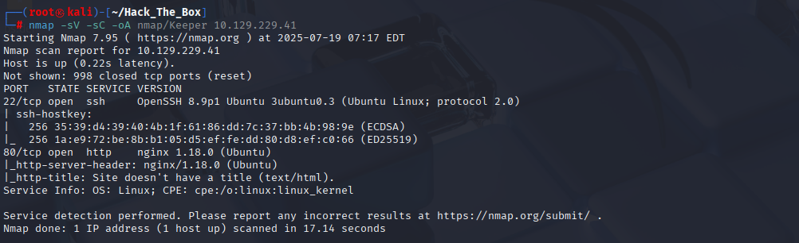

**Answer**: `2`

---

## Task 2: What is the default password for the default user on Request Tracker (RT)?

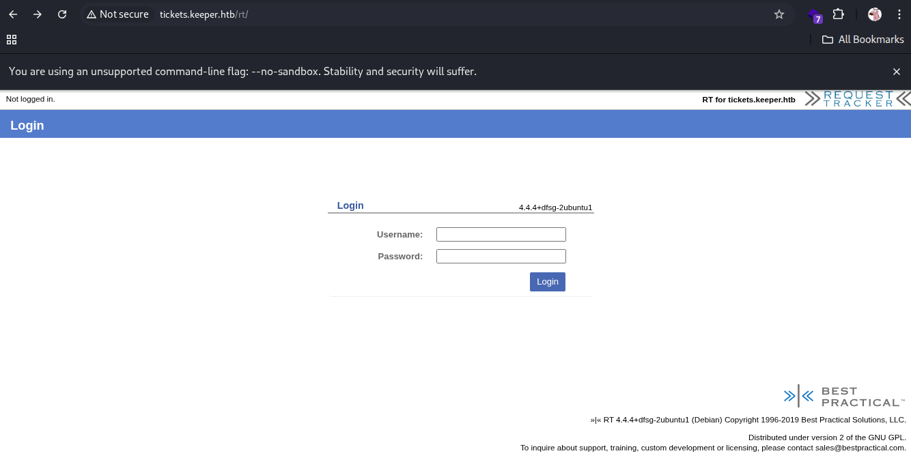  
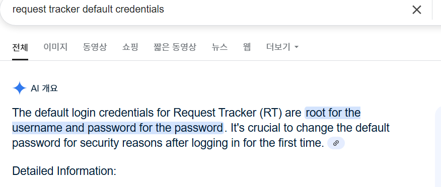

Searched for default credentials:  
**Username**: root  
**Password**: password

**Answer**: `password`  
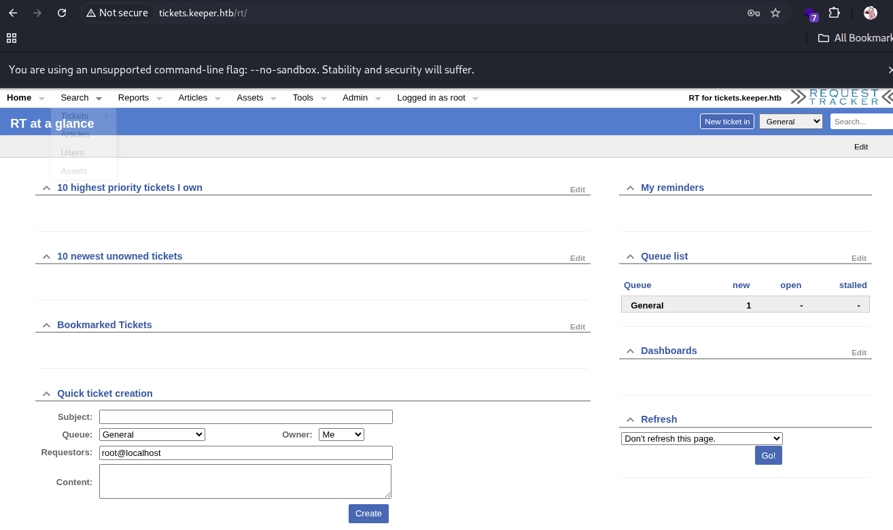

---

## Task 3: Besides root, what other user is in RT?

Dashboard → Admin → Users  
Found another user:  
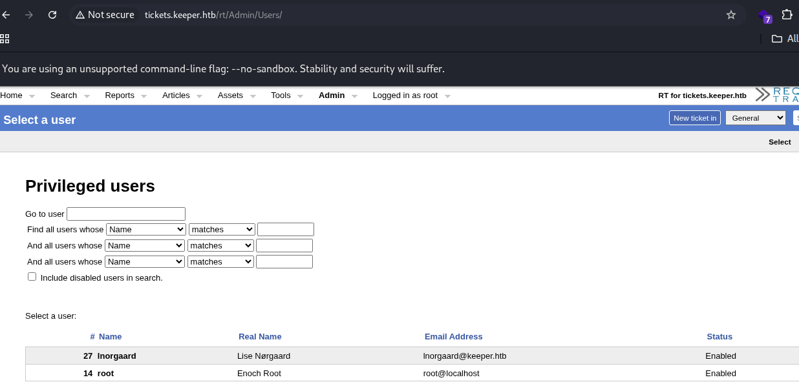

- **Username**: lnorgaard  
- **Real Name**: Lise Nørgaard

**Answer**: `lnorgaard`

---

## Task 4: What is the lnorgaard user's password on Keeper?

Checked user info and found in "Comments about this user":  
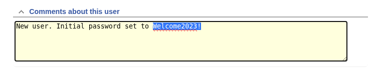

> Initial password set to Welcome2023!

**Answer**: `Welcome2023!`

---

## Submit User Flag

SSH as lnorgaard:
```bash
ssh lnorgaard@10.129.229.41
Password: Welcome2023!
```
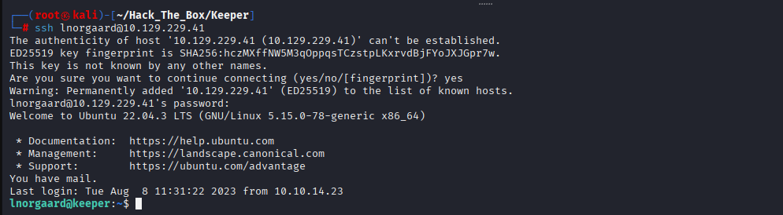

```bash
cat user.txt
```
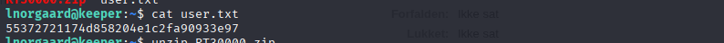

**User Flag**: `55372721174d858204e1c2fa90933e97`

---

## Task 6: What is the 2023 CVE ID for KeePass memory dump vulnerability?

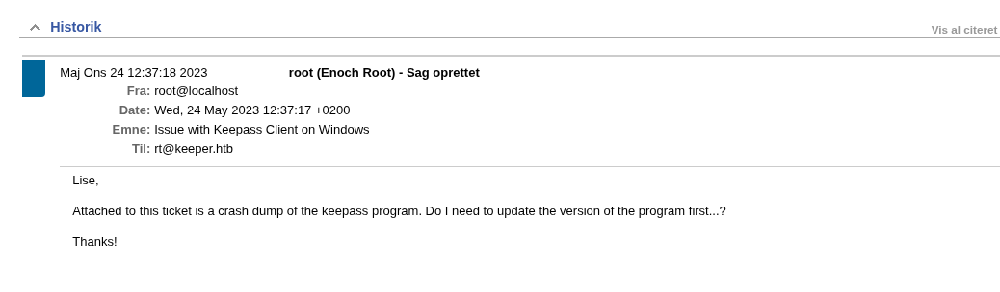

Google search revealed:  
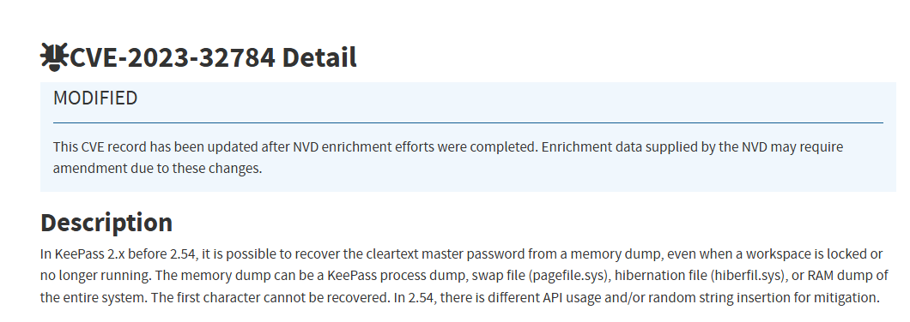

> CVE-2023-32784

**Answer**: `CVE-2023-32784`

---

## Task 7: What is the master password for passcodes.kdbx?

Used KeePass memory dump analysis tool:  
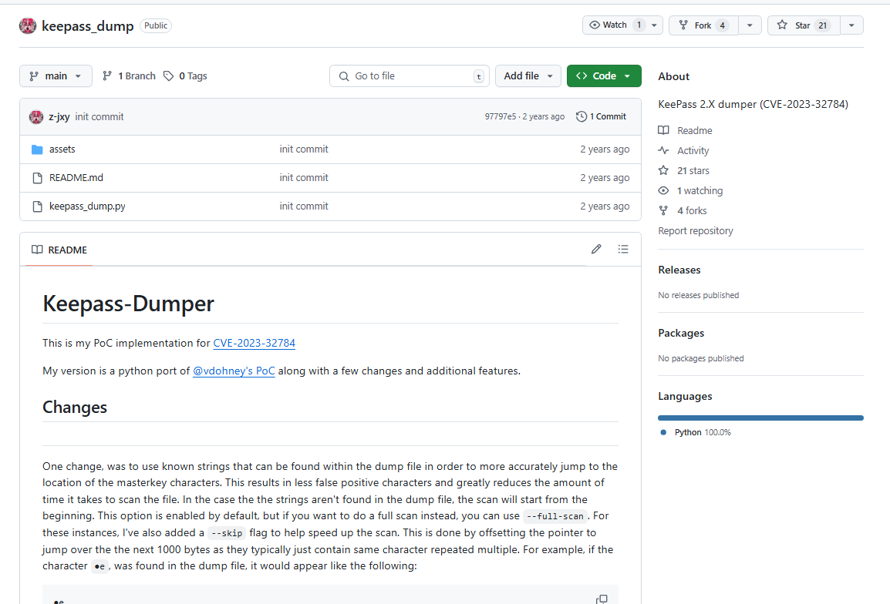

```bash
python3 exploit.py -f KeePassDumpFull.dmp
```
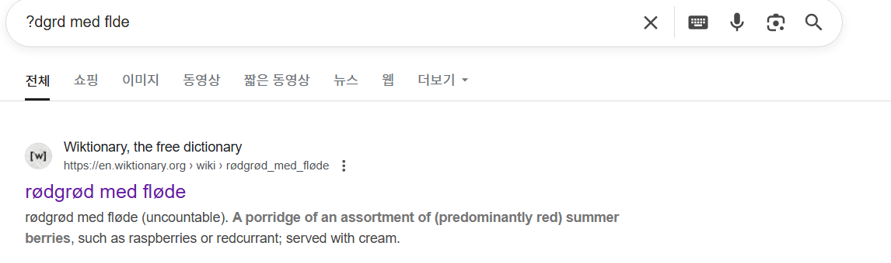

Resulted password:  
> `rødgrød med fløde`

**Answer**: `rødgrød med fløde`

---

## Task 8: What is the first line of the "Notes" section for the entry in the database containing a private SSH key?

Opened database with:
```bash
kpcli --kdb passcodes.kdbx
Password: rødgrød med fløde
```
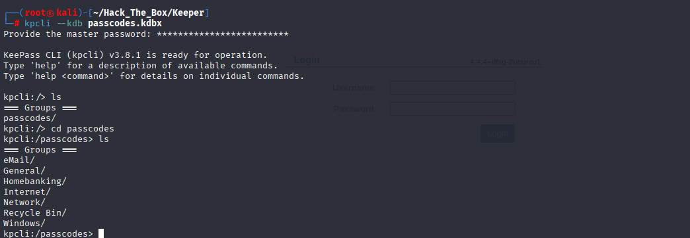

Checked:
```bash
show 0
```
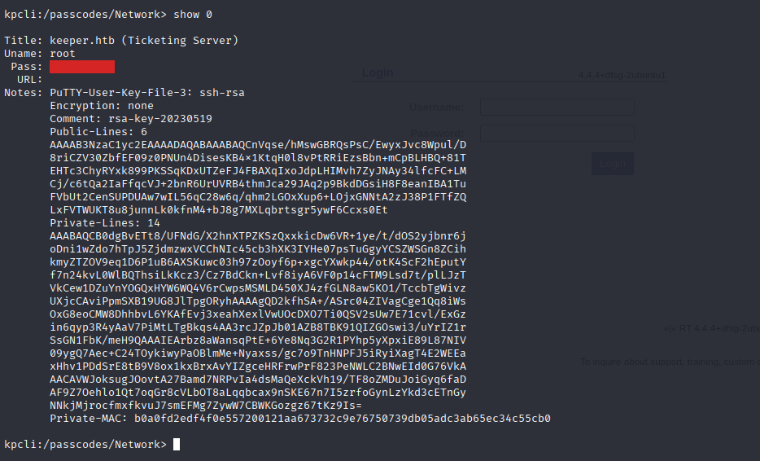

**First line in Notes**:  
> `PuTTY-User-Key-File-3: ssh-rsa`

---

## Submit Root Flag

Used extracted private key to SSH as root:
```bash
chmod 600 keeper.ppk
puttygen keeper.ppk -O private-openssh -o id_rsa_keeper
ssh -i id_rsa_keeper root@10.129.229.41
cat /root/root.txt
```
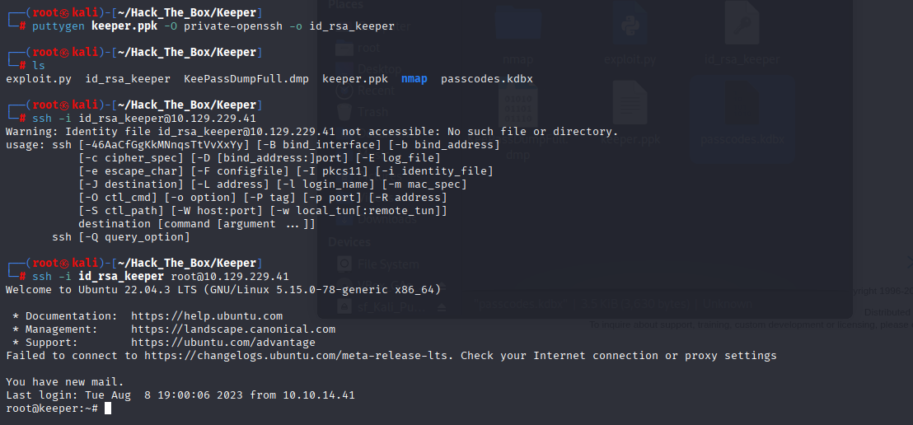  
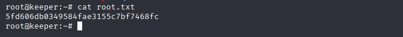

**Root Flag**: `5fd606db0349584fae3155c7bf7468fc`

---
