# HTB Walkthrough - Sau

**Machine Name**: Sau  
**Target IP**: 10.129.229.26  
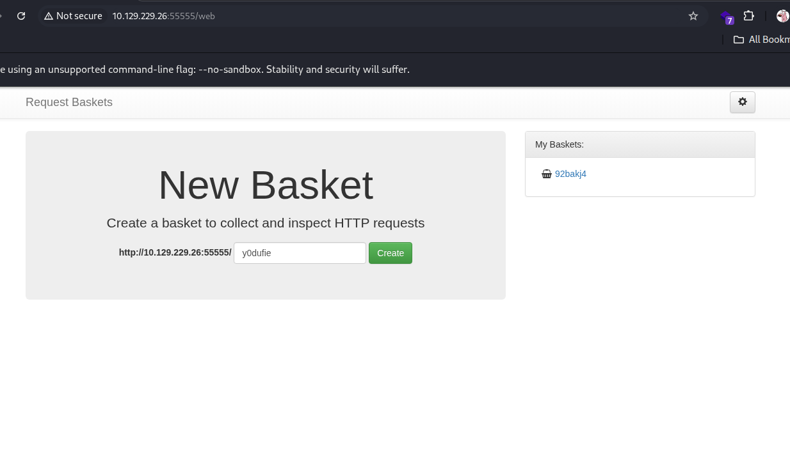

---

## Task 1 - Which is the highest open TCP port on the target machine?

```
PORT      STATE    SERVICE VERSION                                                                                                                   
22/tcp    open     ssh     OpenSSH 8.2p1 Ubuntu 4ubuntu0.7 (Ubuntu Linux; protocol 2.0)  
80/tcp    filtered http                                                                                                                              
55555/tcp open     http    Golang net/http server  
```
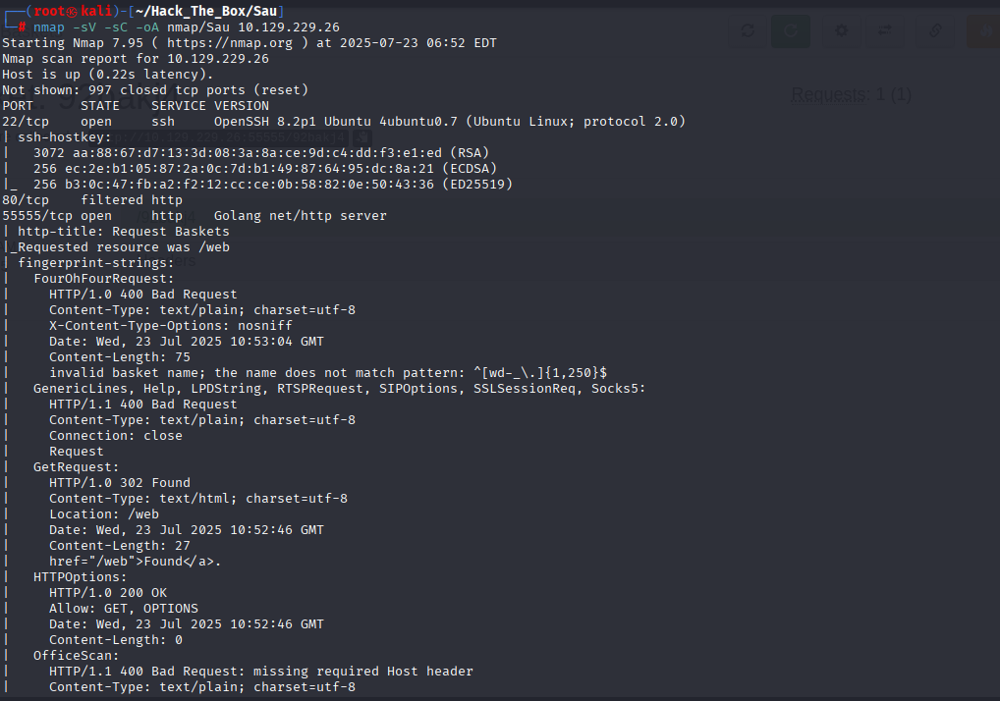

> **Answer**: `55555`

---

## Task 2 - What is the name of the open source software that the application on 55555 is "powered by"?

접속 URL: `http://10.129.229.26:55555/web/baskets`  
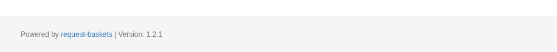

> **Answer**: `request-baskets`

---

## Task 3 - What is the version of request-baskets running on Sau?

> **Answer**: `1.2.1`

---

## Task 4 - What is the 2023 CVE ID for a Server-Side Request Forgery (SSRF) in this version of request-baskets?

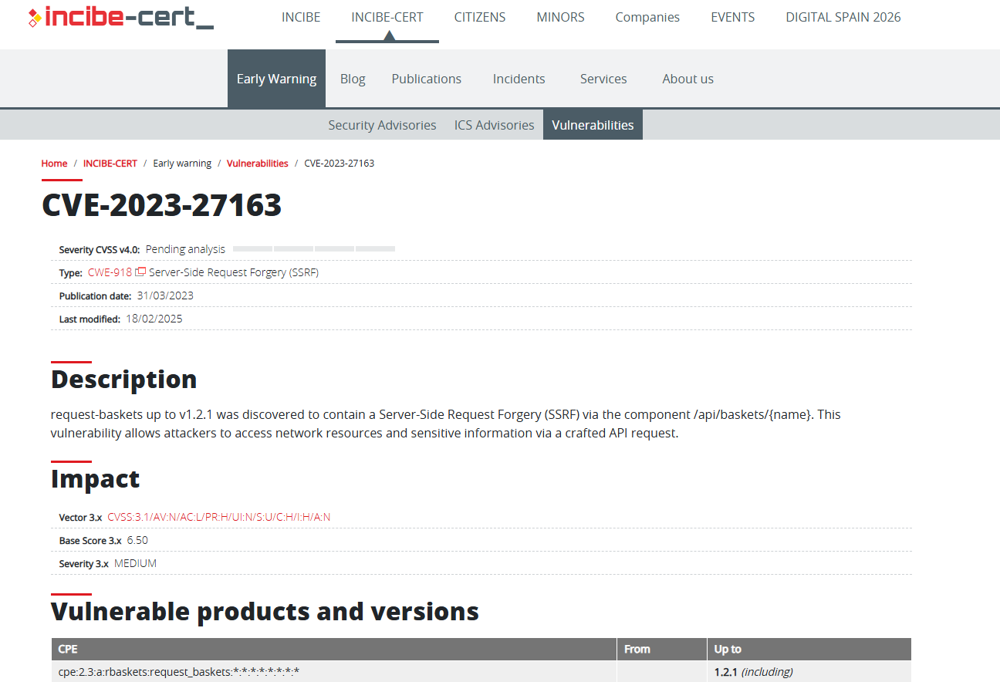

> **Answer**: `CVE-2023-27163`

---

## Task 5 - What is the name of the software that the application running on port 80 is "powered by"?

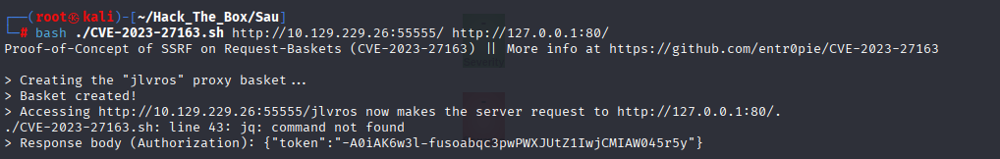  
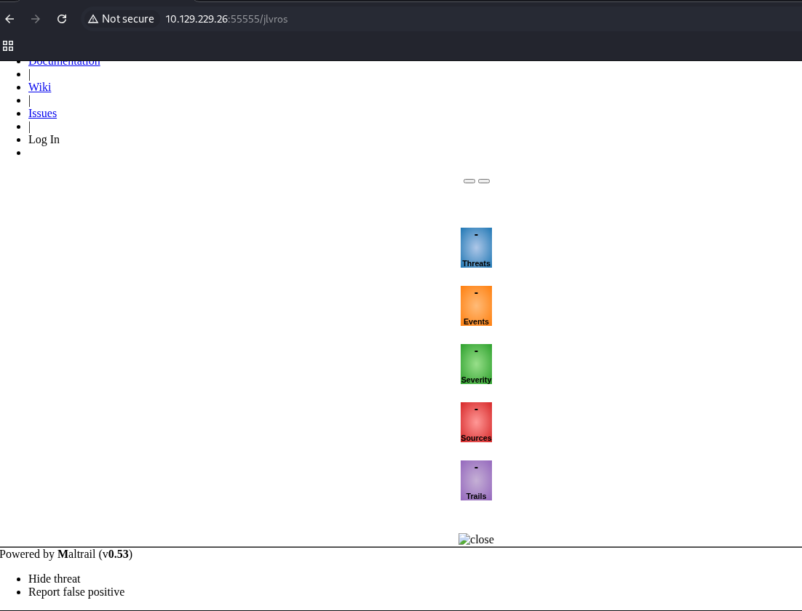

> **Answer**: `Maltrail`

---

## Task 6 - What is the relative path on the webserver targeted by this exploit?

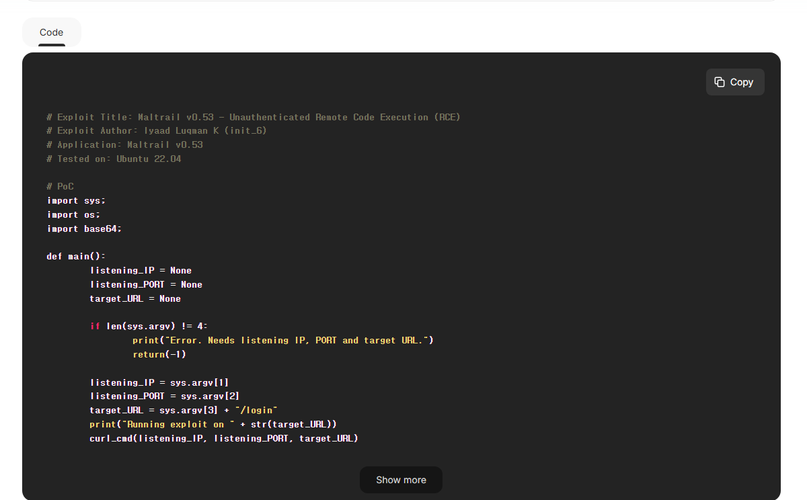

> **Answer**: `/login`

---

## Task 7 - What system user is the Mailtrail application running as on Sau?

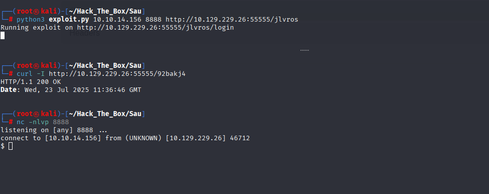

> **Answer**: `puma`

---

## Submit User Flag

```
cat /home/puma/user.txt
de1fe822eea8f84d4c69ca2429e78cff
```
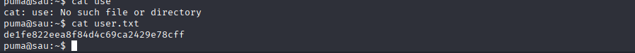

> **Flag**: `de1fe822eea8f84d4c69ca2429e78cff`

---

## Task 9 - What is the full path to the binary (without arguments) the puma user can run as root on Sau?

```
sudo -l
(root) NOPASSWD: /usr/bin/systemctl status trail.service
```

> **Answer**: `/usr/bin/systemctl`

---

## Task 10 - What is the full version string for the instance of systemd installed on Sau?

```
systemctl --version
systemd 245 (245.4-4ubuntu3.22)
```

> **Answer**: `systemd 245 (245.4-4ubuntu3.22)`

---

## Task 11 - What is the 2023 CVE ID for a local privilege escalation vulnerability in this version of systemd?

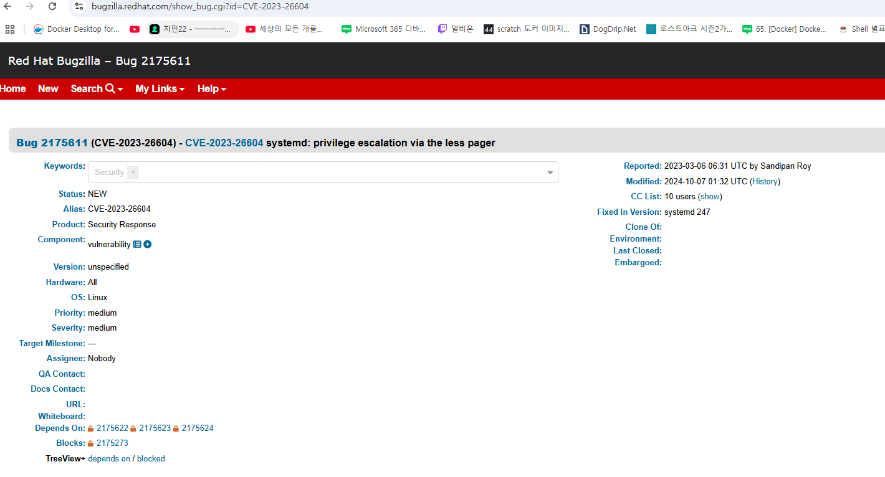

> **Answer**: `CVE-2023-26604`

---

## Submit Root Flag

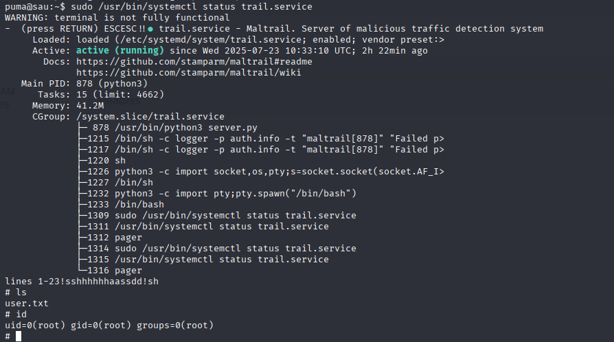

```
id
uid=0(root) gid=0(root) groups=0(root)
cat /root/root.txt
afc4350a2648b48b982367db13b5a9e3
```
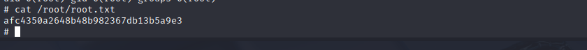

> **Flag**: `afc4350a2648b48b982367db13b5a9e3`
